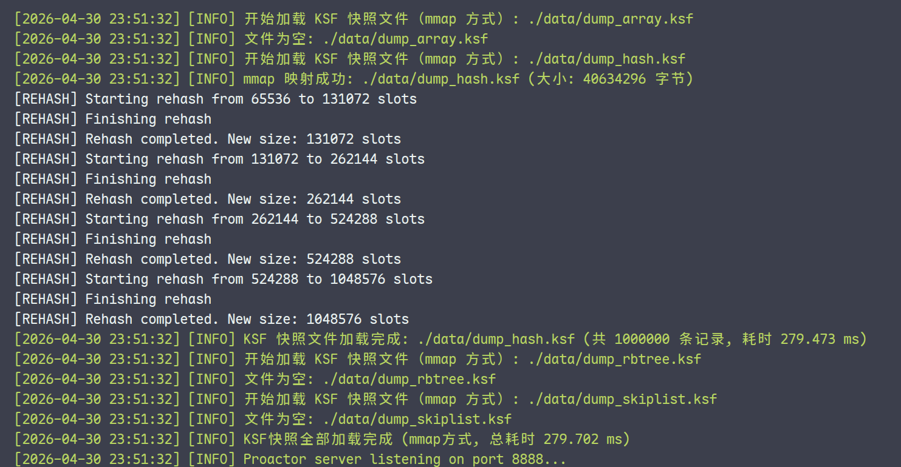
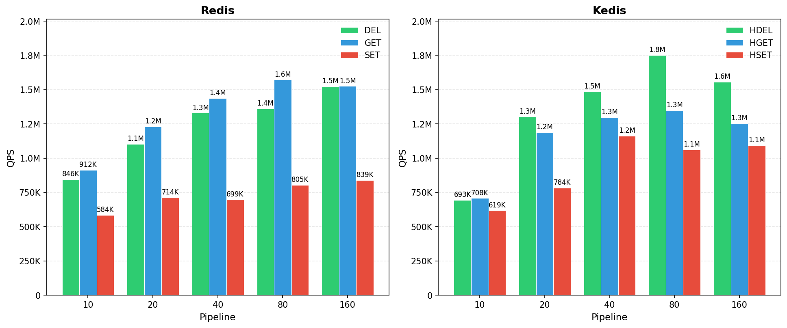
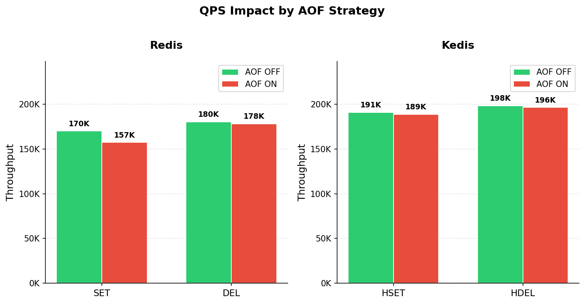
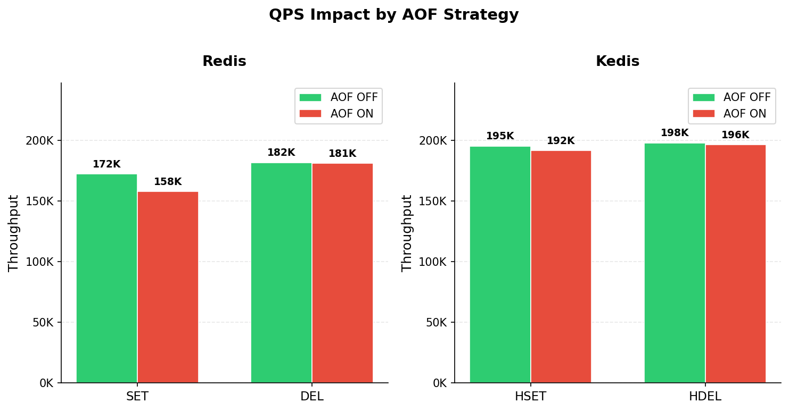
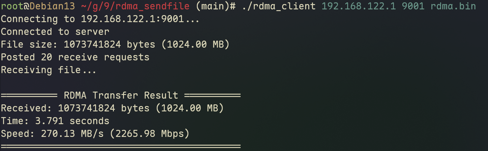
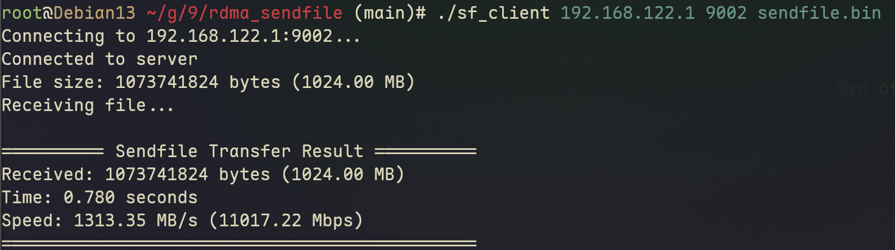

# Kedis 性能数据记录（不定期更新）

## KSF 加载时间

*更新时间: 2026.4.30*

## pipeline 性能 --- Redis VS Kedis

*更新时间: 2026.5.1*

## AOF 性能(预热后) --- Redis VS Kedis

*更新时间: 2026.4.30*

*更新时间: 2026.5.1*

**优化了一下 aof buffer flush 的路径**

## RDMA vs sendfile 文件传输

### RDMA send

*soft-RoCE*

### sendfile

