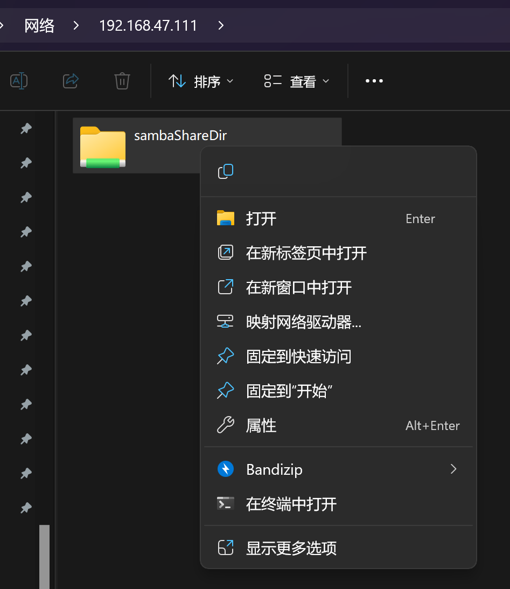
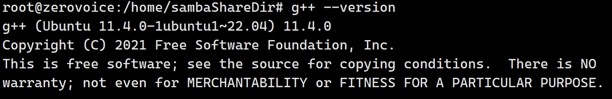
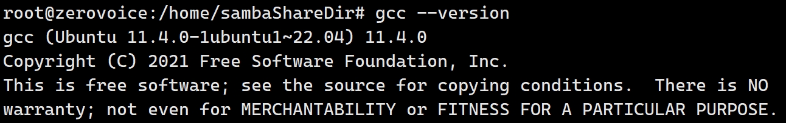
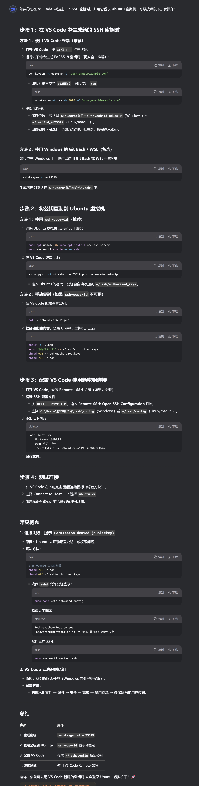
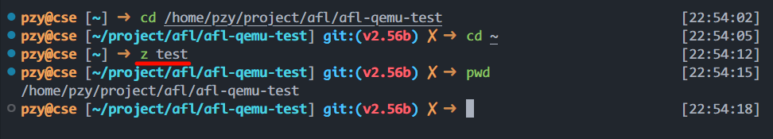
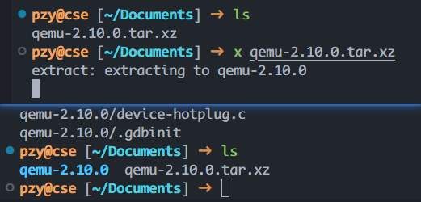
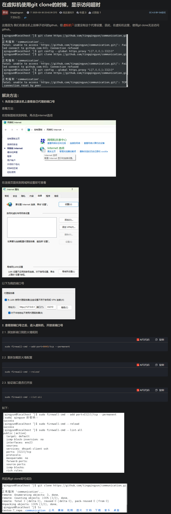
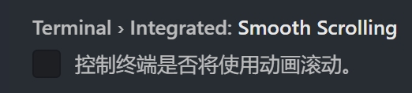
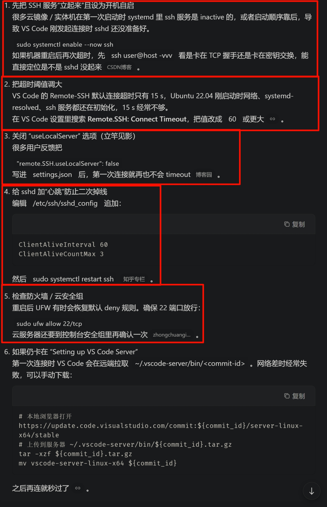

# 0x00-开发环境：Ubuntu22.04

# <u><font style="color:#DF2A3F;">最重要：安装后拍摄快照</font></u>
# 安装时自行设计磁盘空间
+ 磁盘最好 80G
+ 处理器至少 4 核
+ 如果用的 Desktop 版本的 Ubuntu，至少 8G 内存，不然很慢

# 换源（aliyun）
`[http://mirrors.aliyun.com/ubuntu](http://mirrors.aliyun.com/ubuntu)`

# 更新 apt
`apt update`

# 给 root 设置密码
`sudo passwd root`

# 安装 openssh-server
**<font style="color:#DF2A3F;">安装后，找到 ssh 配置文件：</font>**`**<font style="color:#DF2A3F;">vim /etc/ssh/sshd_config</font>**`

**<font style="color:#DF2A3F;">将 PermitRootLogin 后改为 yes</font>**

# 配置静态 ip
# 安装 samba
看下面的内容安装

[Ubuntu22.04 添加samba，并在windows访问 的详细教程_ubuntu22安装samba-CSDN博客](https://blog.csdn.net/wkd_007/article/details/128908085)

+ **<font style="color:#DF2A3F;">弹窗“拒绝访问”如何处理：</font>**

[【Win10 访问 Linux samba 拒绝访问】_samba用户登录拒绝访问-CSDN博客](https://blog.csdn.net/Xixixihohoho/article/details/127430989?ops_request_misc=%257B%2522request%255Fid%2522%253A%252242a286ef2720ade9597de8ab538dbb2a%2522%252C%2522scm%2522%253A%252220140713.130102334..%2522%257D&request_id=42a286ef2720ade9597de8ab538dbb2a&biz_id=0&utm_medium=distribute.pc_search_result.none-task-blog-2~all~top_positive~default-1-127430989-null-null.142^v102^pc_search_result_base2&utm_term=windows%20samba%E6%8B%92%E7%BB%9D%E8%AE%BF%E9%97%AE&spm=1018.2226.3001.4187)

右键可以映射为一个盘符，方便直接访问（此处为 S 盘）



# 安装 gcc/g++
`apt install build-essential`

+ 使用 `gcc --version`和`g++ --version`查看是否成功





# VSCode 远程连接
[VS Code 远程连接 SSH 服务器_vscode连接ssh远程服务器-CSDN博客](https://blog.csdn.net/qq_42417071/article/details/138501026)

## 如果想免密登录



# <font style="color:#DF2A3F;">再拍一个快照: 环境配置完成</font>
# 给 Linux 换上 zsh+oh-my-zsh

> [!NOTE]
>
> 都2025年了, 换用fish吧

## 安装 zsh
`apt install zsh`

`chsh -s $(which zsh)` --- 切换默认终端 **<font style="color:#DF2A3F;">→ 一定要重启</font>**

## 安装 oh-my-zsh
官网：[http://ohmyz.sh/](http://ohmyz.sh/)。 安装方式任选一个即可。

| **Method** | **Command** |
| --- | --- |
| **curl** | `sh -c "$(curl -fsSL https://install.ohmyz.sh/)"` |
| **wget** | `sh -c "$(wget -O- https://install.ohmyz.sh/)"` |
| **fetch** | `sh -c "$(fetch -o - https://install.ohmyz.sh/)"` |
| **国内curl**[**镜像**](https://gitee.com/pocmon/ohmyzsh) | `sh -c "$(curl -fsSL https://gitee.com/pocmon/ohmyzsh/raw/master/tools/install.sh)"` |
| **国内wget**[**镜像**](https://gitee.com/pocmon/ohmyzsh) | `sh -c "$(wget -O- https://gitee.com/pocmon/ohmyzsh/raw/master/tools/install.sh)"` |


[Zsh 安装与配置_zsh安装-CSDN博客](https://blog.csdn.net/qq_58158950/article/details/142966047)

[zsh 快速入门与高级配置-CSDN博客](https://blog.csdn.net/miya0024/article/details/137579191) **<font style="color:#DF2A3F;">--- 高</font>**

```bash
# 装上最牛的 theme (居然不影响性能)
git clone --depth=1 https://github.com/romkatv/powerlevel10k.git ${ZSH_CUSTOM:-$HOME/.oh-my-zsh/custom}/themes/powerlevel10k
#--depth=1 表示只克隆最新版本, 不管历史信息
##镜像: 
git clone --depth=1 https://gitee.com/romkatv/powerlevel10k.git ${ZSH_CUSTOM:-$HOME/.oh-my-zsh/custom}/themes/powerlevel10k
# vim 编辑 ~/.zshrc, 修改主题
ZSH_THEME="powerlevel10k/powerlevel10k"
```

## 插件推荐
1. `oh-my-zsh` 内置了 `z` 插件
+ `z` 是一个文件夹快捷跳转插件，对于曾经跳转过的目录，**<font style="color:#DF2A3F;">只需要输入最终目标文件夹名称</font>**，就可以快速跳转，避免再输入长串路径，提高切换文件夹的效率。



2. `oh-my-zsh` 内置了 `extract` 插件
    - `extract` 用于解压任何压缩文件，不必根据压缩文件的后缀名来记忆压缩软件
    - 使用 `x` 命令即可解压文件，效果如下：



### 剩下两个极其好用的第三方插件
[https://github.com/zsh-users/zsh-autosuggestions](https://github.com/zsh-users/zsh-autosuggestions)

```bash
git clone https://github.com/zsh-users/zsh-autosuggestions ${ZSH_CUSTOM:-~/.oh-my-zsh/custom}/plugins/zsh-autosuggestions
```

[https://github.com/zsh-users/zsh-syntax-highlighting](https://github.com/zsh-users/zsh-syntax-highlighting)

```bash
git clone https://github.com/zsh-users/zsh-syntax-highlighting.git ${ZSH_CUSTOM:-~/.oh-my-zsh/custom}/plugins/zsh-syntax-highlighting
```

```plain
plugins=(
    zsh-autosuggestions
    zsh-syntax-highlighting
    z
)
```


# 虚拟机上挂主机的梯子
**<font style="color:#DF2A3F;">貌似没啥用? ---> </font>**<font style="color:#DF2A3F;">使用 Clash 的 TUN 模式</font>




## oh-my-zsh的主题:powerlevel10k
可以提高流畅度

## 终端的Smooth Scrolling置为`false` [立竿见影]


# 启动虚拟机后第一次SSH连接总超时

