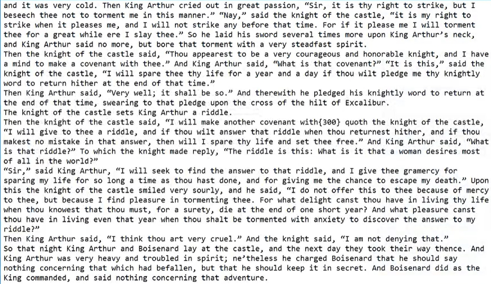
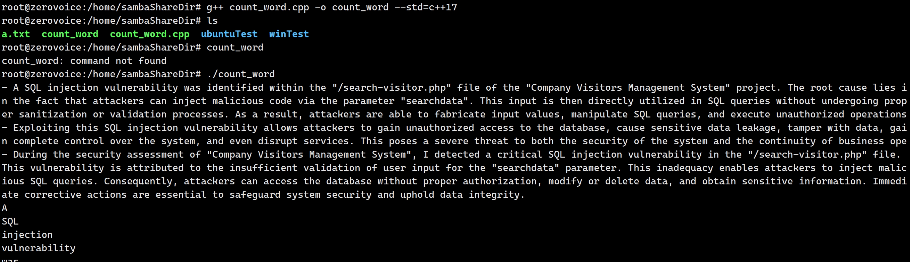

# 0x01-单词统计

# 状态机（一种算法）
维护字符指针状态，IN/OUT




# 代码 → `count_word.cpp`
```cpp
#include <iostream>
#include <fstream>
#include <ctype.h>

#define IN    1
#define OUT   0
#define INIT  OUT

using namespace std;

void countWord(string& filepath) {
  ifstream file(filepath);
  
  string buffer, passage;
  while(getline(file, buffer)) {
    passage += buffer;
    buffer.clear();
  }
  int status = INIT, cnt = 0;
  cout << passage << endl;
  string word;
  for (int i = 0; i < passage.size(); i++) {
    if (isalpha(passage[i])) word += passage[i];
    if (isalpha(passage[i]) && status == OUT) {
      status = IN;
      cnt++;
    }
    if (!isalpha(passage[i]) && status == IN) {
      status = OUT;
      cout << word << endl;
      word.clear();
    }
  }
  cout << word << endl;
  cout << cnt << endl;

  
  file.close();

}
int main() {
  string filepath = "a.txt";
  countWord(filepath);
}
```



# 在 Linux 中编译运行
`<u>g++ count_word.cpp -o count_word --std=c++17</u>`

## <font style="color:#DF2A3F;">注意事项</font>
1. `.cpp` 文件应当使用`g++`编译

> <font style="color:#DF2A3F;">否则会报错：</font>
>
> 根据您提供的错误信息，编译器（`gcc`）在链接阶段遇到了问题，因为它找不到 C++ 标准库中的一些符号定义。这通常是因为没有正确地链接到 C++ 标准库。
>
> 在 Linux 系统中，**<font style="color:#DF2A3F;">编译 C++ 程序时应该使用 </font>**`**<font style="color:#DF2A3F;">g++</font>**`**<font style="color:#DF2A3F;"> 而不是 </font>**`**<font style="color:#DF2A3F;">gcc</font>**`。`g++` 是 GCC 编译器的一个变体，它专门用于编译 C++ 程序，并且会自动链接到 C++ 标准库
>

2. 使用命令`./count_word` 运行可执行文件
