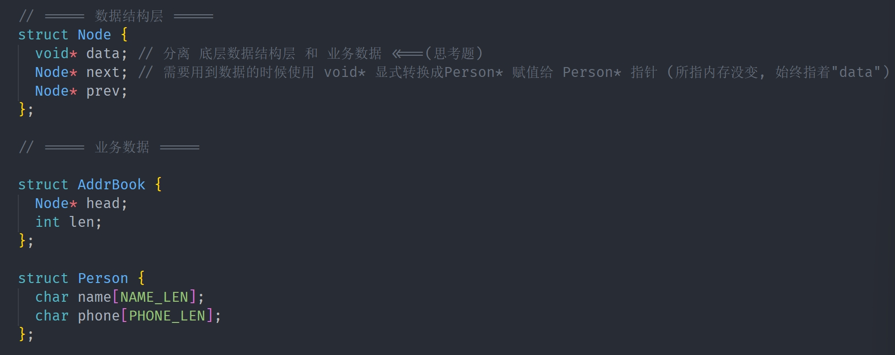
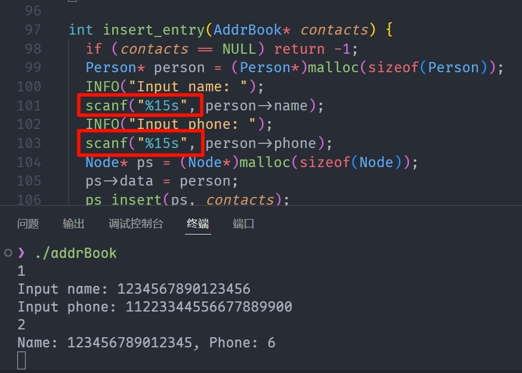
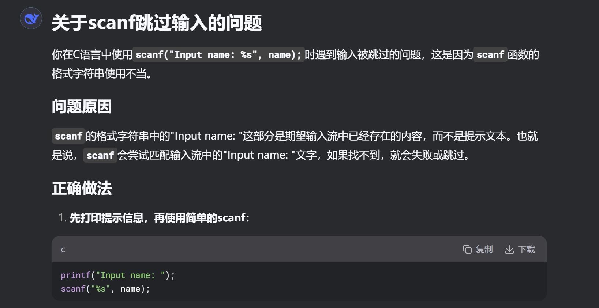
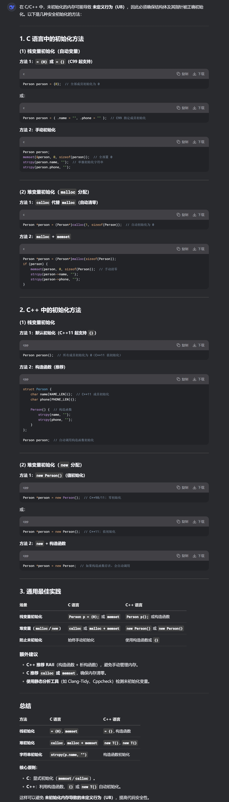

# 0x02-C语言实现通讯录

# 两个思考题
## 如何分离业务数据 `name/phone` 和数据结构层的 `next/prev`?
<font style="color:#DF2A3F;">解决方案:</font> **<font style="color:#DF2A3F;">分层设计</font>**



##  如何修复 `scanf` 缓冲区溢出漏洞?
### 限制读入字符数, 超出部分污染下一次读入


### 使用安全的`fgets`
```c
fgets(buffer, sizeof(buffer), stdin);
```

> **<font style="color:#DF2A3F;">缺点: </font>** <font style="color:#DF2A3F;">需要额外处理 buffer 中被读入的换行符</font>
>
> `<font style="color:#DF2A3F;">scanf()</font>`<font style="color:#DF2A3F;">会默认跳过换行符</font>`<font style="color:#DF2A3F;">\n</font>`<font style="color:#DF2A3F;">, 空格</font>`<font style="color:#DF2A3F;">space</font>`<font style="color:#DF2A3F;">等等, 使他们被留在缓冲区</font>
>

#### <font style="color:#DF2A3F;">两种 </font>`<font style="color:#DF2A3F;">fgets()</font>`<font style="color:#DF2A3F;">出现意外的场景</font>
| **场景** | **原因** | **解决方案** |
| --- | --- | --- |
| `scanf`后接 `fgets` | `scanf`不读取换行符，残留的 `\n`会被`fgets`立即读取 | `while(getchar() != '\n');` |
| 输入超出预期长度 | `fgets / scanf`只读取部分输入<br/>剩余内容会污染下次读取 | 检查输入是否完整，若不完整则清空 |


# 记录
### C 语法不熟悉


### <font style="color:#DF2A3F;">有几次 malloc/new , 就要 free/delete 几次</font>
### 函数的实现, 坚持判断每一个参数<font style="color:#DF2A3F;">是否无意义(如指针是否为空)</font>
### 所有"意义不明的常数", 使用宏定义声明
### 内存初始化


### 清空缓冲区
```c
while(getchar() != '\n'); // 可以直接清空缓冲区
```

### 重写接口层 `ps_insert` 实现按名字的字典序升序排列
```cpp
int personCmp(Person* a, Person* b) {
  return strcmp(a->name, b->name);
} // 辅助函数, 下面会用到

int ps_insert(Node* ps, AddrBook* contacts) {
  if (ps == NULL) return -1;
  if (contacts == NULL) return -2;

  Node* prev = NULL;
  Node* next = NULL;
  
  Person* new_person = (Person*)ps->data;

  for (Node* current = contacts->head; current != NULL; current = current->next) {
    Person* current_person = (Person*)current->data;
    prev = current;
    if (personCmp(new_person, current_person) < 0) {
      next = current;
      prev = current->prev;
      break;
    }
  }
  
  ps->next = next;
  ps->prev = prev;

  if (prev != NULL) prev->next = ps;
  if (next != NULL) next->prev = ps;
  if (next == contacts->head) contacts->head = ps;

  contacts->len++;
  return 0;
}
```

# 问题
1. 好像不需要二级指针? ==> 已解决: 要修改的是指针, 我传的就是指针的指针了, 而视频里也需要传
2. `main`函数最后的 `default:` 有没有把内存 `free`干净? // 没有, 但我已经优化了
