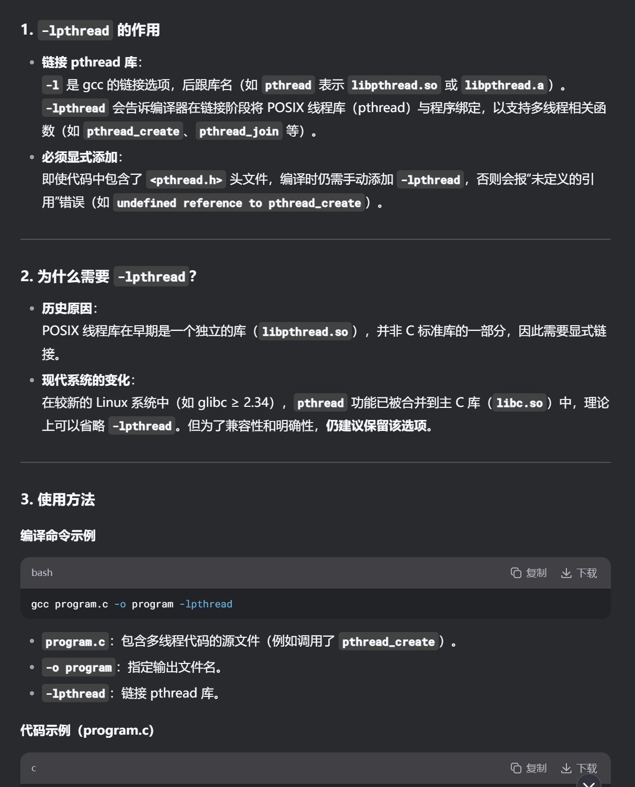
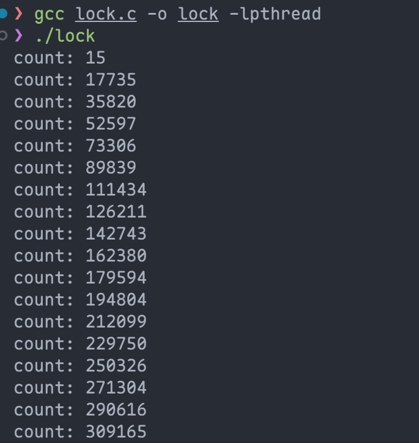
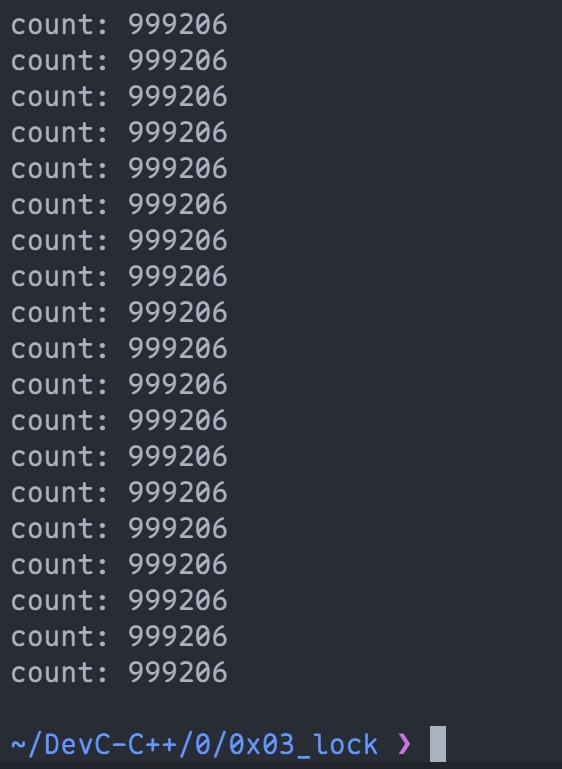
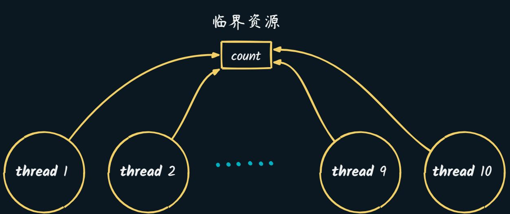
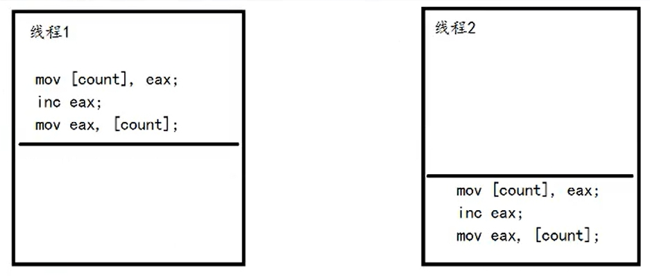
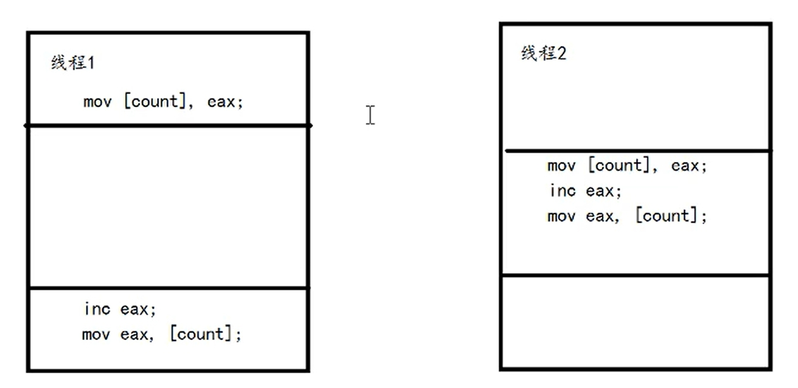
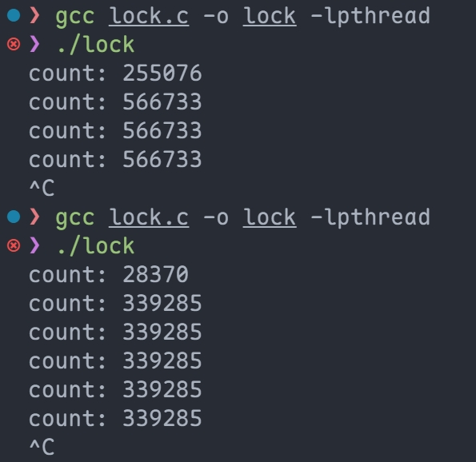
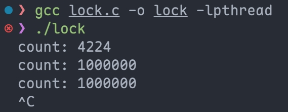
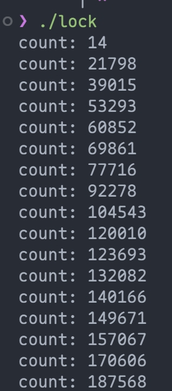
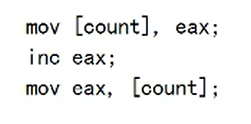

# 0x03-多线程并发锁

# `#include <pthread.h>`
编译时需要加上参数`-lpthread`



# 多线程示例
10 个线程, 对同一个栈变量`count++`, 100000 次 (每次休眠 1ms)

每隔 1s , 打印一次`count`

最终无法到达 100,0000, 为什么???



# 原因是什么?
由于 count 是 **<font style="color:#DF2A3F;">临界资源 </font>**:



### 大部分情况 (正常): 
对于 `count = 50` 两个线程分别++

==> `count = 52`



### <font style="color:#DF2A3F;">一小部分情况: </font>
`<font style="color:#DF2A3F;">count = 50</font>`<font style="color:#DF2A3F;">经过这两个线程 ==> </font>`<font style="color:#DF2A3F;">count = 51</font>`



# 解决方案
### 互斥锁: mutex
> 去掉了 `usleep(1)`, 因为加上 mutex,  降低了性能, 太慢了
>

#### <font style="color:#DF2A3F;">无 mutex:</font>


#### <font style="color:#DF2A3F;">有 mutex: </font>


### 自旋锁: spinlock
**<font style="color:#DF2A3F;">很快, 性能比互斥锁高 (100s 内能够将 count++至 1000000)</font>**



| **特性** | **互斥锁** | **自旋锁** |
| :---: | --- | --- |
| **等待方式** | 线程休眠（OS调度） | CPU忙等待循环 |
| **CPU占用** | 等待时0%占用 | 等待时100%占用核心 |
| **汇编指令** | `SYS_futex`系统调用 | `lock cmpxchg`原子指令 |
| **延迟** | 微秒级（上下文切换开销） | 纳秒级（直接检测内存变化） |
| **缓存影响** | 可能引起缓存失效 | L1缓存保持热状态 |
| **功耗** | 等待时不耗电 | 持续消耗CPU功率 |


### 使用场景
+ **使用互斥锁当：**
    - 临界区操作超过100条指令
    - 涉及IO操作或复杂计算
    - 需要递归锁定能力
+ **使用自旋锁当：**
    - 临界区少于10条指令
    - 在多核CPU上运行
    - 确定锁持有时间极短
    - 在中断上下文使用（内核开发）

#### 自旋锁
**<font style="color:#DF2A3F;">锁住的内容很少, 忙等待的代价小</font>**

> **eg:** count++/普通的赋值操作
>

#### 互斥锁
**<font style="color:#DF2A3F;">锁的内容较多, 忙等待代价太大, 大于线程切换的代价</font>**

> **eg: 线程安全的 **红黑树/B 树, 插入元素
>

### 原子操作
 **<font style="color:#DF2A3F;">三条指令</font>** ===> **<font style="color:#DF2A3F;">单条指令</font>**

```cpp
int inc(int* value, int add) {
  int old;  //  相当于一条指令实现  *value += add
  __asm__ volatile(
    "lock; xaddl %2, %1;"
    : "=a" (old)
    : "m" (*value), "a" (add)
    : "cc", "memory"
  );
  return old;
}
```

```cpp
__atomic_fetch_add(pcount, 1, __ATOMIC_SEQ_CST);
```

| **方法** | **可移植性** | **适用场景** |
| --- | --- | --- |
| `**__atomic_fetch_add**` | 高（GCC/Clang 标准） | 跨平台代码（x86/ARM/RISC-V） |
| `**lock xaddl**`**内联汇编** | 低（仅 x86/x64） | 特定优化场景 |


+ `**<font style="color:#DF2A3F;">__atomic_fetch_add</font>**`**<font style="color:#DF2A3F;"> 是 GCC/Clang 的内置原子操作，编译器会根据目标架构生成最优指令</font>**
    - **<font style="color:#DF2A3F;">如 ARM 用 </font>**`**<font style="color:#DF2A3F;">LDADD</font>**`**<font style="color:#DF2A3F;">，x86 用 </font>**`**<font style="color:#DF2A3F;">LOCK XADD</font>**`
+ `**<font style="color:#DF2A3F;">lock xaddl</font>**`**<font style="color:#DF2A3F;"> 是 x86 专属指令，在其他架构（如 ARM）上无法编译</font>**

#### 原子操作 vs 互斥锁 vs 自旋锁的性能对比
| **机制** | **适用场景** | **开销来源** | **高竞争下的表现** |
| :---: | --- | --- | --- |
| **原子操作** | 轻量级操作（如计数器） | CPU缓存一致性协议（MESI） | 差（缓存行乒乓严重） |
| **互斥锁** | 临界区较长或高竞争 | 系统调用 + 线程调度 | 中等（线程会休眠） |
| **自旋锁** | 临界区极短（<100ns） | CPU空转（忙等待） | 最好（无上下文切换） |


---

#### 为什么你的测试中原子操作比自旋锁慢？
##### 缓存行竞争（Cache Line Bouncing）
+ 原子操作（如 `xaddl`）依赖 CPU 的缓存一致性协议（MESI）。
+ 当多个线程频繁修改同一个变量（如 `count`）时：
    - **<font style="color:#DF2A3F;">每次修改都会导致其他 CPU 核心的缓存行失效（</font>**`**<font style="color:#DF2A3F;">Invalidate</font>**`**<font style="color:#DF2A3F;">）</font>**
    - CPU 必须等待缓存行重新加载，造成严重的 缓存行乒乓（Cache Line Ping-Pong）。
    - **<font style="color:#DF2A3F;">性能杀手：原子操作在高竞争下可能比互斥锁更差。</font>**

##### 自旋锁的优势
+ 自旋锁（如 `pthread_spin_lock`）在 短临界区 下表现最佳：
    - 没有上下文切换开销。
    - **<font style="color:#DF2A3F;">如果锁持有时间极短（如 </font>**`**<font style="color:#DF2A3F;">count++</font>**`**<font style="color:#DF2A3F;">），自旋锁的忙等待不会浪费太多 CPU</font>**
    - 但：如果临界区较长，自旋锁会浪费 CPU 周期。

##### 互斥锁的折中
+ 互斥锁（如 `pthread_mutex_lock`）在高竞争下：
    - 会让竞争失败的线程 休眠，减少 CPU 争用。
    - 避免了缓存行乒乓，但引入了**<font style="color:#DF2A3F;"> 上下文切换开销</font>**
    - **在你的测试中，由于竞争激烈，互斥锁可能比原子操作更高效。**

### 拓展: CAS (Compare-And-Swap)
**<font style="background-color:rgba(255, 255, 255, 0);">“如果目标变量的值等于预期值 (old_value), 则将其更新为新值 (new_value), 否则不做任何操作。”</font>**

#### CAS 函数详细说明
<u>先铺垫一下原子操作的相关函数</u>

| **函数原型** | **作用** | **等价伪代码** |
| --- | --- | --- |
| `atomic_load(atomic_int *ptr)` | 原子读取值 | `return *ptr;` |
| `atomic_store(atomic_int *ptr, int value)` | 原子写入值 | `*ptr = value;` |
| `atomic_fetch_add(atomic_int *ptr, int value)` | 原子加法 | `int old = *ptr; *ptr += value; return old;` |
| `atomic_compare_exchange_strong(atomic_int *ptr, int *expected, int desired)` | CAS 操作 | 见下方说明 |


##### CAS函数
```c
_Bool atomic_compare_exchange_strong(
    volatile A *ptr,   // 原子变量指针
    C *expected,       // 指向预期值的指针
    C desired          // 新值
);
```

##### 工作流程
```c
if (*ptr == *expected) {
    *ptr = desired;
    return true;
} else {
    *expected = *ptr;  // 自动更新为当前实际值
    return false;
}
```

#### <font style="color:#DF2A3F;">进一步解释</font>
##### 开发者视角的代码
```c
// 开发者视角的代码
int expected = *ptr;        // 步骤1：读取旧值（非原子！）
int new_val = expected + 1; // 步骤2：准备新值

// 步骤3：CAS原子操作（唯一原子部分）
atomic_compare_exchange_strong(ptr, &expected, new_val);
```

##### 汇编层面
```plain
; 步骤1：读取旧值（非原子）
mov eax, [ptr]     ; 读取到寄存器 eax (expected)

; 步骤2：准备新值（非原子）
lea ebx, [eax+1]   ; ebx = eax + 1 (new_val)

; 步骤3：真正的原子CAS
lock cmpxchg [ptr], ebx  ; 原子比较交换：
                         ; 如果 [ptr]==eax 则 [ptr]=ebx
                         ; 否则 eax=[ptr]
```

1. **<font style="color:#DF2A3F;">读取 old_val 不属于 CAS 原子操作的一部分</font>**
2. **<font style="color:#DF2A3F;">真正的原子操作只包含两个步骤：比较 + 赋值</font>**
3. **<font style="color:#DF2A3F;">ABA 问题的根源正是这个“读取与 CAS 之间的间隙”</font>**

#### CAS 使用示例：线程安全计数器
```c
#include <stdatomic.h>
#include <threads.h>

atomic_int counter = ATOMIC_VAR_INIT(0);  // 初始化原子计数器

void increment() {
  int old_val;
  do {
    old_val = atomic_load(&counter);  // 读取当前值 (独立操作, 并不包含在CAS操作内)
    // 如果当前值仍是 old_val，则更新为 old_val+1
    // 否则循环重试
  } while (!atomic_compare_exchange_strong(     // 这一步才叫做 CAS (&cur, &old, &new)
    &counter, 
    &old_val, 
    old_val + 1
  ));
}
```

#### 面试回答模板（技术要点 + 场景分析）
**面试官：**请解释一下 CAS，并说明它的应用场景。

**你的回答：**

1. **CAS 的定义**  
CAS（Compare-And-Swap）是一种原子操作，它比较某个内存地址的当前值是否与预期值相同：
    - 如果相同，则更新为新值；
    - 如果不同，则操作失败。  
整个过程由 CPU 硬件（如 x86 的 `CMPXCHG` 指令）保证原子性。
2. **CAS 的特点**
    - 无锁（Lock-Free）：线程不会阻塞，而是通过循环重试（乐观锁）。
    - 内存序可控：可通过参数（如 `std::memory_order`）指定内存屏障强度。
    - 可能失败：需配合循环实现“重试逻辑”（如 `compare_exchange_weak`）。
3. **CAS 的典型应用**
    - 无锁数据结构：如无锁队列、无锁栈。
    - 计数器/累加器：比互斥锁更高效（如 `atomic_add_cas` 示例）。
    - 线程安全单例模式：替代双重检查锁定（Double-Checked Locking）。
4. **CAS 的潜在问题**
    - ABA 问题：如果值从 A→B→A，CAS 会误判“未变化”。
        * 解决：用版本号或指针标记（如 `std::atomic<T*>` + 标记位）。
    - 高竞争时性能差：大量线程重试会导致 CPU 空转。
        * 解决：退化为互斥锁，或使用更高级的无锁算法。
5. **对比互斥锁**

| 场景 | CAS | 互斥锁 |
| --- | --- | --- |
| 低竞争 | ⭐⭐⭐⭐（无阻塞） | ⭐⭐（锁开销） |
| 高竞争 | ⭐（重试开销大） | ⭐⭐⭐（线程休眠） |
| 临界区长度 | 极短操作（如计数器） | 任意长度 |
