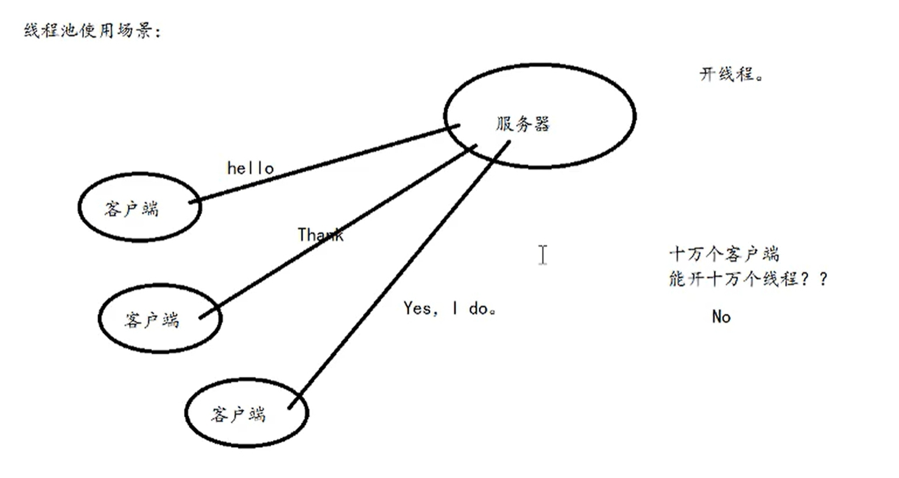
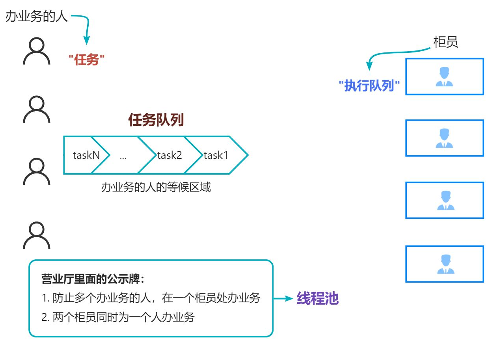

# 0x04-线程池



> POSIX :  一个线程大概 8M
>
> 1024M --> 128 个线程
>
> 16G --> 128 * 16 = 2048 个线程
>

### <font style="color:#DF2A3F;">线程池: </font>
1. 避免线程过多, 内存耗尽
2. 避免创建 / 销毁线程的代价

**<font style="color:#DF2A3F;">除了用于服务器处理请求, 别的适用场景:</font>**

+ 日志文件写入 --> 本质是文件 I/O ---> **会引起线程挂起**

> **线程挂起（Thread Suspension）是指线程从 运行状态 被迫进入 阻塞状态，让出 CPU 资源，直到某个条件满足（如 I/O 完成、锁释放等）。此时线程不消耗 CPU 周期，但会引发 上下文切换开销（约 1–10 μs）**
>

1. **问题根源：**  
文件 I/O 比 CPU 慢 4–6 个数量级，直接同步写会导致线程阻塞，CPU 闲置。
2. **线程池作用：**
    - 异步化：将阻塞 I/O 卸载到后台线程，主线程快速响应。
    - 批处理：合并多次小写入，减少磁盘寻道和系统调用。
    - 并发控制：限制并发 I/O 线程数，避免磁盘过载

# 直观理解


# 写一个线程池
```c
struct Task { // 采用链表
  void (*task_func)(struct Task*); 
  void* arg;

  struct Task* next;
  struct Task* prev;
};

struct Worker { // 采用链表
  pthread_t tid;
  int shutdown;
  struct Manager* manager; // 用于: 在初始化时,指定worker的管理者是谁
                            // "员工需要有经理的联系方式"

  struct Worker* prev;
  struct Worker* next;
};

// 定义一个数据类型: ThreadPool (其实是 struct Manager 的别名)
// C语言: 要加struct, 除非用 typedef 定义的别名 => 此处的ThreadPool
// C++ : 可以去掉struct, 直接使用Manager
typedef struct Manager {
  struct Task* taskHead;
  struct Worker* workerHead;

  pthread_mutex_t mutex;
  pthread_cond_t cond; // 条件变量
} ThreadPool;


static void* WorkerCallback(void* arg)  // 仅在当前文件内可用, 在别的源文件内不可使用 extern 调用

// ===== 以下都是 API 接口 =====
int ThreadPoolCreate(ThreadPool* pool, int Nworker)

int ThreadPoolDestroy(ThreadPool* pool, int Nworker)

int pushTask(struct Task* task, ThreadPool* pool)

// ===== 以下是用户使用时需要定义的东西 =====
int task_entry(struct Task* task) {
  // 用户自行 free 在 main 函数内 alloc 的内存
}


int main() {
  // 用户在此处创建的 task 和 task->arg 如果是 alloc 出来的堆内存
  // 需要自行在 上面 [task_entry] 函数内 free 掉

  // C语言中函数名本身就是地址，不需要用*解引用
  // task_entry 和 &task_entry 是等价的，但 *task_entry 是错误的
  task->task_func = task_entry;
}

```

## ThreadPoolCreate
### <font style="color:#DF2A3F;">初始化  cond 时: </font>
#### 静态初始化：`pthread_cond_t cond = PTHREAD_COND_INITIALIZER`
#### 特点：
+ **编译时初始化：**由编译器在程序加载时完成初始化（类似于全局变量的初始化）
+ **无需显式销毁：**静态初始化的条件变量通常不需要调用 `pthread_cond_destroy()`（但某些实现可能仍建议销毁）
+ **<font style="color:#DF2A3F;">仅适用于默认属性：无法自定义条件变量的属性（如进程共享、时钟类型等）</font>**

#### 适用场景：
+ 全局或静态条件变量（如全局变量、`static` 变量）
+ 不需要特殊属性的简单多线程程序

#### 动态初始化：`pthread_cond_init(&cond, NULL)`
#### 特点：
+ **运行时初始化：**在代码中显式调用初始化函数。
+ **可自定义属性：**通过 `pthread_condattr_t` 设置条件变量属性（如进程共享、高精度时钟等）。
+ **必须显式销毁：**需调用 `pthread_cond_destroy()` 释放资源，否则可能内存泄漏（尤其是动态分配的条件变量）。

#### 适用场景：
+ 局部变量或堆分配的条件变量（如函数内定义的 `pthread_cond_t`）
+ 需要特殊属性（如跨进程同步、使用 `CLOCK_MONOTONIC`）

### 创建线程: `pthread_create`
#### <font style="color:#DF2A3F;">重点: </font>
**每一个线程的 **`**callback**`** 回调函数是一样的**

**"每一个柜员的工作内容是一样的, ****<u>但来的任务是不一样的</u>****"**

**<u><font style="color:rgb(209, 84, 84);">callback 函数不等于 任务</font></u>**

```c
int ret = pthread_create(&worker->tid, NULL, workerCallback, worker); 
        
if (ret) {   // POXIS API 的特点: 成功了返回0, 不成功返回非0
  perror("pthread_create");
  free(worker);
  return -3;
}
```

## 回调函数 workerCallback 的实现
### 明确逻辑
+ **"柜员一直在判断任务队列是否有任务存在"**
    - 若有, 取出任务
    - 若无, **等待**

### 条件变量 `pthread_cond_t` 究竟是什么
**<font style="color:#DF2A3F;">"条件"</font>**是你自己定义的业务逻辑，比如：

+ **<font style="color:#DF2A3F;">"任务队列不为空"（</font>**`**<font style="color:#DF2A3F;">pool->task_queue != NULL</font>**`**<font style="color:#DF2A3F;">）</font>**
+ **<font style="color:#DF2A3F;">"线程池需要关闭"（</font>**`**<font style="color:#DF2A3F;">pool->shutdown == 1</font>**`**<font style="color:#DF2A3F;">）</font>**

```c
// 这就是"条件"的判断！
while (pool->task_queue == NULL && !pool->shutdown) {
    pthread_cond_wait(&pool->cond, &pool->lock);
}
```

+ `**<font style="color:#DF2A3F;">cond</font>**`**<font style="color:#DF2A3F;">（条件变量）</font>**不是条件本身，**<u><font style="color:#DF2A3F;">只是用来通知条件可能变化的工具</font></u>**
+ 真正的条件是`pool->task_queue == NULL`这类表达式

### 使用示例
**以****<font style="color:#DF2A3F;">"任务队列不为空"</font>****为例：**

1. **<font style="color:#DF2A3F;">生产者线程</font>**添加任务：

```c
// 1. 加锁保护共享数据
pthread_mutex_lock(&pool->lock); 

// 2. 修改条件（向队列添加任务）
pool->task_queue = new_task;  // 现在队列不为空了！

// 3. 通知等待者条件可能变化
pthread_cond_signal(&pool->cond);

// 4. 解锁
pthread_mutex_unlock(&pool->lock);
```

2. **<font style="color:#DF2A3F;">消费者线程</font>**被唤醒后：

```c
pthread_mutex_lock(&pool->lock);

// 外层需要加锁, 进入循环开始睡觉前 => wait函数自动解锁
while (pool->task_queue == NULL && !pool->shutdown) {
    pthread_cond_wait(&pool->cond, &pool->lock); // 开始"睡觉", 就停在这里了
    // 如果被 signal / broadcast 唤醒:
    /* 1. 抢回那把锁!
       2. 继续往下执行 (回去判断 while 循环条件是否成立)
    */
}

// 由于任务队列是临界资源, 此时仍需上锁
// ...提取出任务 (先获取任务内容, 然后将任务从队列中 REMOVE)
pthread_mutex_unlock(&pool->unlock);

```

    - **<font style="color:#DF2A3F;">重新检查</font>**`**while (pool->task_queue == NULL...)**`
    - 发现现在`**pool->task_queue != NULL**`（条件满足了！）
    - 跳出循环执行任务

### 内部详细逻辑
1. **为什么用while：**防止虚假唤醒（即使没有signal也可能被唤醒）
2. `**pthread_cond_wait(&cond, &mutex)**`** **内部做了三件事：
    1. **解锁：**先放开你传入的mutex（让其他线程可以操作共享数据）
    2. **睡觉：**真正进入等待状态（不消耗CPU）
    3. **被唤醒时：**在函数返回前，重新抢锁（保证你醒来后能安全操作）

## 线程池销毁
### 为什么需要加锁
1. **保护退出标志：**确保所有线程都能正确看到退出标志的变化
2. **避免竞态条件：**防止在设置标志和广播之间有线程错过唤醒
3. **与等待锁一致：**必须使用与等待时相同的锁，否则会有同步问题

## 添加任务 `pushTask`
1. 加锁
2. 任务插入队列
3. 唤醒一个线程
4. 接受

# 完整代码
```c
#include <stdio.h>
#include <pthread.h>
#include <stdlib.h>
#include <string.h>

#define LIST_INSERT(item, list) do {  \
  item->next = list;\
  item->prev = NULL;\
  if (list != NULL) list->prev = item;\
  list = item;    \
} while (0)

#define LIST_REMOVE(item, list) do {\
  if (item->next != NULL) item->next->prev = item->prev;\
  if (item->prev != NULL) item->prev->next = item->next;\
  if (list == item) list = item->next;\
  item->next = item->prev = NULL;\
} while (0) 

struct Task { // 采用链表
  void (*task_func)(struct Task*); 
  void* arg;

  struct Task* next;
  struct Task* prev;
};

struct Worker { // 采用链表
  pthread_t tid;
  int shutdown;
  struct Manager* manager; // 用于: 在初始化时,指定worker的管理者是谁
                          // "员工需要有经理的联系方式"

  struct Worker* prev;
  struct Worker* next;
};

// 定义一个数据类型: ThreadPool (其实是 struct Manager 的别名)
typedef struct Manager {
  struct Task* taskHead;
  struct Worker* workerHead;
  
  pthread_mutex_t mutex;
  pthread_cond_t cond; // 条件变量
} ThreadPool;


// <| callback != task |>
// callback 函数是 task 函数执行的托盘
static void* workerCallback(void* arg) { // 仅在当前文件内可用, 在别的源文件内不可使用 extern 调用
  

  // 先处理传入的 worker 参数
  struct Worker* worker = (struct Worker*)arg;
  
  // "worker 处理完一个 task, 要继续等下一个 task 来, 不会逃避"
  while (1) {
    
    pthread_mutex_lock(&worker->manager->mutex);
    // 任务队列如何通过 worker 表示? ==> 用它的 manager 的联系方式获取 taskHead
    // while循环目的: 使得=> 线程被通知醒来以后, 能够重新判断 while() 中的条件
    while (worker->manager->taskHead == NULL && !worker->shutdown) {
      // 条件等待函数: 挂起当前线程 ==> 参数(cond, mutex)
      pthread_cond_wait(&worker->manager->cond, &worker->manager->mutex);

    }
    if (worker->shutdown) {
      pthread_mutex_unlock(&worker->manager->mutex);
      break;
    }
    
    
    // 不为空的话, 就要拿出任务 (拿出 Head 任务) ==> 保持锁
    struct Task* task = worker->manager->taskHead;
    if (task) {
      LIST_REMOVE(task, worker->manager->taskHead);
    }
    
    pthread_mutex_unlock(&worker->manager->mutex);
    
    // 执行任务时 ==> 无锁
    if (task) {
      
      // 此处执行该线程所接的任务, 跳转到 task_entry 函数
      // 传入 task 本身, 让用户自行管理内存
      task->task_func(task);  
      
      // 此处不要擅自free( task / task->arg ) , 让用户自行 [创建 task] & [管理 task 内存]

    }
  }
  // 这个循环怎么退出??? ==> 线程销毁函数: 操作worker->shutdown
  

  free(worker); // 退出后, 记得把创建完的线程释放掉
  return NULL;
  
}

// API 接口 (提供给外部使用)
int initPool(ThreadPool* pool, int Nworker) { // 对 pool 进行初始化

  // debug1: 如果使用时定义 pool 为栈变量, 内存没有置为0, 会导致其内部 taskHead 指针不为NULL
  // 故 : 对 pool 置 0
  memset(pool, 0, sizeof(ThreadPool));

  if (pool == NULL) return -1; // 连 pool 都没有, 好歹有个 ThreadPool 指针再来说话
  if (Nworker < 1) Nworker = 1;// 想创建的线程的个数 < 1, 那么就强行设置为最小值1
  // 初始化mutex
  pthread_mutex_init(&pool->mutex, NULL);
  // 初始化cond
  pthread_cond_t cond = PTHREAD_COND_INITIALIZER;
  memcpy(&pool->cond, &cond, sizeof(pthread_cond_t));
  // 初始化 Nworker 个 Worker (线程id)
  for (int i = 0; i < Nworker; i++) {
    // 堆上分配内存, 并置0
    struct Worker* worker = (struct Worker*)calloc(1, sizeof(struct Worker));
    if (worker == NULL) {
      perror("calloc");
      return -2;
    }
    // 指定 worker 的 manager 是pool 
    worker->manager = pool;
    // 创建线程: 每一个线程的 callback 回调函数是一样的 => "每一个柜员的工作内容是一样的, 但来的任务是不一样的"
    int ret = pthread_create(&worker->tid, NULL, workerCallback, worker);  // [此时 workerCallback 开始执行, 所遍历到的线程都进入等待了]
        // POXIS API 的特点: 成功了返回0, 不成功返回非0
    if (ret) {
      perror("pthread_create\n");
      free(worker);
      return -3;
    }
    // 插入 工作队列
    LIST_INSERT(worker, pool->workerHead);
    
    
  }
  return 0;
}
// API 接口 (提供给外部使用)
// 销毁线程池
int destroyPool(ThreadPool* pool, int Nworker) { 

  // 此时就要加锁, 保护 shutdown = 1 和 broadcast 的设置
  pthread_mutex_lock(&pool->mutex);
  // 先终止掉所有的进程
  struct Worker* worker = NULL;
  for (worker = pool->workerHead; worker != NULL; worker = worker->next) {
    worker->shutdown = 1; // (受锁保护)
  }
  
  
  // 唤醒所有沉睡的线程: "咱们不用等了, 可以跑路了(被free)" ==> break 出去
  pthread_cond_broadcast(&pool->cond); // (受锁保护)
  // 这个锁和条件等待时的锁是一把锁 <== POXIS 标准
  
  pthread_mutex_unlock(&pool->mutex);


// 将 pool 所有属性置为 NULL => 声明 pool 不可用
  pool->taskHead = NULL;
  pool->workerHead = NULL;
  // free(pool); 使用此SDK(软件开发包) 时, 把 pool 定义为栈变量, 就不需要 free pool 了
  return 0;

}

// API 接口 (提供给外部使用)
// <|此处采用 "只允许用户直接传入 [函数] & [参数], 不允许传入 Task 结构体"|>
// 原因 : 不知道用户的 task 结构体是栈还是堆, 所以不知道是否需要 free(task->arg 和 task)
int pushTask(struct Task* task, ThreadPool* pool) { // 往 pool 里丢任务
  if (pool == NULL) return -1;
  if (task == NULL) return -2;

  // 传入的 task 是栈变量还是堆变量都无所谓
  // 让用户自行管理内存: 如果是 main 里 malloc 出来的 task, 他就得自行在 task_entry 里面 free

  // 加锁
  pthread_mutex_lock(&pool->mutex);
  
  // 添加任务
  LIST_INSERT(task, pool->taskHead);
  
  // cond 可以使线程睡觉, 也可以使他们醒来
  // 通知(仅一个)线程: "有活干了, 不要睡觉啦"
  pthread_cond_signal(&pool->cond);

  pthread_mutex_unlock(&pool->mutex);
}


// if 1 的时候: 测试, if 0 的时候: 作为接口使用
#if 1 

#define THREADPOOL_INIT_COUNT 20
#define TASK_INIT_COUNT 1000

void task_entry(struct Task* task) {

  int idx = *(int*)task->arg;

  // 任务就是: 打印当前任务创建时的序号
  printf("idx: %d\n", idx);


  // 根据用户创建 task 和 task->arg 的方式, 让他自行选择是否 free( task 或 task->arg)
  // free(task->arg);
  free(task->arg);
  free(task);
}


int main() {

  ThreadPool pool;
  initPool(&pool, THREADPOOL_INIT_COUNT); // 线程已创建完毕, 所有线程进入等待(pthread_cond_wait)


  for (int i = 0; i < TASK_INIT_COUNT; i++) {

    struct Task* task = (struct Task*)calloc(1, sizeof(struct Task));

    // ==|| task_func 赋给 task ||==
    // C语言中函数名本身就是地址，不需要用*解引用
    // task_entry 和 &task_entry 是等价的，但 *task_entry 是错误的
    task->task_func = task_entry;


    // ==|| arg 赋给 task ||==
    // task->arg = &i ==> [错误示范1], 不要传栈变量的地址啊啊 : 导致了 task->arg 指向的是栈变量
    // *task->arg = i ==> [错误示范2], 直接解引用 void* 是 非法的C语言操作（编译器会报错）
    // *(int*)task->arg = i ==> [错误示范3], task->arg 的内存地址还没分配呢! 它只是一个置0的空指针 ( task 初始化时置的0) 没有地方存它的数据
    task->arg = calloc(1, sizeof(int));
    *(int*)task->arg = i;  // 将 i 的值赋给堆变量才对 (此处的堆变量其实是, 堆变量的指针解引用)
    
    pushTask(task, &pool);   
    // 随后, 某一条线程被唤醒, 发现有 task 开始执行 task_entry 的内容
    
  }


  // 让主线程等一下, 不要 push 完 task 就走了, 几个线程还在工作呢, 等他们处理完 1000 个任务再走
  getchar(); 
  // sleep(1);
  
  destroyPool(&pool, THREADPOOL_INIT_COUNT);
  return 0;
}

#endif
```
