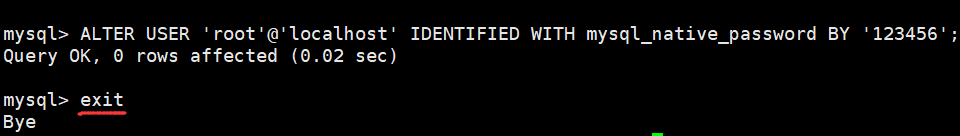
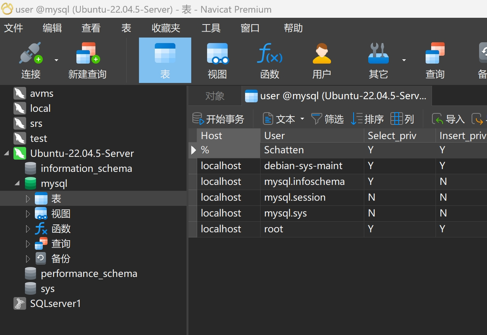
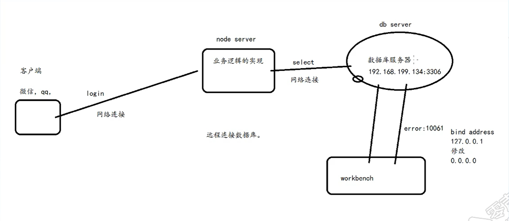
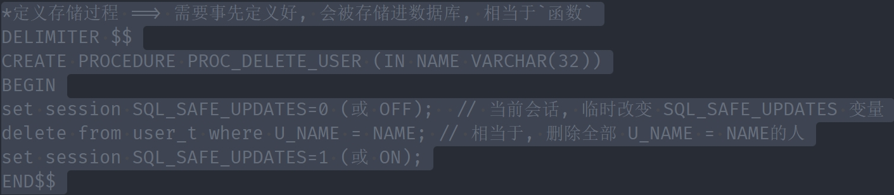
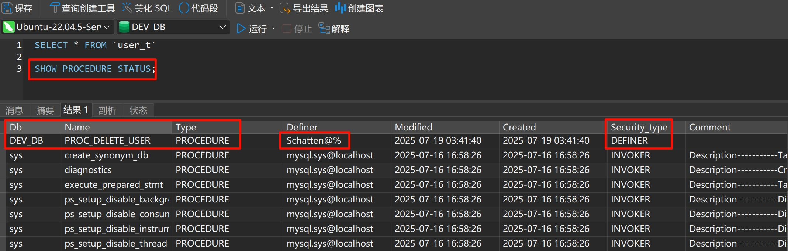
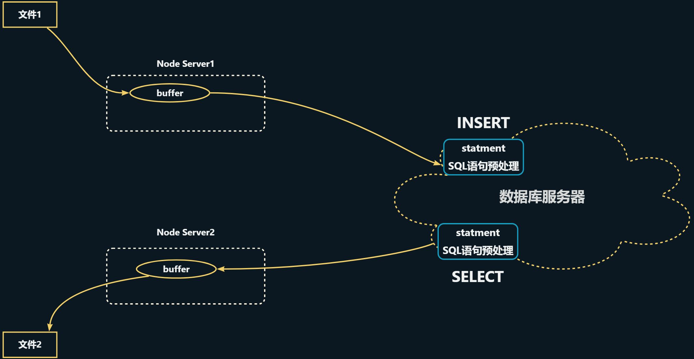

# 0x05-MySQL

[【mysql部署】在ubuntu22.04上安装和配置mysql教程_ubuntu22.04安装mysql-CSDN博客](https://blog.csdn.net/weixin_53459689/article/details/136199813?ops_request_misc=%257B%2522request%255Fid%2522%253A%25222f9adf2d38978862b3ae9153296f98f0%2522%252C%2522scm%2522%253A%252220140713.130102334..%2522%257D&request_id=2f9adf2d38978862b3ae9153296f98f0&biz_id=0&utm_medium=distribute.pc_search_result.none-task-blog-2~all~top_positive~default-1-136199813-null-null.142^v102^pc_search_result_base2&utm_term=ubuntu22.04%E5%AE%89%E8%A3%85mysql&spm=1018.2226.3001.4187)

# Ubuntu 上安装 MySQL
1. 记得 `sudo apt update`
2. `sudo apt install mysql-server `
3. `sudo mysql_secure_installation`, 进入配置页

```bash
# 1.询问是否安装密码插件，我选择 No ==> 不选 No 的话密码最少要8位, 不好记
VALIDATE PASSWORD COMPONENT can be used to test passwords
and improve security. It checks the strength of password
and allows the users to set only those passwords which are
secure enough. Would you like to setup VALIDATE PASSWORD component?
Press y|Y for Yes, any other key for No: n

# 2.为root用户设置密码，不一定提示这个，特别强调不一定提示这个，如果不提示等会再通过mysql无密码进入配置
Please set the password for root here.

New password: 

Re-enter new password: 
#2.1 解决方法详见下一小节，解决bug
 ... Failed! Error: SET PASSWORD has no significance for user 'root'@'localhost' as the authentication method used doesn't store authentication data in the MySQL server. Please consider using ALTER USER instead if you want to change authentication parameters.

# 2.2 解决bug后，重新设置密码
New password: 

Re-enter new password: 

#3.删除匿名用户，我选No
By default, a MySQL installation has an anonymous user,
allowing anyone to log into MySQL without having to have
a user account created for them. This is intended only for
testing, and to make the installation go a bit smoother.
You should remove them before moving into a production
environment.

Remove anonymous users? (Press y|Y for Yes, any other key for No) : n

 ... skipping.

#4.禁止root管理员从远程登录，这里我选 No
Normally, root should only be allowed to connect from
'localhost'. This ensures that someone cannot guess at
the root password from the network.

Disallow root login remotely? (Press y|Y for Yes, any other key for No) : n

 ... skipping.
 
 #5.删除test数据库并取消对它的访问权限， 我选 No
By default, MySQL comes with a database named 'test' that
anyone can access. This is also intended only for testing,
and should be removed before moving into a production
environment.


Remove test database and access to it? (Press y|Y for Yes, any other key for No) : n

 ... skipping.
 
 #6.刷新授权表，让初始化后的设定立即生效, 选 Yes
Reloading the privilege tables will ensure that all changes
made so far will take effect immediately.

Reload privilege tables now? (Press y|Y for Yes, any other key for No) : y
Success.

All done! 

```

**解决配置MySQL中的bug**（在上述操作中如果有问题，比如报错Failed! Error: SET PASSWORD has no significance for user ‘root’@‘localhost’ as the authentication me）

<font style="color:#DF2A3F;">或者不提示输入root密码，则无密码登录msyql，使用命令：</font>

```plain
sudo mysql
```

进入控制台后，修改密码 ，注意改成自己的密码

```plain
# 修改 root密码：ALTER USER 'root'@'localhost' IDENTIFIED WITH mysql_native_password BY 'your_password';
#比如把密码设置为123456

ALTER USER 'root'@'localhost' IDENTIFIED WITH mysql_native_password BY '123456';

```

然后输入 exit 退出 



退出后再使用

`mysql -uroot -p`

根据提示输入刚才配置的密码。

# 远程连接
## 修改 `mysqld.cnf`
`sudo vim /etc/mysql/mysql.conf.d/mysqld.cnf`

找到：

`bind-address = 127.0.0.1`

把它注释掉 → 改为：

`# bind-address = 127.0.0.1`

保存并退出（`:wq`）。

#### 重启 MySQL 使配置生效
`sudo systemctl restart mysql`

---

## 检查 MySQL 是否监听所有 IP
运行：`sudo netstat -tulnp | grep mysql`

如果看到 `0.0.0.0:3306` 或 `:::3306`，说明 MySQL 已经允许远程连接：

```plain
tcp6   0   0 :::3306    :::*    LISTEN    12345/mysqld
```

**<font style="color:#DF2A3F;">如果 </font>**`ubuntu`**<font style="color:#DF2A3F;"> 没有装</font>**`netstat, 可以用`**<font style="color:#DF2A3F;">ss</font>**`**<font style="color:#DF2A3F;">, 更高级</font>**

`ss`<font style="color:#DF2A3F;">（Socket Statistics）是 </font>`netstat 的现代替代工具，性能更好，默认安装在 Ubuntu 22.04 上：</font>

`sudo ss -tulnp | grep mysql`

<font style="color:#DF2A3F;">输出示例：</font>

```plain
tcp   LISTEN 0      151     0.0.0.0:3306     0.0.0.0:*    users:(("mysqld",pid=1234,fd=21))
```

---

## <font style="color:#DF2A3F;">配置 MySQL 用户权限（关键！）</font>
默认情况下，MySQL 的 `root` 用户可能只允许本地登录。你需要 授权远程访问：

### 方法 1：允许 root 远程登录（不推荐，安全性较低）
```plain
-- 登录 MySQL
sudo mysql -u root -p

-- 授权 root 用户从任意 IP 访问（替换 '你的密码'）
CREATE USER 'root'@'%' IDENTIFIED BY '你的密码';
GRANT ALL PRIVILEGES ON *.* TO 'root'@'%' WITH GRANT OPTION;
FLUSH PRIVILEGES;
```

### <font style="color:#DF2A3F;">方法 2：创建专用用户（推荐）</font>
`'%'`<font style="color:#DF2A3F;">: </font>**<font style="color:#DF2A3F;">允许从任意 IP 访问</font>**

`'localhost'`<font style="color:#DF2A3F;">:  </font>**<font style="color:#DF2A3F;">只能从本地访问</font>**

`'xxx.xxx.xxx.xxx'`**<font style="color:#DF2A3F;">: 只允许从特定 IP 访问</font>**

```plain
-- 创建新用户（例如 'remote_user'）并允许从任意 IP 访问
CREATE USER 'remote_user'@'%' IDENTIFIED BY '强密码';  // 创建专属用户
GRANT ALL PRIVILEGES ON *.* TO 'remote_user'@'%';  // 授予新用户高权限
FLUSH PRIVILEGES; // 刷新一下
```

---

## 开放防火墙（如果使用 `ufw`）
```plain
sudo ufw allow 3306/tcp
sudo ufw reload
```

---

## 测试远程连接
从另一台机器尝试连接：

`mysql -h <你的服务器IP> -u remote_user -p`

如果成功，说明配置正确。

**<font style="color:#DF2A3F;">或者直接使用你的数据库客户端工具</font>**



# 开发 --- 知识点记录
## 文本数据
先装这个包: 得以使用 `mysql.h`头文件

`**<font style="color:#DF2A3F;">apt install libmysqlclient-dev</font>**`



### 编译: 
`gcc conn.c -o conn -I /usr/include/mysql/ -lmysqlclient`

### 存储过程
一次性执行多条语句, 相当于`定义了一个函数`, 并且`create`后会被存储到该数据库内





## 图片数据`INSERT`
`write_image --> mysql_write`

### `fopen`中`mode`参数 `+` 作用
**<font style="color:#DF2A3F;">遇到图片数据读/写, 可使用二进制模式:</font>**

+ **<font style="color:#DF2A3F;">eg: </font>**`rb`**<font style="color:#DF2A3F;">, </font>**`wb`**<font style="color:#DF2A3F;">, </font>**`wb+`**<font style="color:#DF2A3F;"> ... </font>**

| **模式** | **原始能力** | **增加 **`**+**`**后的能力** | **文件存在时的处理** | **文件位置** | **典型用途** |
| --- | --- | --- | --- | --- | --- |
| `r` | 只读 | 读写 `r+` | 必须存在，不修改内容 | 文件开头 | 修改现有文件 |
| `w` | 只写 | 读写 `w+` | 截断为0字节 | 文件开头 | 创建/覆盖文件 |
| `a` | 只追加 | 读写 `a+` | 保留内容 | 文件末尾（写）   任意位置（读） | 日志文件 |


### 正常情形下: 文件数据流向图
> `Node Server1`和 `Node Server2`也可能是同一个服务器
>




### 什么是预处理语句（Prepared Statement）
预处理语句是 MySQL 提供的一种高效、安全的 SQL 执行方式，具有以下特点：

1. **SQL与数据分离：**SQL模板与参数值分开处理
2. **预编译：**SQL语句先被数据库解析和编译
3. **参数绑定：**通过占位符（`?`）动态绑定参数
4. **高效复用：**同一语句可多次执行，只需改变参数值

#### `stmt` 的具体作用
在您的代码中，`stmt` 作为预处理语句句柄，承担了以下职责：

1. **"先把SQL模板发给服务器检查"**

```c
mysql_stmt_prepare(stmt, "INSERT INTO images_t VALUES(?)", ...);
```

这里的 `?` 是参数占位符

+ **<font style="color:#DF2A3F;">把这条 SQL 发给 MySQL 服务器做语法/语义检查，生成内部执行计划</font>**
2. **创建参数, 绑定占位符**`?`**：**

```c
MYSQL_BIND param = {0};
param.buffer_type = MYSQL_TYPE_LONG_BLOB;
param.buffer      = NULL;      // 下面用 send_long_data 逐块送
param.is_null     = 0;         // 不是 NULL
param.length      = NULL;      // 也交给 send_long_data 动态决定

mysql_stmt_bind_param(stmt, &param);
```

+ **<font style="color:#DF2A3F;">把上面的 </font>**`param`**<font style="color:#DF2A3F;"> 和 SQL 里的第 1 个 </font>**`?`**<font style="color:#DF2A3F;"> 绑定在一起。</font>**

>     - 现在服务器知道了：  
“一会儿客户端会送一个 LONG_BLOB 过来，但具体字节流请他自己用 `send_long_data` 发”
>

3. **真正地把二进制数据流进服务器**

```c
mysql_stmt_send_long_data(stmt, 0, buffer, length);
```

<font style="color:#DF2A3F;">“分块上传”接口。</font>

+ <font style="color:#DF2A3F;">第 2 个参数 </font>`0`<font style="color:#DF2A3F;">：表示给第 0 号参数（也就是 SQL 里的第 1 个 </font>`?`<font style="color:#DF2A3F;">）</font>
+ `buffer / length`<font style="color:#DF2A3F;">：这次要发的内存块</font>
+ **<font style="color:#DF2A3F;">可以多次调用</font>**<font style="color:#DF2A3F;">，把大文件切成小包慢慢传；这里一次就发完</font>
4. **执行SQL操作：**

```c
mysql_stmt_execute(stmt);
```

服务器收到 `send_long_data` 传完的所有数据后，**<font style="color:#DF2A3F;">执行 </font>**`INSERT`**<font style="color:#DF2A3F;">，把行写进表</font>**

### 为什么使用 `stmt` 而不是直接执行SQL
| **直接执行SQL** | **<font style="color:#DF2A3F;">使用预处理语句</font>**`stmt` |
| --- | --- |
| `mysql_query(handle, "INSERT...")` | `mysql_stmt_prepare()`<font style="color:#DF2A3F;">准备语句</font><br/><font style="color:#DF2A3F;"> + </font>`mysql_stmt_execute()`<font style="color:#DF2A3F;">执行语句</font> |
| 每次都要解析SQL | <font style="color:#DF2A3F;">SQL只需解析一次</font> |
| 容易SQL注入 | <font style="color:#DF2A3F;">天然防注入</font> |
| 处理二进制数据麻烦 | <font style="color:#DF2A3F;">完美支持BLOB</font> |
| 性能较低 | <font style="color:#DF2A3F;">高性能，特别适合重复操作</font> |


## 图片数据`SELECT`
`mysql_read --> read_image`

## 作业: `mysql`连接池
