# 0x08-TCP_server

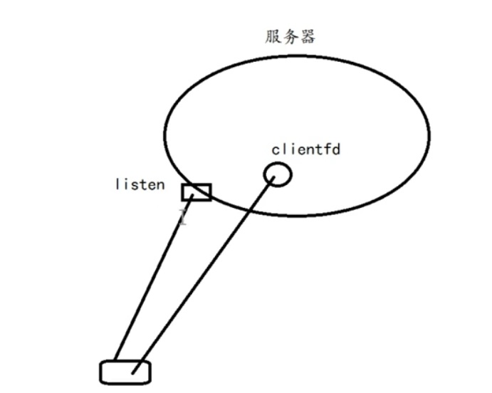

```c
#include <string.h>
#include <stdlib.h>
#include <stdio.h>


#include <netdb.h>
#include <unistd.h>
#include <fcntl.h>

#include <pthread.h>

#include <sys/epoll.h>

#define BUFFER_SIZE 4096
#define EPOLL_SIZE  1024

void* client_routine(void* arg) {
  int clientfd = *(int*)arg;

  char buffer[BUFFER_SIZE] = {0};
  while (1) {
 // 目前的 clientfd : 阻塞 ==> 没有数据就会挂起 , 一直等待
    int len = recv(clientfd, buffer, BUFFER_SIZE, 0);
    if (len < 0) { // 返回-1 出错了

      // 如果是非阻塞, 有以下情况需要判断:  if (erron == EAGAIN || erron == EWOULDBLOCK) 
      close(clientfd);
      break;

    } else if (len == 0) { // 客户端断开连接了 disconnect
        close(clientfd);
        break;

    } else {
      printf("[TID=%lu] Recv %d bytes\nReceive: %s\n", pthread_self(), len, buffer);
    }


  }
}

const char *rsp =
          "HTTP/1.1 200 OK\r\n"
          "Content-Length: 6\r\n\r\n"
          "hello\n";

int main(int argc, char* argv[]) {
  if (argc < 2) {
    fprintf(stderr, "Usage: %s  <port>\n", argv[0]);
    return 1;
  }
  // Usage: ./TCPserver 8888
  unsigned short port = atoi(argv[1]);
  
  // 服务器: 其中迎宾的人 ==> listenfd

  /* 定义迎宾员和迎宾对象的基本信息:  端口号为port */
  int listenfd = socket(AF_INET, SOCK_STREAM, 0);

  struct sockaddr_in addr = {0}; 
  addr.sin_family = AF_INET;
  addr.sin_port = htons(port);  // 确定迎宾人的工位(port)   
  addr.sin_addr.s_addr = INADDR_ANY; // (in_addr_t) 0x00000000 == 0.0.0.0 相当于任意地址都可以绑定

  /* 将迎宾员绑定到她的工位上, 使她能够在此端口进行监听 */
  if (bind(listenfd, (struct sockaddr*)&addr, sizeof(struct sockaddr_in)) < 0) {
    perror("bind failed!\n");
    return 2;
  }

  /* 开始正式工作  */
  if (listen(listenfd, 5) < 0) {  // 迎宾小姐姐最多只能接待 `5个人` 的等候区
    perror("listen failed\n");
    return 3;
  }  

  printf("listening on localhost:%d...\n", port);
  /* 只要有人过来, 就带给内部服务员 => 会建立新的`client_fd`, 这才是真正用来通信的 */

// 接下来, 两种模式: 1.一请求一线程  2.epoll  //
  /* 一请求一线程  (clientfd可以是阻塞的)  */ //==> 已经被弃用了: 一个线程要分配8MB内存, 100w个线程, 根本用不了
#if 0

  while (1) {
    
    /* 新的服务员信息, 先置空, 迎宾员会把信息交接给服务员 */
    struct sockaddr_in client_addr = {0}; 
    socklen_t client_addr_len = sizeof(client_addr);
    
    // accept 会获取客户端的 ip + port, 存进新的 `client_addr` 内
    /* 返回值为新服务员的fd  */
    int clientfd = accept(listenfd, (struct sockaddr*)&client_addr, &client_addr_len);


    pthread_t tid;
    pthread_create(&tid, NULL, client_routine, &clientfd);
  }

  return 0;
  
#elif 1
/*
  #include <sys/epoll.h>
  epoll 是什么 ==> 管理多个 IO, 能够检测到哪一个 IO 来了数据, 从而返回提示
    很多IO ==> 小区住户
  epoll ==> 快递员: 监听小区住户, 谁要收发快递
    
  1# epoll_create() ==> 聘请一个快递员
  2# epoll_ctl()  ==> 住户搬走了/新搬进来一个住户 [添加/关闭 IO]
  3# epoll_wait() ==> 快递员多长时间去一次小区? [带来外面寄进来的快递, 带走寄出去的快递]
*/
    
 // 快递员
  int epfd = epoll_create(1); // `1`: [参数 size] 只要 >0 即可，内核 2.6.8 以后已忽略
// 快递员收发快递的箱子: 存储快递
  struct epoll_event events[EPOLL_SIZE] = {0};  // 这个epoll_event数组用于存放 需要`处理的fd们`
  // 一旦有fd符合事件要求(关心读|写|边缘触发...), 就会放到events这个数组里, 长度也会由wait函数返回回来, 我们需要手动去处理他们

// 接下来将 listen 的 fd 也加入 epoll 管理范围, 
// 这个epoll_event , 单纯是用来告诉epfd快递员, 本次要 ctl 的
  struct epoll_event ev = {0};
  ev.events = EPOLLIN;   // EPOLLIN : 仅关注数据是否来了(关心读) [默认水平触发]  /  EPOLLOUT : 仅关注数据是否要出去(关心写)
  ev.data.fd = listenfd;
// 加入管理范围
  epoll_ctl(epfd, EPOLL_CTL_ADD, listenfd, &ev);

  while (1) {
// 快递员多长时间跑一次小区: 参数(快递员, 箱子, 快递员箱子的大小, 时间间隔)
    int nready = epoll_wait(epfd, events, EPOLL_SIZE, 5); // -1=>无限等待,一直不去   0=>只要有时间就去   N>0: 最多 N ms 去一次, 但只要有数据来, 立刻去
/**
 * epoll_wait: 立即扫一遍“就绪列表”
     ├─ 有事件 → 立刻把结果拷进 events[] → 立即返回
     └─ 没事件 → 把线程挂起，最多挂 timeout 毫秒
         ├─ 这期间任何 fd 就绪 → 提前唤醒
         └─ timeout 时间到 → 返回 0

 * 一句话:: epoll_wait(timeout) = “能立即给结果就马上给；给不了就最多等 timeout 毫秒”。
 */

// 返回需要处理的快递数; 如果没有对应 events 事件 的 IO, 返回-1
    if (nready == -1) continue;   // 就继续等
    
    for (int i = 0; i < nready; i++) { // 遍历快递员的袋子, 都处理一下
      // 区分: listenfd=>用 accept 处理    clientfd=>用 recv 处理
      if (events[i].data.fd == listenfd) { // listenfd
        struct sockaddr_in client_addr = {0};
        socklen_t client_addr_len = sizeof(client_addr);

        // 交接给新创建的 clientfd 
        int clientfd = accept(listenfd, (struct sockaddr*)&client_addr, &client_addr_len);  
        fcntl(clientfd, F_SETFL, O_NONBLOCK);
        // 新的 clientfd 需要被加入 epoll 管理范围内 (重复使用 ev 进行迎接新住户, ev 作为新住户的箱子)
        ev.events = EPOLLIN | EPOLLET; // 既想监听读，又想用边缘触发 (水平触发是默认的)
        /*
         边缘触发: 要求必须一次性读完所有数据 ==> [while(1)循环 recv 直到返回 EAGAIN] ==> 性能会高一点 
         必须保证一次读完 ==> 使用while(1), 通过判断 errno == EAGAIN 保证读完, 才跳出 recv 循环
         水平触发: 无所谓, 可以不循环recv ==> 可以不读完, 留给下次读也没事儿, 因为下次epoll还会提醒有剩余数据, 当然, 循环读完就和边缘触发好像没什么区别
        */
        
        ev.data.fd = clientfd;
        epoll_ctl(epfd, EPOLL_CTL_ADD, clientfd, &ev); 
      } else { // 不是listenfd, 那就是clientfd

        int clientfd = events[i].data.fd;   // events内, 当前要处理的是clientfd
        char buffer[BUFFER_SIZE] = {0};

 
      // 目前的 clientfd : 阻塞 ==> 没有数据就会挂起 , 一直等待
        int len = recv(clientfd, buffer, BUFFER_SIZE, 0);
        if (len < 0) { // 返回-1 出错了

          // 如果是非阻塞, 有以下情况需要判断:  if (erron == EAGAIN || erron == EWOULDBLOCK) 
          close(clientfd);
          ev.events = EPOLLIN | EPOLLET;
          ev.data.fd = clientfd;
          epoll_ctl(epfd, EPOLL_CTL_DEL, clientfd, &ev);
          
        } else if (len == 0) { // 客户端断开连接了 disconnect
          close(clientfd);
          ev.events = EPOLLIN | EPOLLET;
          ev.data.fd = clientfd;
          epoll_ctl(epfd, EPOLL_CTL_DEL, clientfd, &ev);
          
        } else {
          printf("[TID=%lu] Recv %d bytes\nReceive: %s\n", pthread_self(), len, buffer);          
          // send(clientfd, rsp, strlen(rsp), 0);

          // close(clientfd);
          // ev.events = EPOLLIN;
          // ev.data.fd = clientfd;
          // epoll_ctl(epfd, EPOLL_CTL_DEL, clientfd, &ev);

        }

      }


    }


  }

 
 #endif
}
```
# `epoll`运行结果
超出一次读取的缓冲区, 就会分开读取

### 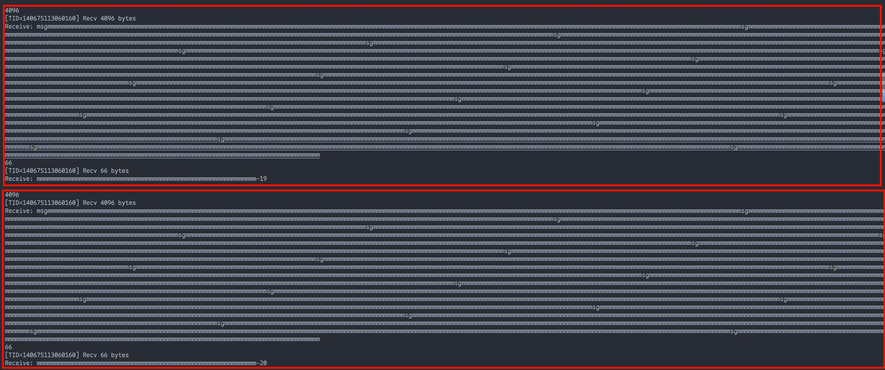
# 多虚拟机向server进行`nc`, `curl`没有回显
`ufw allow 8888/tcp`立刻解决

# 单个进程已把系统/用户的文件描述符（fd）上限打满
+ <font style="color:#DF2A3F;">1024左右</font>

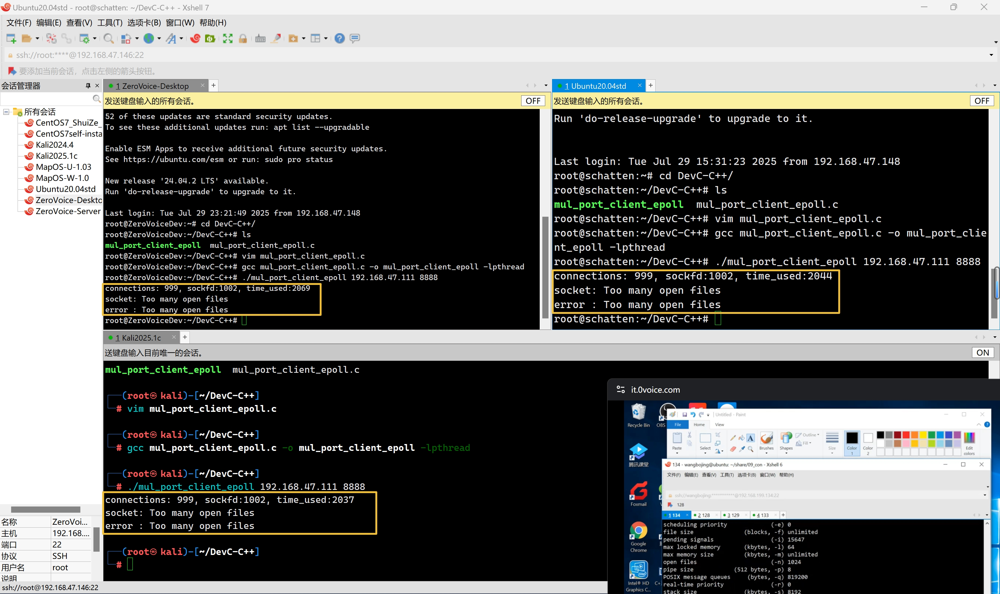

## 解决方案
**服务器和客户端都要改!!!**
- **临时修改:** `ulimit -n 1048576`
- **永久修改:**
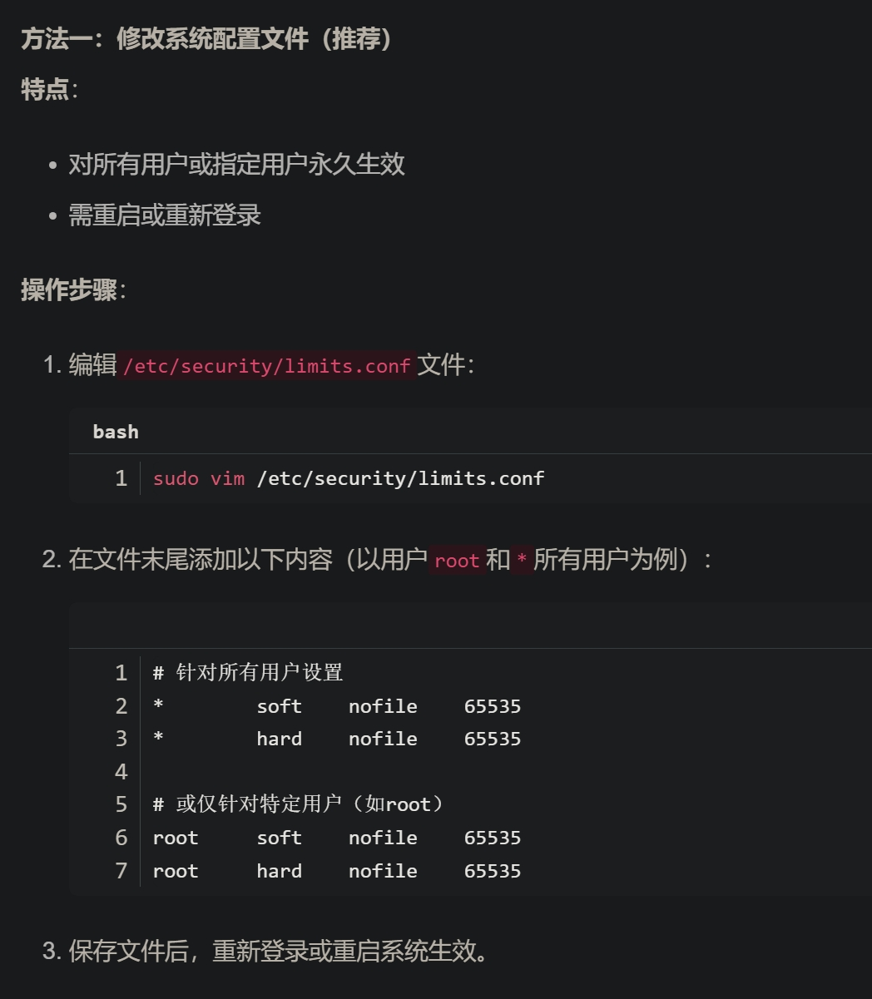

问题出在软限制: 只有1024 ** [硬限制: 很高, 够用了]</font>**

| **选项** | **含义** | **默认数值** | **作用** |
| --- | --- | --- | --- |
| `ulimit -Sn` | **soft limit**（软限制） | **1024** | 普通会话实际生效的上限，**可以临时提高** |
| `ulimit -Hn` | **hard limit**（硬限制） | **1048576** | **系统/管理员设定的绝对天花板**, 普通用户不能超过它 |


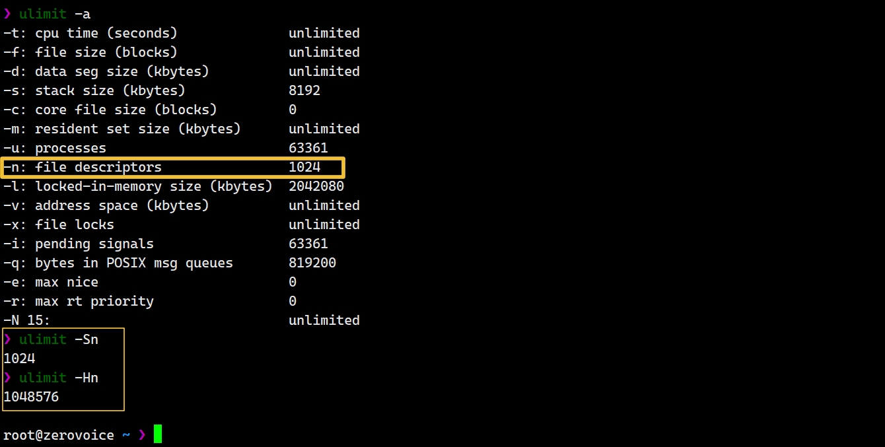

# connect错误: cannot assign requested address
+ <font style="color:#DF2A3F;">地址用完了, 没法再分配了</font>

一个`socket fd`, 与一个<u><font style="color:#DF2A3F;">会话五元组</font></u>一一对应 

> `src_ip`, `src_port`, `dst_ip`, `dst_port`, `protocol`
>

其中, 两个IP是固定的, 对于`dst_port == 8888`, `src_port`最多仅有约`28k`个可以使用

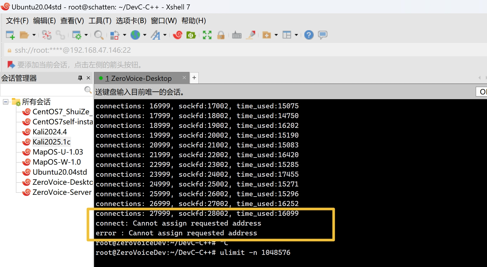

**客户端** 调用 `connect()` 时，内核自动从 **源端口池(32768-60999)** 挑一个随机端口

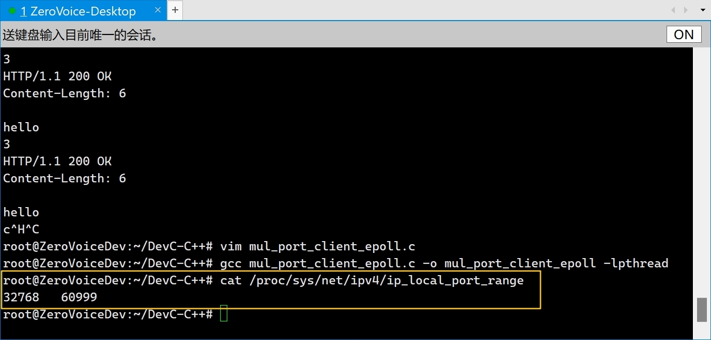

## 解决方案
客户机扩大源端口范围

**<font style="color:#DF2A3F;">服务端监听更多端口</font>**

# 客户机掉线 (ping不通)
限制连接速率 --- `usleep(1 * 1000)`

# 高并发下, `connect`超时
1. `cat /proc/sys/fs/file-max` 这个值

`9223372036854775807`

> `/proc/sys/fs/file-max`是整个 Linux 系统 能同时打开 所有文件、套接字、管道等描述符 的 全局硬上限
>
> **(我的三台Debian: 都默认**`9223372036854775807`**)**
>

2. `cat /proc/sys/net/nf_conntrack_max`这个值, 一般是需要改的

**<u>Linux 防火墙/ NAT 模块 里 “连接跟踪表” 的最大槽位数</u>**

**我的server端: 262144    ---> 可能造成连接瓶颈**

> `/proc/sys/net/nf_conntrack_max` 表示当前系统能够跟踪的最大连接数，是 Linux 内核中连接跟踪系统的一个关键参数。当系统的跟踪表达到这个最大值时，新的连接将无法被跟踪，从而可能成为连接的瓶颈
>

**检查模块是否加载:**

```bash
lsmod | grep nf_conntrack
```

+ `/proc/sys/net/nf_conntrack_max` 不存在
    - 说明没有加载 `nf_conntrack` 模块, 此时超时原因不是这个值
    - 可以使用命令`modprobe nf_conntrack`, 临时手动加载

**临时修改:**

```bash
sysctl -w net.netfilter.nf_conntrack_max=1048576
```


**注: 正常情况下**

1. 不会在同一台服务器上开这么多端口去监听, 而是采用负载均衡, 服务端内核防火墙不会有这么多压力
2. 单个客户端一般也不会发出这么多长连接, 主要关注服务端的防火墙的 `nf_conntrack_max`


# 永久修改系统参数
在`/etc/sysctl.conf`下面添你修改的值

```bash
# 系统 fd 硬上限
fs.file-max=9223372036854775807
# 最大追踪连接数
net.netfilter.nf_conntrack_max=1048576

# 内存管理
net.ipv4.tcp_mem = 1572864 2097152 4194304    # 6GB / 8GB / 16GB
net.ipv4.tcp_rmem = 4096 8192 16777216        # 4KB / 8KB / 16MB
net.ipv4.tcp_wmem = 4096 8192 16777216        # 4KB / 8KB / 16MB

# 使 /etc/sysctl.conf 更改生效
sysctl -p   
```

# 百万并发达成✌️--- 系统默认`tcp`内存参数
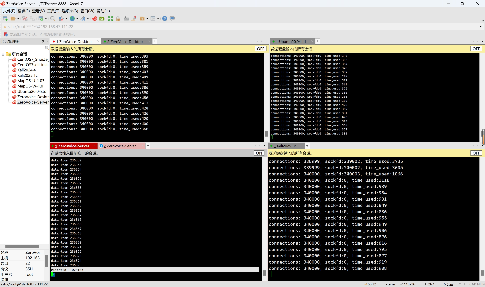

## top 分析
+ **内存用量约**`3.63 GB`

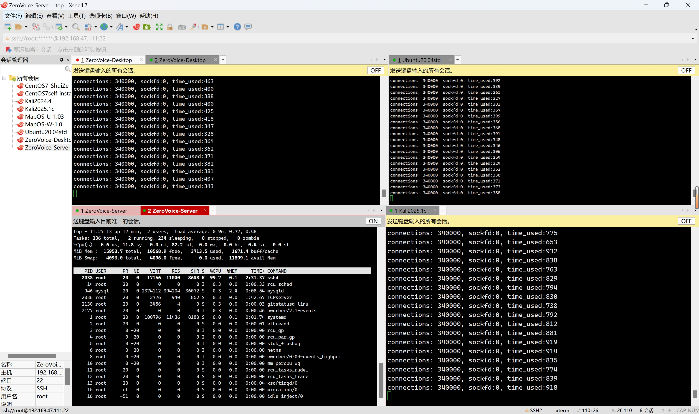

# 内存管理: 调参 ---- 尝试减少内存占用
+ `tcp_mem`：整个 TCP 协议栈可用的总内存
+ `tcp_rmem`：每个 TCP 连接的接收缓冲区
+ `tcp_wmem`：每个 TCP 连接的发送缓冲区
+ 我的 16GB 服务器需要预留：
    - 系统运行：2GB
    - 应用内存：2GB
    - TCP 专用：12GB
+ <font style="color:#DF2A3F;">设置原则：high ≤ 总内存 × 80%</font>

```plain
net.ipv4.tcp_mem = 1572864 2097152 4194304    # 6GB / 8GB / 16GB
net.ipv4.tcp_rmem = 4096 8192 16777216        # 4KB / 8KB / 16MB
net.ipv4.tcp_wmem = 4096 8192 16777216        # 4KB / 8KB / 16MB
```

## 1️⃣`net.ipv4.tcp_mem` —— 整个 TCP 内存大水池
```plain
low        pressure      high
188898     251864        377796   (单位：4 KB 页)
≈ 740 MB   ≈ 987 MB      ≈ 1.48 GB
```

| **<font style="background-color:rgba(255, 255, 255, 0);">内存水位</font>** | **<font style="background-color:rgba(255, 255, 255, 0);">内核行为</font>** |
| :---: | :---: |
| **<font style="background-color:rgba(255, 255, 255, 0);">< low</font>** | <font style="background-color:rgba(255, 255, 255, 0);">自由分配</font> |
| **<font style="background-color:rgba(255, 255, 255, 0);">> pressure</font>** | <font style="background-color:rgba(255, 255, 255, 0);">压缩缓冲区，丢弃可选数据包</font> |
| **<font style="background-color:rgba(255, 255, 255, 0);">> high</font>** | <font style="background-color:rgba(255, 255, 255, 0);">拒绝新连接，强制回收内存</font> |


## 2️⃣ `net.ipv4.tcp_rmem` —— 单条连接的接收桶
```plain
min      default       max
4096     131072        6291456   (字节)
4 KB     128 KB        6 MB
```

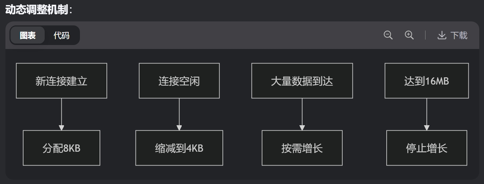

## 3️⃣ `net.ipv4.tcp_wmem` —— 单条连接的发送桶
```plain
min      default       max
4096     16384         4194304   (字节)
4 KB     16 KB         4 MB
```

+ 设计原则同 `tcp_rmem`
+ **关键区别：**
    - **写缓冲区**更易触发阻塞
    - 最大值16MB适应大文件传输

# 第二次百万并发✌️--- 上述调整后的`tcp`内存管理
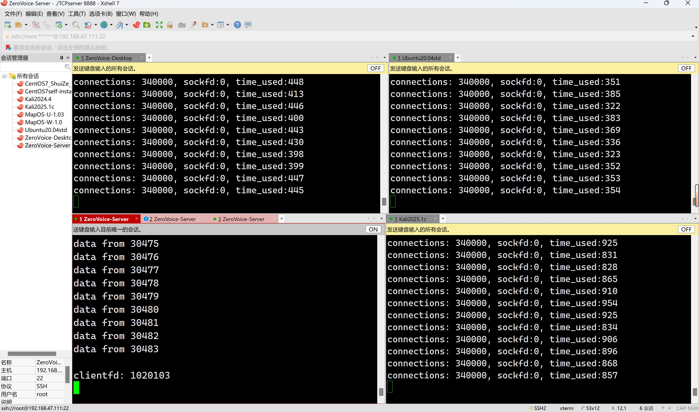

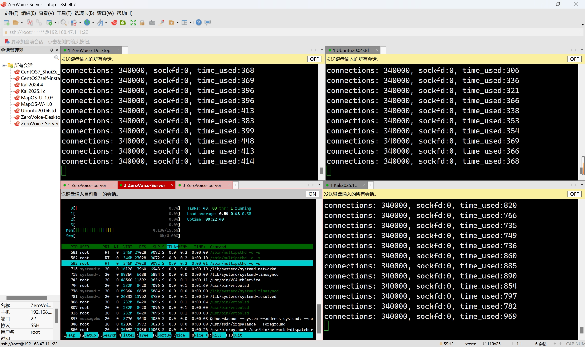

## htop分析
+ **绿色条：** 应用程序实际使用的内存
+ **蓝色条：** Buffers
+ **橙色/黄色条：** Cache

总内存用量(绿色部分) `4.13GB`, 比内存调参前的`3.63 GB`增加了`0.5 GB`, 增长约`14%`内存用量

+ 平均每条连接: `4.33KB`

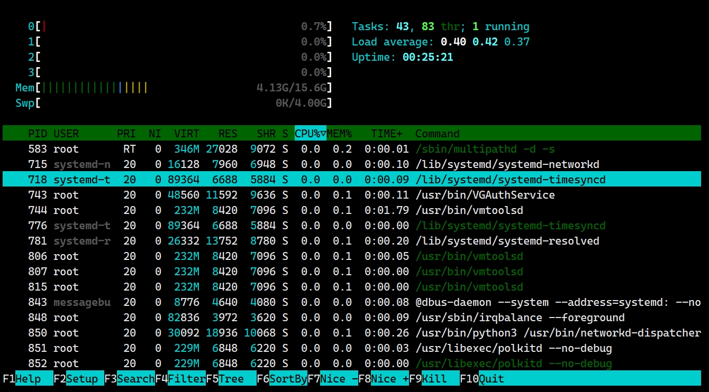

## 💥<font style="color:#DF2A3F;">断开连接 : CPU爆红
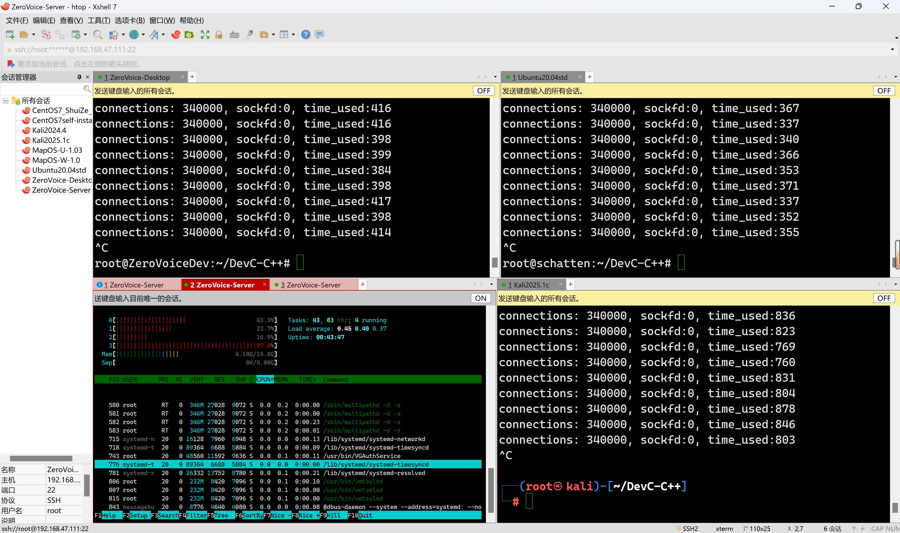

# 第三次百万并发: `tcp`内存参数为系统默认值
内存用量: `3.64GB`, 平均每条连接仅占用 `3.8KB`

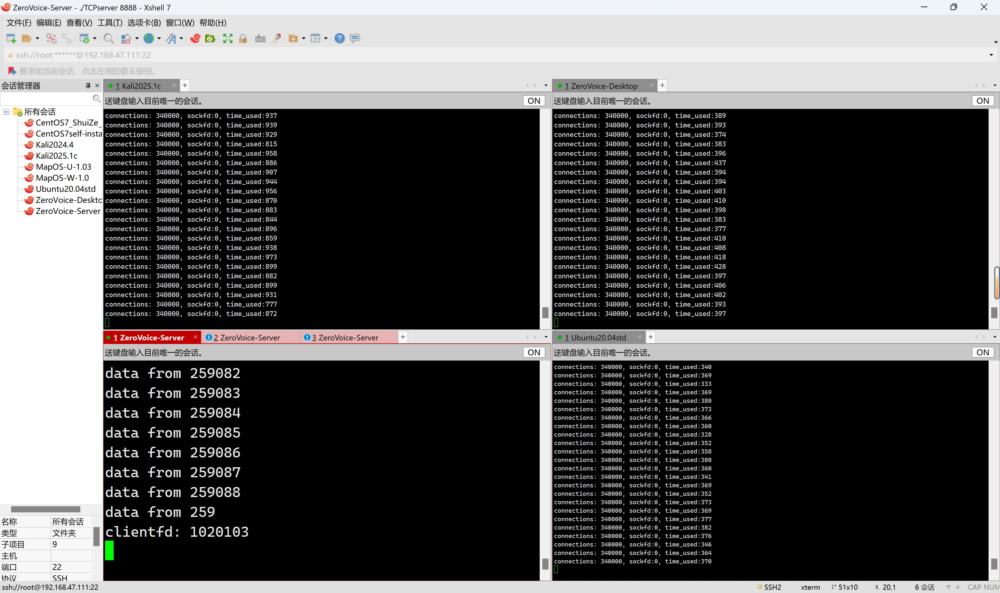

## htop
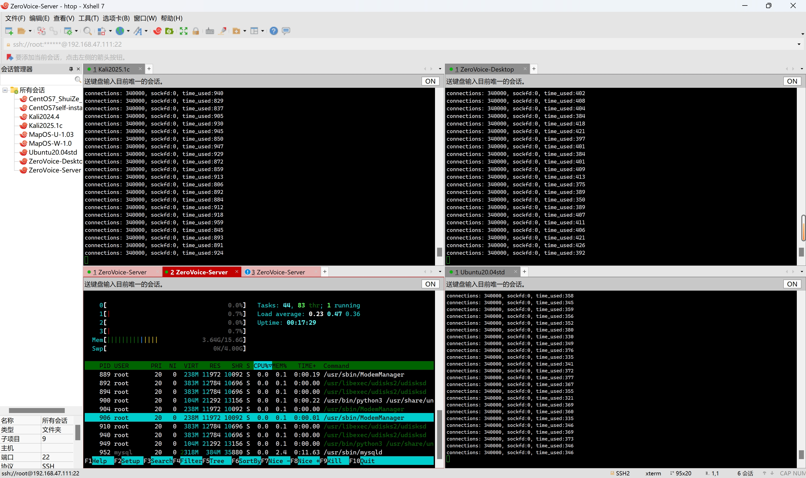

## top
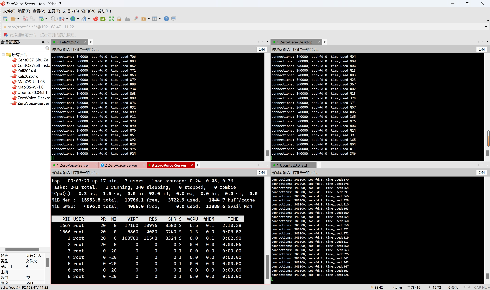
