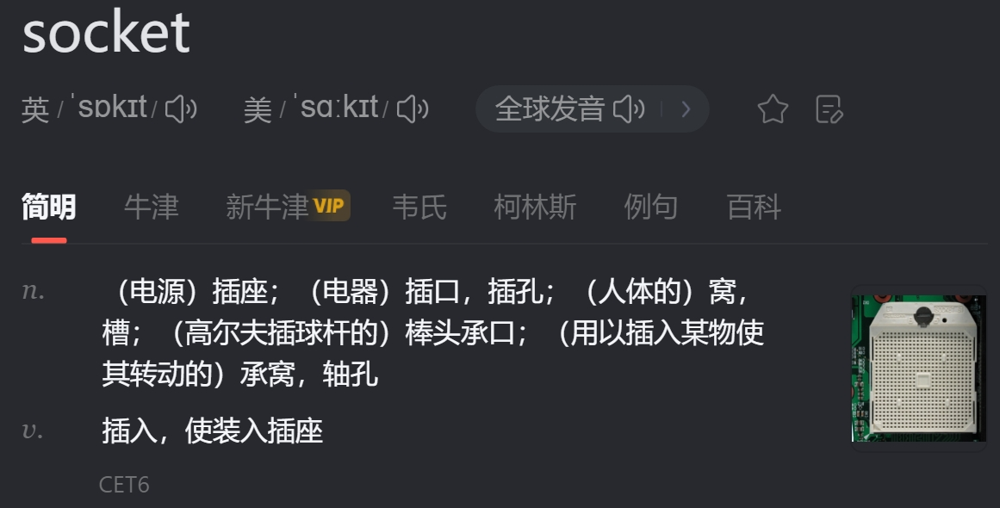
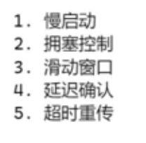
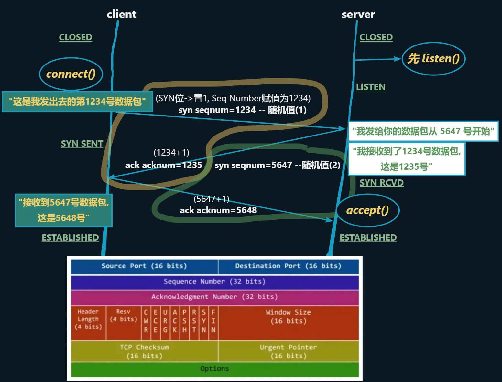
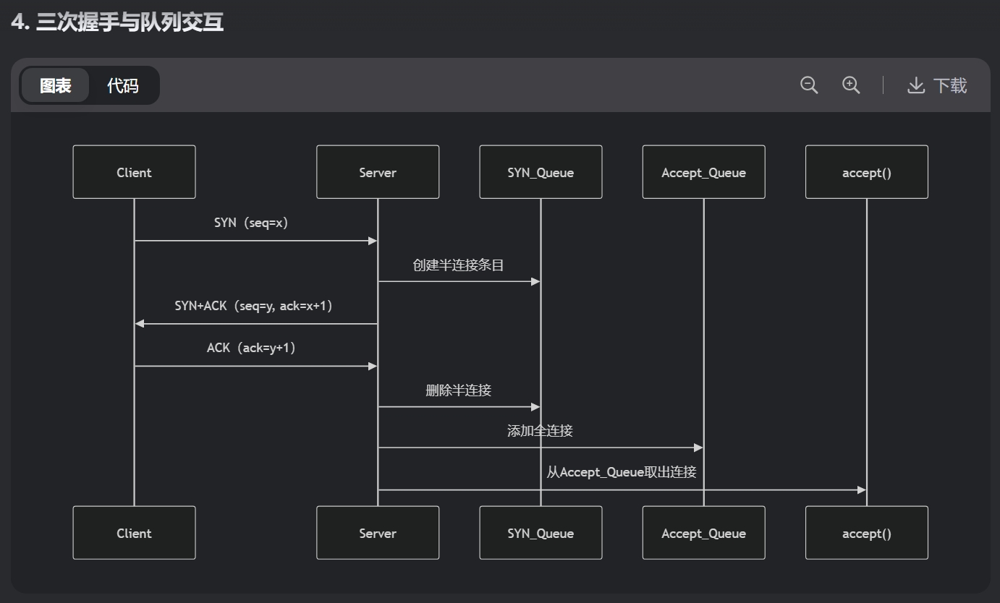
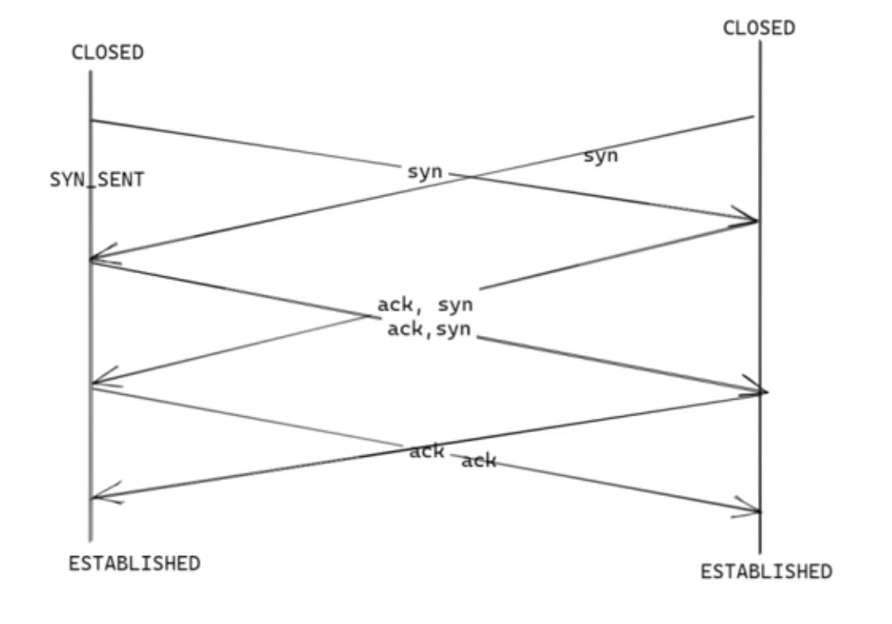
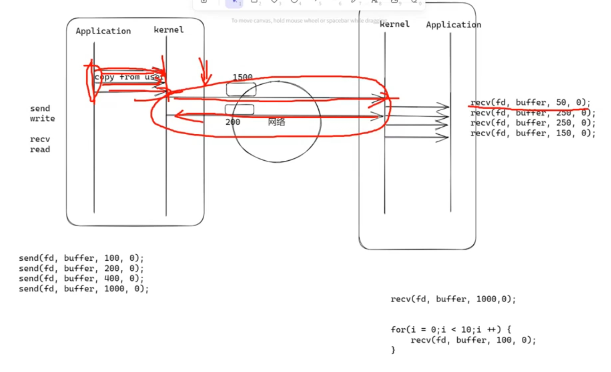
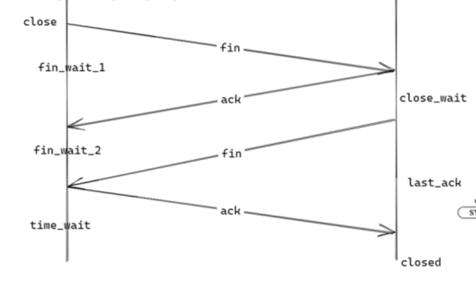
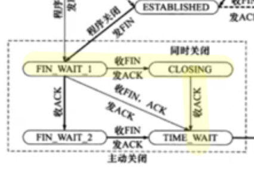
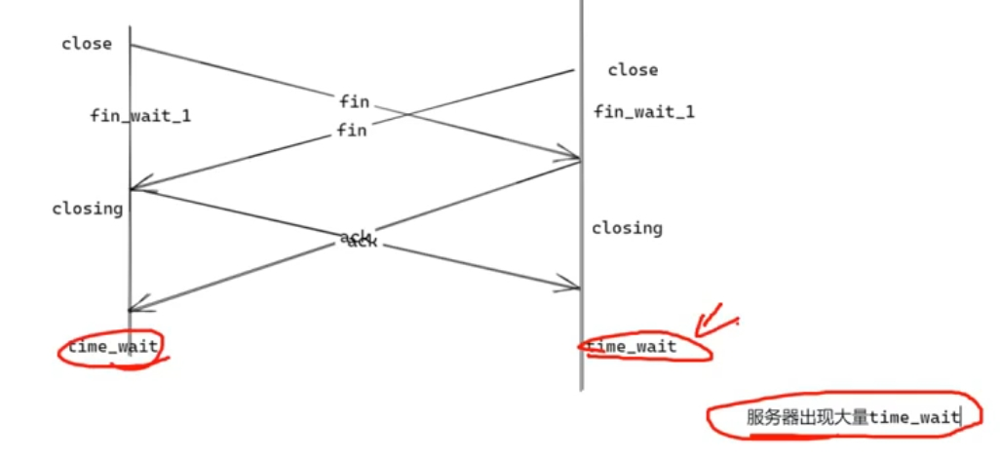

# POSIX API

# 服务端
## socket()
### Socket基础概念
**核心作用：**

+ 进程间通信（尤其是跨网络通信）的端点（Endpoint）
+ 支持多种协议（TCP/UDP/Unix Domain等）



### `socket()`功能
#### 分配 `int fd`
当前进程, 最小可用的非负整数 `0, 1, 2: 默认被占用` 

#### 分配TCP控制块 --- `TCB`
### 面试重点：
```c
int socket(int domain, int type, int protocol);
```

+ `domain`：地址族（`AF_INET`/`AF_INET6`/`AF_UNIX`--本地通信 ）
+ `type`：服务类型（SOCK_STREAM/SOCK_DGRAM）
+ `protocol`：通常填0（自动选择）

## bind()
```c
bind(int sockfd, const struct sockaddr *addr, socklen_t addrlen)
```

给`socket()`创建的`fd`分配一个本机地址 `ip:port`

+ **面试考点：**`sockaddr_in`结构体填充

```c
struct sockaddr_in serv_addr;
memset(&serv_addr, 0, sizeof(serv_addr));
serv_addr.sin_family = AF_INET;
serv_addr.sin_addr.s_addr = htonl(INADDR_ANY); // 监听所有IP
serv_addr.sin_port = htons(8080);              // 端口号

// 使用的时候需要强制转换
bind(listenfd, (struct sockaddr*)&serv_addr, sizeof(serv_addr));
```

> `htonl(): host to net [uint32_t]` 将无符号整数`hostlong`从主机字节序转换为网络字节顺序
>
> + `ipv4`地址刚好 32 位
>
> `htons(): host to net [uint16_t]`将无符号短整数`hostshort`从主机字节序转换为网络字节序
>
> + 端口个数`65535`刚好 16位无符号整型 可以表示
>

## listen()
`tcb`状态从: `CLOSED`--->`LISTEN`, 允许三次握手

+ **面试考点：**`backlog`参数含义（已完成连接队列的最大长度）

### 三次握手
**<font style="color:#DF2A3F;">不丢失+不重复+不乱序</font>**





### 全连接队列（Completed Connection Queue）
+ **定义：**当TCP三次握手完成后，但尚未被应用程序通过`accept()`取走的连接会进入全连接队列（也称为**ACCEPT**队列）。
+ **作用：**
    - 暂存已完成握手的连接
    - 作为应用层`accept()`调用的连接池
+ **队列大小：**
    - 由`listen(fd, backlog)`的`backlog`参数决定
    - Linux内核2.2+后实际值为`min(backlog, net.core.somaxconn)`

即可以通过`listen`设置全连接队列长度 ---> 上限是`SOMAXCONN`

> - 经过 Linux 多年迭代: 
> - `backlog`的含义 : `SYN 队列长度`→ `SYN队列+ACCEPT队列长度` → `ACCEPT`队列长度
> - 查看系统限制：`sysctl net.core.somaxconn`
> - 宏: `SOMAXCONN`

###  半连接队列（SYN Queue）
+ 定义：当服务器收到SYN包并回复SYN+ACK后，连接进入半连接队列（也称SYN队列）。
+ 状态：`SYN_RECEIVED`
+ 队列大小：由`net.ipv4.tcp_max_syn_backlog`控制



### 特殊三次握手 --- P2P
+ Peer-To-Peer

发送 SYN 包 之后 收到 SYN 包

此时没有 `client, server` --> **<font style="color:#DF2A3F;">双方平等, 去中心化</font>**



#### 应用场景 --> 物联网
**EG : 手机控制家电**

+ 使用 `P2P`, 无需经过中间的厂商服务器
+ 手机直接与家电通信, 方便快捷, 数据安全


## accept()
**面试考点：返回的是新socket描述符，原监听socket继续使用**

**Q: 为什么连接成功但accept()阻塞？**

**A: 检查全连接队列是否溢出：**

```bash
# Linux监控命令
netstat -s | grep "listen queue"
ss -lnt | grep 8080 # (推荐)
```

**Q：如何避免SYN Flood攻击？**

**A：**

1. **启用SYN Cookie**
2. **减小**`net.ipv4.tcp_synack_retries`
3. **限制半连接队列大小**

## recv() + send()
- send() : copy from user  `user`→`kernel`

- recv() : copy to user   `kernel`→`user`

MTU: 最大传输单元 `kernel -> kernel 单个包最大的大小`

`recv(1000)`和 循环5次 `recv(200)`性能差别不大



## close()
### 功能
1. 回收`fd`
2. 发送`fin`包 --> `FIN`位 为 1 的空包

> `close()`本质还是一个`send`, 只不过`send`的是`FIN`空包
>
> + 可以和别的包放在同一个 MTU 内传过去, 但是会让`recv`多触发一次 --> 返回 0
>

### 四次挥手
只有`主动方与被动方`, 不分`client server`



### 特殊情况
#### 左边没收到 ack 却先收到了 fin
1. 进入 CLOSING 状态
2. 收到 ack 后直接 TIME-WAIT



#### 双方同时`close()`
1. 也是相当于  发完了fin就收到了fin --> 进入 CLOSING
2. 收到 ack 后直接 TIME-WAIT



# 客户端(略)
## socket()
## bind()
## connect()
## close()
## send()
## recv()
