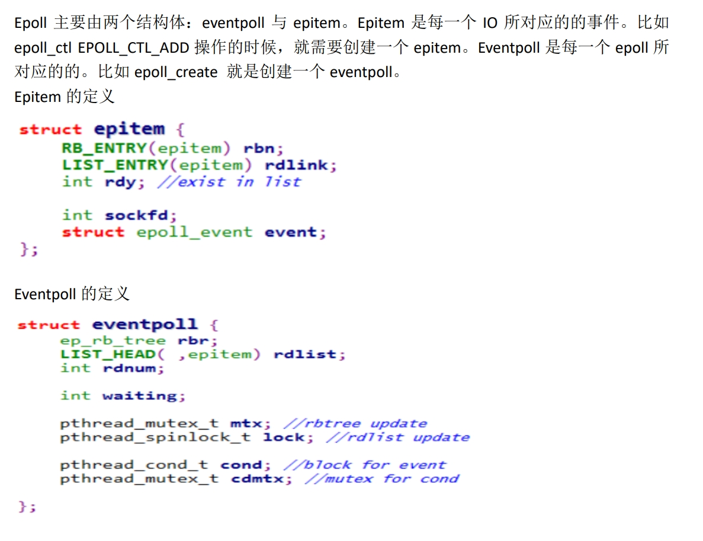
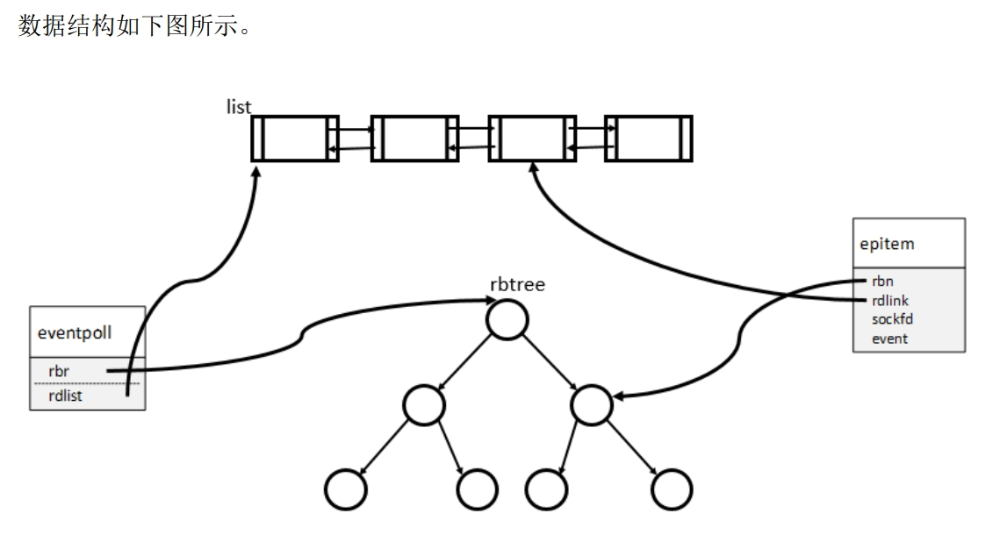
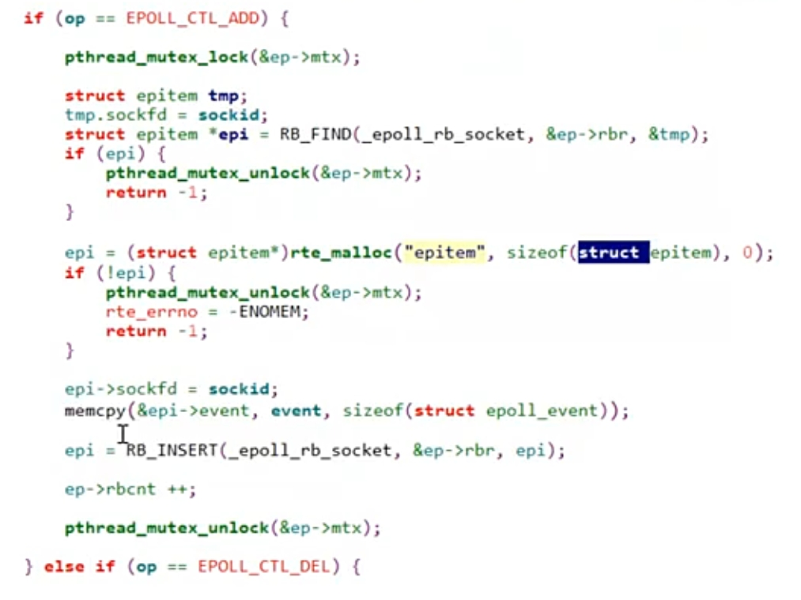
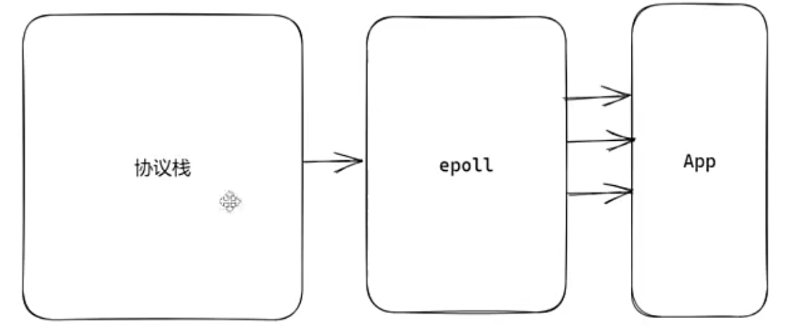

# epoll 实现原理

# 红黑树 和 队列
> '2 + 2' : 两个**结构体**, 两个**数据结构**
>

**epitem 结构体 : 描述每一个节点 (既是红黑树的节点, 又是就绪队列的节点)**

+ 即使添加到就绪队列, 也没有从整集中移除 ---> `节点`** 由 **`红黑树`** 和 **`队列` 共用**

**eventpoll 结构体 : 整集, 描述整棵红黑树**

+ `rbr`: 红黑树 根节点
+ `rdlist`: 就绪队列首节点

看上去 List 和 RB tree 是两个数据结构, **实则二者的节点是共用的**

# epoll_create / ctl / wait 分别实现
> epoll 函数 : '3 + 1'
>
> + 三个对外的接口
> + 一个对内 -- epoll_callback
>

## epoll_create
1. **创建一个 **`**struct eventpoll**`
2. **为**`**epollevent**`这个结构体分配一个`**epfd**`

## epoll_ctl
ADD : 如果事件存在, 直接返回 (已存在)

DEL : 如果存在, 直接删除, 如果不存在, 返回 (不存在)

MOD : 查找, 重新赋值

## epoll_wait
**参数 :**

**epfd, event, length, timeout**

#### timeout < 0 --> 一直等待
**pthread_cond_wait()**

+ **就绪队列非空的时候 **`pthread_cond_signal()`唤醒一下

#### timeout != 0 --> 等待固定长度事件
**pthread_cond_timedwait()**

#### timeout == 0 --> 不用等待, 立刻返回

# 协议栈如何通知到 epoll 模块
> epoll 函数: '3 + 1'
>

## epoll_callback
1. **三次握手完成时, 调用一次:**
+ `epoll_event_callback(table->ep, listener->fd, EPOLLIN)` 通知: ** listenfd 触发一个 EPOLLIN 事件 **
2. **数据来临时 （PSH 包）, 调用一次**

通知 fd 触发一个 EPOLLIN

3. **接收到 FIN 包的时候, 调用一次**

通知 fd 触发一个 EPOLLIN
