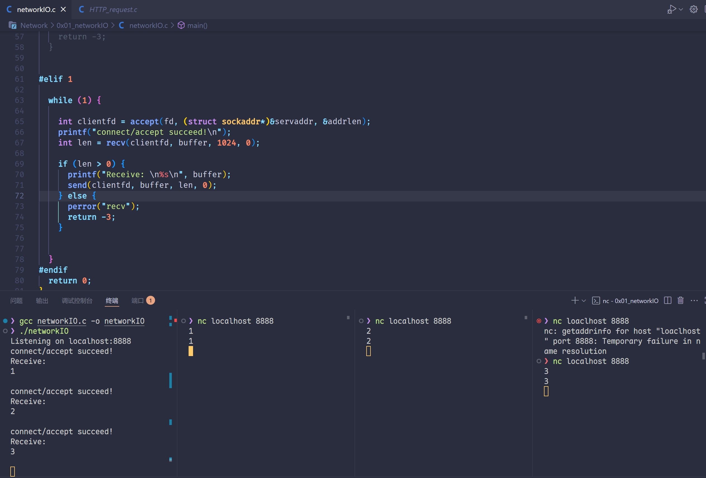
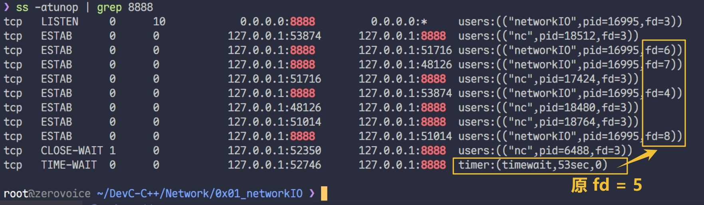
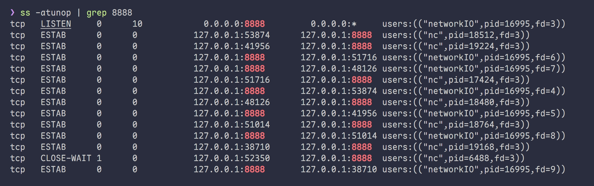
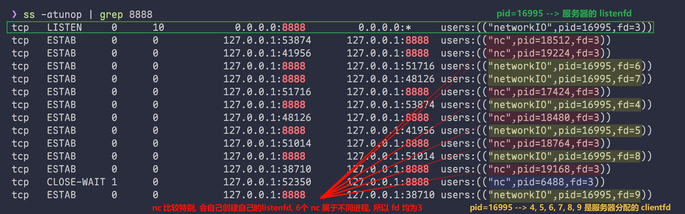

# select/poll/epoll

# 网络的应用
1. 使用微信的时候，发送文字，发送视频，发送语音，与网络 io 什么关系
2. 抖音的视频资源，如何到达你的 App
3. `github/gitlab`，`git clone`，为什么能够到达本地
4. 共享电动车能够开锁
5. 通过手机操作你家的空调

# 一请求一线程由浅入深
## while(1)内先 `accept` 后 `recv`
下图中: 

+ 连接顺序:  1 --> 2 --> 3
+ 发送数据顺序:  3 --> 2 --> 1

结果: 

+ '1' 先连接, '2', '3' 也能建立 tcp 三次握手, 已经在内核中排队 ---> 即  `listen`  的等待队列 
+ '2', '3' 的连接在内核中等待, 发送的数据暂时不能接收 
+ `recv`  掉 1 号 IO 的数据后, listen 员  `accept`  后回来继续监听, 发现有人排队, 立刻将 '2' `accept`
+  又发现 '2' 早早发了数据, 正堵在  2 号 IO 的出口, 于是立即  `recv`
+  [ '3' 同理  ] 



## 一请求一线程
# `ss` 命令使用
## 看 `TIME-WAIT` 和连接状态
```c
ss -atunpo | grep TIME-WAIT
```



> [!Note] 
>
> **TIME-WAIT 是什么?**
>
> `close(fd)` 后,  `fd/会话五元组` 进入 `TIME-WAIT` 状态: 
> 新 `fd` 不能以这 5 个值作为五元组 --> 即 `fd` 仍然处于被占用的状态
> 一段时间后会自动解除 --> 可以自行设置
## 只看监听状态

+ 加一个 `-l` ---> 只看正在被监听的端口

```c
ss -atulnpo | grep <port>
```

---

## 实战分析

###  先说结论

1. `nc` 会自己创建 `listenfd` , 自己监听
2. 不同进程有各自的文件描述符表  `fd表`  , 可能会出现多个 `fd = 3` 的情况
    - 即每个进程重新取最小的值作 `fd`
3. 注意到有一个 CLOSE-WAIT  --> 没有进行完整的 TCP 四次挥手 



### 分析


### 什么时候会 `CLOSE_WAIT` 一直不消失？
+  你的服务器程序没有检测到对端关闭；
+  或者检测到了但没有调用  `close()` ；
+ 比如：
    - `recv()` 返回 0 时你没有 close；
    - 线程异常退出，没有走到 `close()`；
    - 你把 `clientfd` 传给了线程，但线程没及时 close；
    - 或者你把 `close()` 写在了永远不会执行的代码路径里；

# 事件驱动 `Reactor`
## `select`
#### 📒 笔记都在代码里
#### 重点 1: `fd_set` 的本质
+ 一个 `bit位集合`/`bit-mask` 位图, 字节数为 `宏 FD_SETSIZE 1024`
+ 第 fd 个字节, 有 0/1 两种状态 ==> 最多能监控 1024 个 fd

#### 重点 2: `select` 的缺点
+ 拷贝到内核, 让它线性遍历  (不如 epoll: 无拷贝, 无线性遍历)  
+ 修改 `fd_set` : 虽然有的 fd 事先 FD_SET 置 1 了, 但如果被 `select` 发现并未就绪,  会被置 0
    - 所以要设置一个用于承受修改的 fd_set 副本, 不然就被 `select` 改乱了

`fd_set`  会被  `select`  修改, 建议使用下面的方式: 创建  `rset`  副本, 在循环内承受  `` 修改之痛 ``

```c
/**
 * select 参数: 
 *  1. maxfd+1 => 用于判断遍历到哪个数为止 (fd 相当于位图中的索引, 值为 1/0) ==> 位图 bit-mask
 *  2. &read_fdset  ==>  检测到 `可读` 的 fd, 会将 set 中对应元素置 1
 *  3. &write_fdset ==>			`可写`
 *  4. &except_fdset ==> 		`异常`
 *  5. &timeout => {x, y}-->(x 秒+y 微秒) 超时时间的地址 (NULL 表示可以一直等) 
 * 返回值: 事先 FD_SET 的 fd 中, 真正就绪的 fd 个数
 
 * select 完整工作原理: 
 *  a. 事先要手动 FD_ZERO + FD_SET, 然后 select 将三个 fd_set 从用户空间拷贝到内核空间
 *  b. 内核从 0 开始线性遍历, 重点关注那些事先置 1 的 fd 位, 等待其中出现第一个真正就绪的 fd
 *  c. select 会自行修改 fd_set: 等到的真正就绪的仍然是 `1`, 其余 fd 都清零
 *  d. timeout == {0, 0} 立即返回 | timeout == NULL 一直等待
 * 
 * 各种宏
 *   FD_SET    fd 位 置为 1 ==> 告诉 select 对应 fdset 的哪些 fd 需要监控
 *   FD_ISSET  fd 位 检测是否为 1  
 *   FD_CLR    fd 位 置为 0
 *   FD_ZERO   所有位清零
 */

  // fd 集合: fd 为下标, 值为 0/1, 默认长度 FD_SETSIZE 1024 (最多支持 fd = 1023)
  fd_set mainfds, rset; // 创建一个 rset, 用来当副本, 防止 select 直接修改 mainfds
  struct timeval tv = {5, 0}; // timeout == 5s
  // 清空
  FD_ZERO(&mainfds);
  // 将 listenfd 添加到集合里
  FD_SET(fd, &mainfds);
  // 最大的 fd
  int maxfd = fd;
  socklen_t addrlen = sizeof(addr);
  while (1) {
    // 每一轮都要初始化为上一轮积累好的 mainset: 积累什么? ==> 积累 clientfd
    rset = mainfds;
    // 开始扫荡, 要么是 fd 来新连接了, 要么是 clientfd 来新数据了
    int nready = select(maxfd + 1, &rset, NULL, NULL, &tv);

// 分别处理即可
    // |>: 先看看有没有 listen 到新连接, 有就分配 clientfd
    if (FD_ISSET(fd, &rset)) { 
      int clientfd = accept(fd, (struct sockaddr*)&addr, &addrlen);
      printf("accept/connect succeed!\nclientfd: %d\n", clientfd);

      FD_SET(clientfd, &mainfds);
      // 更新一下 maxfd, 可能变成新的 clientfd
      if (clientfd > maxfd) maxfd = clientfd;  
    }

    // |>: 再处理一下刚收到消息的 clientfd
    // listenfd 一定小于 accept 分配的 clientfd ==>> 放心从 fd+1 开始枚举
    for (int cur = fd + 1; cur <= maxfd; cur++) {

      if (FD_ISSET(cur, &rset)) {

        char buffer[1024] = {0};
        int len = recv(cur, buffer, 1024, 0);

        if (len < 0) {

          perror("recv");
          close(cur);
          FD_CLR(cur, &mainfds);
          continue;

        } else if (len == 0) { // disconnect
          
          printf("client: %d disconnect!\n", cur);
          close(cur);
          FD_CLR(cur, &mainfds);
          continue;

        } else {
          printf("Receive %d bytes from clientfd: %d\n%s\n", len, cur, buffer);
          send(cur, buffer, len, 0);
        }

      }
    }

  }

```

## `poll`
```c
/**
 *  struct pollfd {
      int fd;
      short events;    ==> 用于 `扫描前` 的设置: `我要关注这个 fd 是否 可读/可写/异常!`
      short revents;   ==> 作为 `扫描后` 的返回结果: `这个 fd 真的 可读? 可写? 异常?`
    };
 *  
 *  pollfd 本质上, 就是带有标签的 fd:
 *    标签 1. 代表这个 fd 被关注的方面
 *    标签 2. 代表这个 fd 在这三个方面是否真的就绪
 * 
 *  #define POLLIN		0x001		 There is data to read.       ==> 0000 0001
    #define POLLPRI		0x002		 There is urgent data to read.==> 0000 0010
    #define POLLOUT		0x004		 Writing now will not block.  ==> 0000 0100
      
      eg1: 追加一个 POLLIN ==>  fds [listenfd].events |= POLLIN
      eg2: 检查结果是否可读 ==>   `如果可读`  if ( fds [curfd] & POLLIN )

 * 
 *  函数 poll 的 3 个参数: 
 *    1. 内核要扫描的 `带标签的fd` 数组首地址 ==> 数组传入, 本身就隐式转换为首地址, 无需加取地址符
 *    2. 内核要扫描到哪个值 ==> maxfd + 1 
 *          a.建议使用手动更新的 maxfd
 *          b.也可以直接使用数组长度 1024, 但是有一些是无效扫描
 *    3. int timeout ==> milliseconds (和 epoll 单位一样)
 *          特别的, timeout = -1 表示 `一直阻塞`
 */

// 定义 `带有标签的fd` 数组
  // 我们将每个 fd 的信息存储在 下标 == fd 的位置, 便于访问
  struct pollfd fds[1024] = {0};
  fds[listenfd].fd = listenfd;
  fds[listenfd].events = POLLIN;  // 关注 `是否可读`

  int maxfd = listenfd;  

  while (1) {
    
    int nready = poll(fds, maxfd + 1, 5 * 1000);  // 5s 超时   
    
    // |> 先看看 listenfd 是否就绪
    if (fds[listenfd].revents & POLLIN) {
      int clientfd = accept(listenfd, (struct sockaddr*)&addr, &servAddrLen);
      printf("clientfd: %d accepted!\n", clientfd);

      // clientfd 也要加入监控范围
      fds[clientfd].fd = clientfd;
      fds[clientfd].events = POLLIN;
      if (maxfd < clientfd) maxfd = clientfd;

    }
    // |> 再看看 clientfd 有没有就绪的
    for (int cur = listenfd + 1; cur <= maxfd; cur++) {

      if (fds[cur].revents & POLLIN) {

        char buffer[1024] = {0};
        int len = recv(cur, buffer, 1024, 0);

        if (len < 0) { // error
          perror("recv");
          close(cur);
          // 出错/断连后就不要监控它了, 监控了也没用
          fds[cur].fd = -1;
          fds[cur].events = 0;
          continue;
        } else if (len == 0) {  // disconnect 
          printf("clientfd: %d disconnect!\n", cur);
          close(cur);
          // 出错/断连后就不要监控它了, 监控了也没用
          fds[cur].fd = -1;
          fds[cur].events = 0;
          continue;
        }

        printf("Receive %d byte(s) from clientfd = %d:\n%s\n", len, cur, buffer);
        send(cur, buffer, len, 0);
      }
    }
  }

```

## `epoll`
### Epoll 与其他 I/O 模型的比较
| 特性 | `select` | `poll` | `epoll` |
| --- | --- | --- | --- |
| 性能 | 随文件描述符数量线性增长 | 随文件描述符数量线性增长 | 与文件描述符数量无关，常数时间复杂度 |
| 文件描述符上限 | 通常 1024（可调整） | 同 `select` | 巨大的上限（取决于系统配置，如数十万） |
| 内存效率 | 每次调用都需要重新传递文件描述符 | 每次调用都需要重新传递文件描述符 | 创建一次后可重复使用，节省内存和系统调用开销 |
| 事件触发方式 | 仅水平触发 | 仅水平触发 | 支持水平触发和边缘触发 |
| 使用复杂度 | 简单 | 简单 | 相对复杂，需要额外的初始化和事件处理机制 |


**总结**：对于大规模并发连接，`epoll` 比 `select` 和 `poll` 更具优势，特别是在性能和可扩展性方面。

### 代码 (监听单端口)
```c
  int epfd = epoll_create(1); // size > 0 就行, 无所谓
  printf("epfd = %d created!\n", epfd);
  // returned events (数组) 和 request events (单个即可, 每次 ctl 时复用)
  struct epoll_event revents[1024], ev;

  ev.data.fd = listenfd;
  ev.events = EPOLLIN;

  epoll_ctl(epfd, EPOLL_CTL_ADD, listenfd, &ev);

  while (1) {
    int timeout = 10 * 1000;
    int nready = epoll_wait(epfd, revents, 1024, timeout);
    if (nready == 0) {
      printf("timeout: %d ms\n", timeout);
      continue;
    }
    for (int i = 0; i < nready; i++) {

      int readyfd = revents[i].data.fd;
      
      if (readyfd == listenfd) { // 处理 listenfd 
        
        struct sockaddr_in clientAddr = {0};
        socklen_t clientAddrLen = sizeof(clientAddr);

        int clientfd = accept(listenfd, (struct sockaddr*)&clientAddr, &clientAddrLen);
        printf("clientfd = %d accept\n", clientfd);


        ev.data.fd = clientfd;
        ev.events = EPOLLIN;
        epoll_ctl(epfd, EPOLL_CTL_ADD, clientfd, &ev);

      } else { // 处理 clientfd

        char buffer[1024] = {0};
        int len = recv(readyfd, buffer, 1024, 0);
        /*
         EAGIN , EWOULDBLOCK 都 define 为 11
               ! 表示非阻塞模式下!   读操作出错, 无法立即完成 [无数据可读] 
         或者是 ! 表示非阻塞模式下!   写操作无法立即完成 [内核缓冲区已满]
        */
        if (len < 0) { 
          if (errno == EAGAIN || errno == EWOULDBLOCK) {
            printf("clientfd = %d, EAGAIN caught, no data available yet!\n", readyfd);
            continue; // 只是暂时没读到数据, 连接要保持打开
          }
          else {   // 没有 EAGAIN, 说明是真正的出错, 需要 close(readyfd)
            perror("recv");
            close(readyfd);
            // epoll_ctl 删除 clientfd 时, 可以不用 ev, 改为 NULL 即可
            epoll_ctl(epfd, EPOLL_CTL_DEL, readyfd, NULL);
            continue;
          }
        } else if (len == 0) {
          printf("clientfd = %d disconnect!\n", readyfd);
          close(readyfd);

          epoll_ctl(epfd, EPOLL_CTL_DEL, readyfd, NULL);
          continue;
        }
        // printf(" %.*s \n ", len, buffer) 安全打印
        printf("Receive %d byte(s) from clientfd = %d:\n%.*s\n", len, readyfd, len, buffer);  
        send(readyfd, buffer, len, 0);
      }
    }
  }
```

### 水平触发和边缘触发 LT / ET
LT: epoll 监控到 fd 内有数据, 就触发

ET: epoll 监控到 fd 内有数据变化, 才触发

_**他们没有明显的性能差异**_
#### 一个重要的问题: ET 为什么一定要搭配非阻塞 IO

- ET 模式监控下, 你必须确保 **循环 读/写** 完每一次触发的事件 --> 毋庸置疑对吧
- 但在最后 **判断是否 读/写 结束时, 你要怎么做?**

- 非阻塞 recv 遇到空缓冲区, 会返回 -1, errno == EAGAIN 
- 但是阻塞的 recv 遇到空缓冲区, 只会阻塞等待

#### => 案例如下

```c
// 假设这是 ET 模式下的事件处理函数
void handle_event(int fd) {
    char buf[1024];
    ssize_t total_read = 0;
    
    // 你建议的循环：循环接收直至 recv 不可读
    while (1) {
        ssize_t n = read(fd, buf, sizeof(buf)); // 阻塞 IO 调用
        
        if (n > 0) {
            total_read += n;
            printf("Read %zd bytes, total: %zd\n", n, total_read);
        } 
        else if (n == 0) {
            // 对端关闭连接 - 正常退出
            printf("Connection closed\n");
            break;
        } 
        else {
            // 错误处理
            perror("read error");
            break;
        }
    }
}
```

1. **第一次 epoll_wait() 触发**（因为有新数据 1500 字节到达）
2. **第一次 read()**：读取 1024 字节（内核缓冲区剩余 476 字节）
3. **第二次 read()**：读取 476 字节（内核缓冲区为空）
4. **第三次 read()**：**问题出现！**

- 内核缓冲区 **没有数据**
- 但这是 **阻塞 IO**，所以 read()会 **永远阻塞** 等待新数据
- 由于是 ET 模式，epoll_wait()**不会再次触发** 这个 fd 的事件
- **线程永远卡在这里，无法处理其他连接！**

# QWEN: select / poll / epoll 三者区别
我来为你详细讲解 select、poll、epoll 三者的区别，从底层实现、性能分析到 API 使用流程，分别进行深入分析。

## select

### 底层实现

### 数据结构

- **fd_set 位图**：select 使用固定大小的位图（bitmap）来表示文件描述符集合
- **内核实现**：在 Linux 内核中，select 使用 `struct fd_set` 结构，通常定义为：
  
  ```c
  typedef struct {
    unsigned long fds_bits[__FD_SETSIZE / (8 * sizeof(unsigned long))];
  } fd_set;
  ```
  其中 `__FD_SETSIZE` 通常是 1024，意味着最多支持 1024 个文件描述符

#### 工作原理
- **轮询机制**：每次调用 select 时，内核会遍历所有注册的 fd，检查其状态
- **状态检查**：内核会检查每个 fd 的读/写/异常状态，通过位操作设置对应的位
- **阻塞等待**：如果没有任何 fd 就绪，进程会被挂起，直到超时或有 fd 就绪
- **状态返回**：返回时，内核会修改传入的 fd_set，只保留就绪的 fd

#### 系统调用流程
```c
sys_select() -> do_select() -> 
    for each fd in readfds/writefds/exceptfds:
        check if fd is ready
        if ready, mark it in the result set
```

### 2. 性能分析

#### 优点
- **跨平台兼容性**：POSIX 标准，所有 Unix-like 系统都支持
- **简单易用**：API 相对简单，学习成本低

#### 缺点
- **文件描述符数量限制**：通常最大 1024（FD_SETSIZE 限制）
- **O(n)时间复杂度**：每次调用都需要遍历所有注册的 fd
- **重复拷贝开销**：每次调用都需要在用户态和内核态之间拷贝 fd_set
- **不可重用**：每次调用后 fd_set 会被修改，需要重新初始化
- **精度限制**：超时精度为微秒级，但实际精度可能更低

#### 性能瓶颈
- **大连接数场景**：当监控的 fd 数量很大时，性能急剧下降
- **频繁调用场景**：每次调用都需要重新传递所有 fd，开销很大

### 3. API 使用流程

#### 函数原型
```c
#include <sys/select.h>
#include <sys/time.h>

int select(int nfds, fd_set *readfds, fd_set *writefds,
          fd_set *exceptfds, struct timeval *timeout);

// 操作宏
FD_ZERO(fd_set *set);      // 清空集合
FD_SET(int fd, fd_set *set);    // 添加 fd 到集合
FD_CLR(int fd, fd_set *set);    // 从集合中移除 fd
FD_ISSET(int fd, fd_set *set);  // 检查 fd 是否在集合中
```

#### 使用示例
```c
#include <stdio.h>
#include <sys/select.h>
#include <unistd.h>

int main() {
    fd_set read_fds;
    struct timeval timeout;
    int max_fd = 0;
    int ret;
    
    while (1) {
        // 1. 初始化 fd_set
        FD_ZERO(&read_fds);
        
        // 2. 添加需要监控的 fd
        FD_SET(STDIN_FILENO, &read_fds);  // 监控标准输入
        max_fd = STDIN_FILENO;
        
        // 3. 设置超时时间
        timeout.tv_sec = 5;
        timeout.tv_usec = 0;
        
        // 4. 调用 select
        ret = select(max_fd + 1, &read_fds, NULL, NULL, &timeout);
        
        if (ret == -1) {
            perror("select error");
            break;
        } else if (ret == 0) {
            printf("Timeout occurred\n");
        } else {
            // 5. 检查就绪的 fd
            if (FD_ISSET(STDIN_FILENO, &read_fds)) {
                char buffer[1024];
                ssize_t bytes_read = read(STDIN_FILENO, buffer, sizeof(buffer));
                if (bytes_read > 0) {
                    printf("Read %zd bytes: %.*s", bytes_read, (int)bytes_read, buffer);
                }
            }
        }
    }
    
    return 0;
}
```

#### 典型使用模式
1. 初始化 fd_set，添加需要监控的文件描述符
2. 设置超时时间
3. 调用 select 等待事件
4. 检查返回值，处理错误或超时
5. 遍历所有可能的 fd，使用 FD_ISSET 检查哪些 fd 就绪
6. 处理就绪的 fd
7. 重新初始化 fd_set，进入下一轮循环

---

## 二、poll

### 1. 底层实现

#### 数据结构
- **pollfd 数组**：poll 使用 `struct pollfd` 数组来表示文件描述符集合
  ```c
  struct pollfd {
      int   fd;         // 文件描述符
      short events;     // 请求的事件
      short revents;    // 返回的事件
  };
  ```
- **动态数组**：不像 select 的固定位图，poll 的数组大小可以动态指定

#### 工作原理
- **事件驱动**：poll 使用事件掩码（events/revents）来表示 fd 的状态
- **内核遍历**：内核同样需要遍历所有传入的 fd，检查其状态
- **状态分离**：events 用于输入（请求的事件），revents 用于输出（发生的事件）
- **无数量限制**：理论上只受系统资源限制，没有固定上限

#### 系统调用流程
```c
sys_poll() -> do_poll() -> 
    for each struct pollfd in fds array:
        check requested events on fd
        if any event occurs, set corresponding revents
```

### 2. 性能分析

#### 优点
- **无 FD 数量限制**：不依赖固定大小的位图，可以监控更多 fd
- **事件分离**：events 和 revents 分离，使用更清晰
- **支持更多事件类型**：比 select 支持更多的事件类型
- **避免重复初始化**：不需要每次重新初始化整个集合

#### 缺点
- **O(n)时间复杂度**：仍然需要遍历所有注册的 fd
- **重复拷贝开销**：每次调用都需要在用户态和内核态之间拷贝整个数组
- **不可重用**：revents 字段在每次调用后会被修改，需要重新设置 events
- **跨平台性稍差**：虽然大部分系统支持，但不如 select 普及

#### 性能瓶颈
- **大连接数场景**：当监控数千个 fd 时，遍历开销仍然很大
- **活跃连接少**：如果大部分连接都不活跃，效率很低

### 3. API 使用流程

#### 函数原型
```c
#include <poll.h>

int poll(struct pollfd *fds, nfds_t nfds, int timeout);

// 事件标志
#define POLLIN     0x001  // 有数据可读
#define POLLPRI    0x002  // 有紧急数据可读
#define POLLOUT    0x004  // 可写
#define POLLERR    0x008  // 错误发生
#define POLLHUP    0x010  // 挂起
#define POLLNVAL   0x020  // 无效的 fd
```

#### 使用示例
```c
#include <stdio.h>
#include <poll.h>
#include <unistd.h>
#include <string.h>

int main() {
    struct pollfd fds[2];
    int ret;
    
    // 1. 初始化 pollfd 数组
    fds[0].fd = STDIN_FILENO;
    fds[0].events = POLLIN;  // 监控可读事件
    
    fds[1].fd = STDOUT_FILENO;
    fds[1].events = POLLOUT; // 监控可写事件
    
    while (1) {
        // 2. 调用 poll，超时 5 秒
        ret = poll(fds, 2, 5000);
        
        if (ret == -1) {
            perror("poll error");
            break;
        } else if (ret == 0) {
            printf("Timeout occurred\n");
            continue;
        }
        
        // 3. 检查每个 fd 的事件
        if (fds[0].revents & POLLIN) {
            char buffer[1024];
            ssize_t bytes_read = read(STDIN_FILENO, buffer, sizeof(buffer));
            if (bytes_read > 0) {
                printf("Read %zd bytes: %.*s", bytes_read, (int)bytes_read, buffer);
            }
        }
        
        if (fds[1].revents & POLLOUT) {
            const char *msg = "STDOUT is writable\n";
            write(STDOUT_FILENO, msg, strlen(msg));
        }
        
        // 4. 检查错误事件
        for (int i = 0; i < 2; i++) {
            if (fds[i].revents & (POLLERR | POLLHUP | POLLNVAL)) {
                printf("fd %d error occurred\n", fds[i].fd);
                // 处理错误...
            }
        }
    }
    
    return 0;
}
```

#### 典型使用模式
1. 创建和初始化 pollfd 数组，设置每个 fd 的 events
2. 调用 poll 等待事件
3. 检查返回值，处理错误或超时
4. 遍历 pollfd 数组，检查每个 fd 的 revents
5. 根据 revents 处理对应的事件
6. 重新设置 events（如果需要），进入下一轮循环

---

## 三、epoll

### 1. 底层实现

#### 数据结构
- **红黑树 + 双向链表**：epoll 使用红黑树来管理所有注册的 fd，使用双向链表来管理就绪的 fd
- **epoll 实例**：通过 `epoll_create` 创建一个 epoll 实例，内核会分配相应的数据结构
- **eventpoll 结构**：内核中的核心数据结构：
  ```c
  struct eventpoll {
      spinlock_t lock;
      struct mutex mtx;
      wait_queue_head_t wq;           // 等待队列
      struct list_head rdllist;       // 就绪列表
      struct rb_root_cached rbr;      // 红黑树根节点
      // ... 其他字段
  };
  ```

#### 工作原理
- **事件注册**：通过 `epoll_ctl` 将 fd 注册到 epoll 实例，内核会将 fd 插入红黑树
- **回调机制**：当 fd 状态变化时，内核会调用回调函数，将 fd 加入就绪列表
- **事件通知**：通过 `epoll_wait` 获取就绪的事件，内核直接返回就绪列表
- **两种触发模式**：
  - **LT (Level Triggered)**：水平触发，默认模式，只要 fd 就绪就会一直通知
  - **ET (Edge Triggered)**：边缘触发，只在状态变化时通知一次

#### 系统调用流程
```c
// 创建 epoll 实例
sys_epoll_create() -> anon_inode_getfd() -> alloc_file()

// 注册/修改/删除事件
sys_epoll_ctl() -> ep_insert()/ep_modify()/ep_remove()
    -> 将fd插入红黑树，设置回调函数

// 等待事件
sys_epoll_wait() -> ep_poll()
    -> 如果就绪列表为空，挂起进程
    -> 当有事件发生时，唤醒进程，返回就绪事件
```

### 2. 性能分析

#### 优点
- **O(1)时间复杂度**：只返回就绪的事件，不需要遍历所有注册的 fd
- **无 FD 数量限制**：只受系统资源限制，可以轻松支持数十万连接
- **内存映射优化**：使用 mmap 减少用户态和内核态之间的数据拷贝 (然而并没有)
 - -> 通过事件回调和就绪链表避免大量数据拷贝
- **事件复用**：注册的事件可以重复使用，不需要每次重新设置
- **两种触发模式**：LT 模式兼容传统逻辑，ET 模式提供更高性能

#### 缺点
- **Linux 特有**：不是 POSIX 标准，只在 Linux 系统上可用
- **API 相对复杂**：需要三个系统调用配合使用
- **ET 模式要求严格**：使用 ET 模式时必须使用非阻塞 IO，并且要一次性处理完所有数据

#### 性能优势
- **大连接数场景**：在 C10K、C100K 甚至更高连接数场景下性能优势明显
- **高并发场景**：当活跃连接比例很低时（如 1%），性能优势更加显著
- **内存效率**：内核使用高效的数据结构，内存占用更低

### 3. API 使用流程

#### 函数原型
```c
#include <sys/epoll.h>

// 创建 epoll 实例
int epoll_create(int size);  // size 参数已废弃，通常传入一个大于 0 的值
int epoll_create1(int flags); // 新版本，flags 可以是 EPOLL_CLOEXEC

// 控制 epoll 实例
int epoll_ctl(int epfd, int op, int fd, struct epoll_event *event);

// 等待事件
int epoll_wait(int epfd, struct epoll_event *events,
              int maxevents, int timeout);

// epoll_event 结构
struct epoll_event {
    uint32_t     events;    // 事件类型
    epoll_data_t data;      // 用户数据
};

typedef union epoll_data {
    void        *ptr;
    int          fd;
    uint32_t     u32;
    uint64_t     u64;
} epoll_data_t;
```

#### 事件标志
```c
#define EPOLLIN     0x001  // 可读
#define EPOLLOUT    0x004  // 可写
#define EPOLLERR    0x008  // 错误
#define EPOLLHUP    0x010  // 挂起
#define EPOLLRDHUP  0x2000 // 对端关闭连接或 shutdown 写端
#define EPOLLET     (1 << 31)  // 边缘触发模式
```

#### 操作类型
```c
#define EPOLL_CTL_ADD 1  // 添加 fd
#define EPOLL_CTL_DEL 2  // 删除 fd  
#define EPOLL_CTL_MOD 3  // 修改 fd
```

#### LT 模式使用示例
```c
#include <stdio.h>
#include <stdlib.h>
#include <string.h>
#include <unistd.h>
#include <sys/epoll.h>
#include <fcntl.h>

#define MAX_EVENTS 10
#define BUF_SIZE 1024

int main() {
    int epoll_fd = epoll_create1(0);
    if (epoll_fd == -1) {
        perror("epoll_create1");
        exit(EXIT_FAILURE);
    }
    
    struct epoll_event event, events[MAX_EVENTS];
    
    // 1. 监控标准输入
    event.events = EPOLLIN;  // LT 模式（默认）
    event.data.fd = STDIN_FILENO;
    
    if (epoll_ctl(epoll_fd, EPOLL_CTL_ADD, STDIN_FILENO, &event) == -1) {
        perror("epoll_ctl");
        exit(EXIT_FAILURE);
    }
    
    printf("LT模式epoll服务器启动，输入任意字符测试...\n");
    
    while (1) {
        // 2. 等待事件，超时 5 秒
        int nfds = epoll_wait(epoll_fd, events, MAX_EVENTS, 5000);
        
        if (nfds == -1) {
            perror("epoll_wait");
            exit(EXIT_FAILURE);
        } else if (nfds == 0) {
            printf("Timeout occurred\n");
            continue;
        }
        
        // 3. 处理就绪事件
        for (int i = 0; i < nfds; i++) {
            if (events[i].data.fd == STDIN_FILENO) {
                if (events[i].events & EPOLLIN) {
                    char buffer[BUF_SIZE];
                    ssize_t bytes_read = read(STDIN_FILENO, buffer, BUF_SIZE);
                    if (bytes_read > 0) {
                        printf("Read %zd bytes: %.*s", bytes_read, (int)bytes_read, buffer);
                    } else if (bytes_read == 0) {
                        printf("EOF reached\n");
                        exit(EXIT_SUCCESS);
                    }
                }
            }
        }
    }
    
    close(epoll_fd);
    return 0;
}
```

#### ET 模式使用示例（必须使用非阻塞 IO）
```c
#include <stdio.h>
#include <stdlib.h>
#include <string.h>
#include <unistd.h>
#include <sys/epoll.h>
#include <fcntl.h>
#include <errno.h>

#define MAX_EVENTS 10
#define BUF_SIZE 1024

// 设置非阻塞 IO
void set_nonblocking(int fd) {
    int flags = fcntl(fd, F_GETFL, 0);
    fcntl(fd, F_SETFL, flags | O_NONBLOCK);
}

int main() {
    int epoll_fd = epoll_create1(0);
    if (epoll_fd == -1) {
        perror("epoll_create1");
        exit(EXIT_FAILURE);
    }
    
    struct epoll_event event, events[MAX_EVENTS];
    
    // 1. 设置标准输入为非阻塞
    set_nonblocking(STDIN_FILENO);
    
    // 2. 监控标准输入，ET 模式
    event.events = EPOLLIN | EPOLLET;  // ET 模式
    event.data.fd = STDIN_FILENO;
    
    if (epoll_ctl(epoll_fd, EPOLL_CTL_ADD, STDIN_FILENO, &event) == -1) {
        perror("epoll_ctl");
        exit(EXIT_FAILURE);
    }
    
    printf("ET模式epoll服务器启动，输入任意字符测试...\n");
    
    while (1) {
        int nfds = epoll_wait(epoll_fd, events, MAX_EVENTS, 5000);
        
        if (nfds == -1) {
            perror("epoll_wait");
            exit(EXIT_FAILURE);
        } else if (nfds == 0) {
            printf("Timeout occurred\n");
            continue;
        }
        
        for (int i = 0; i < nfds; i++) {
            if (events[i].data.fd == STDIN_FILENO) {
                if (events[i].events & EPOLLIN) {
                    printf("EPOLLIN event triggered\n");
                    
                    char buffer[BUF_SIZE];
                    ssize_t total_read = 0;
                    ssize_t bytes_read;
                    
                    // 3. ET 模式必须循环读取直到 EAGAIN
                    while (1) {
                        bytes_read = read(STDIN_FILENO, buffer, BUF_SIZE);
                        
                        if (bytes_read > 0) {
                            total_read += bytes_read;
                            printf("Read %zd bytes in this read()\n", bytes_read);
                        } else if (bytes_read == 0) {
                            printf("EOF reached, total read: %zd bytes\n", total_read);
                            exit(EXIT_SUCCESS);
                        } else {
                            if (errno == EAGAIN || errno == EWOULDBLOCK) {
                                printf("✅ All data read (EAGAIN), total: %zd bytes\n", total_read);
                                break;  // 重要：必须在这里 break
                            } else {
                                perror("read error");
                                exit(EXIT_FAILURE);
                            }
                        }
                    }
                }
            }
        }
    }
    
    close(epoll_fd);
    return 0;
}
```

#### 典型使用模式
1. **创建 epoll 实例**：使用 `epoll_create1(0)` 创建
2. **设置非阻塞 IO**（ET 模式必需）
3. **注册事件**：使用 `epoll_ctl(EPOLL_CTL_ADD)` 添加需要监控的 fd
4. **事件循环**：
   - 调用 `epoll_wait` 等待事件
   - 处理返回的就绪事件
   - 根据事件类型进行相应操作
5. **修改/删除事件**：需要时使用 `epoll_ctl(EPOLL_CTL_MOD/DEL)`
6. **清理资源**：关闭 epoll 文件描述符

---

## 四、三者对比总结

### 1. 底层实现对比

| 特性 | select | poll | epoll |
|------|--------|------|-------|
| **数据结构** | 固定位图(fd_set) | 动态数组(pollfd) | 红黑树+就绪链表 |
| **事件管理** | 每次重新传递 | 每次重新传递 | 持久化注册 |
| **触发机制** | 水平触发 | 水平触发 | 水平/边缘触发 |
| **内核遍历** | O(n)遍历所有 fd | O(n)遍历所有 fd | O(1)返回就绪事件 |
| **回调机制** | 无 | 无 | 有（状态变化时回调） |

### 2. 性能对比

| 特性 | select | poll | epoll |
|------|--------|------|-------|
| **时间复杂度** | O(n) | O(n) | O(1) |
| **最大 fd 数** | 1024 (FD_SETSIZE) | 无硬限制 | 无硬限制 |
| **内存拷贝** | 每次拷贝整个 fd_set | 每次拷贝整个数组 | 只拷贝就绪事件 |
| **大连接数性能** | 差 | 一般 | 优秀 |
| **活跃连接比例低时** | 性能差 | 性能一般 | 性能优秀 |

### 3. API 使用对比

| 特性 | select | poll | epoll |
|------|--------|------|-------|
| **系统调用数量** | 1 个 | 1 个 | 3 个 |
| **跨平台性** | 优秀（POSIX 标准） | 良好 | 差（Linux 特有） |
| **使用复杂度** | 简单 | 中等 | 复杂 |
| **事件类型** | 有限 | 较多 | 丰富 |
| **ET 模式支持** | 不支持 | 不支持 | 支持 |

### 4. 选择建议

- **小型应用/跨平台**：使用 `select`
  - 连接数少（< 1000）
  - 需要跨平台兼容性
  - 代码简单性优先

- **中等规模应用**：使用 `poll`
  - 连接数中等（1000-10000）
  - 需要比 select 更好的扩展性
  - 仍然需要一定的跨平台性

- **大型/高性能应用**：使用 `epoll`
  - 连接数大（> 10000）
  - 高性能要求
  - Linux 平台
  - 需要处理 C10K+问题

### 5. 现代应用推荐

- **Web 服务器**：Nginx、Node.js 等都使用 epoll
- **数据库**：Redis、MySQL 等使用 epoll
- **消息队列**：Kafka、RabbitMQ 等使用 epoll
- **实时通信**：WebSocket 服务器使用 epoll
- **游戏服务器**：使用 epoll 处理大量并发连接

**总结**：select 和 poll 适合小型应用和跨平台需求，epoll 是 Linux 下高性能网络编程的首选。随着连接数的增长，epoll 的性能优势会越来越明显，这也是为什么现代高性能服务器都选择 epoll 作为 I/O 多路复用的基础。