# WebServer / WebSocket

# Reactor的实现
IO管理 --> 事件管理

| **IO** | **event** | **action (callback)** |
| :---: | :---: | :---: |
| listenfd | EPOLLIN | accept_cb |
| clientfd | EPOLLIN | recv_cb |
| clientfd | EPOLLOUT | send_cb |


**根据遇到事件的类型 --> 判断当前fd应该执行什么回调函数 (callback)**

**<font style="color:#DF2A3F;">可以做成一个结构体 </font>**`**<font style="color:#DF2A3F;">struct Conn</font>**`**<font style="color:#DF2A3F;">, 维护一个</font>**`**<font style="color:#DF2A3F;">Conn</font>**`**<font style="color:#DF2A3F;">数组, 下标就是</font>**`**<font style="color:#DF2A3F;">fd</font>**`

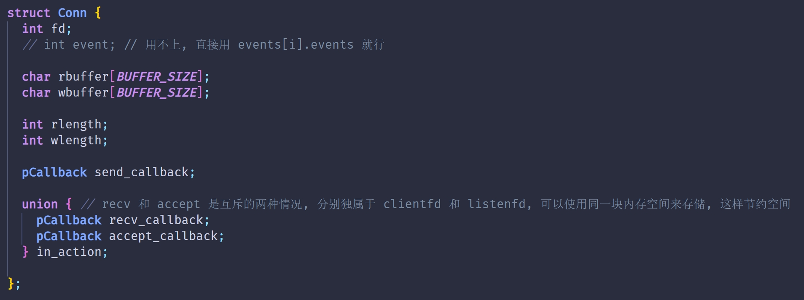

## `reactor.c`和普通`epoll.c`的区别
+ 读写分离, 遇到读事件 就读, 遇到写事件 就写
+ 维护一个 `connList`, 每个元素`conn`独立, 都有各自的`rbuffer``wbuffer`

## 不切EPOLLOUT (不send) 测试百万并发<font style="color:rgb(148, 220, 6);">✓</font>
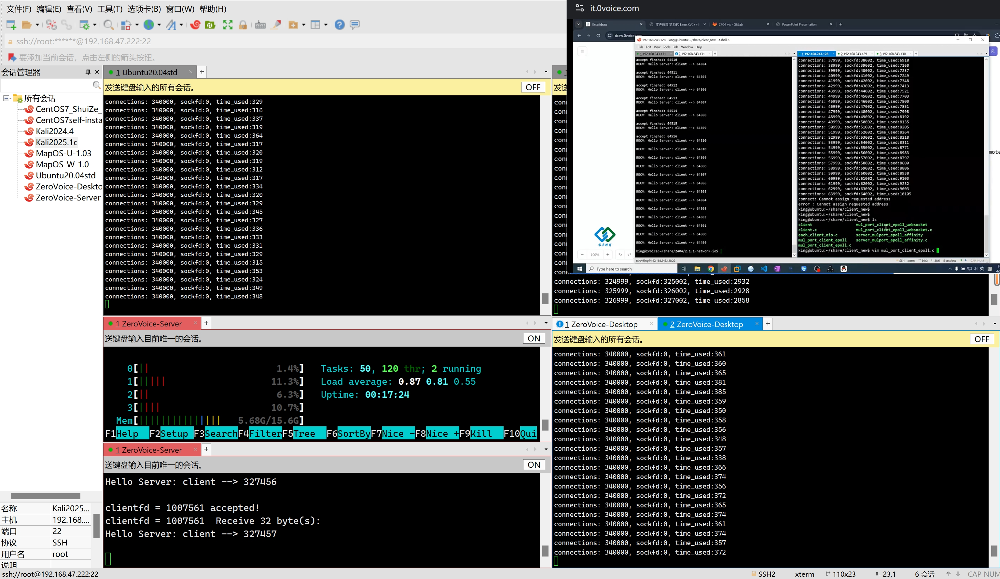

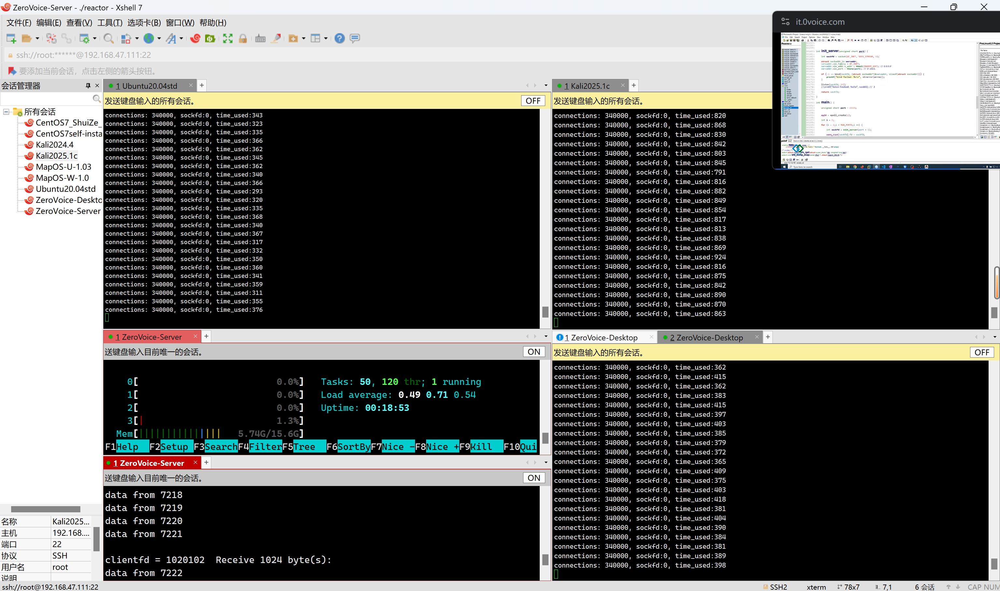

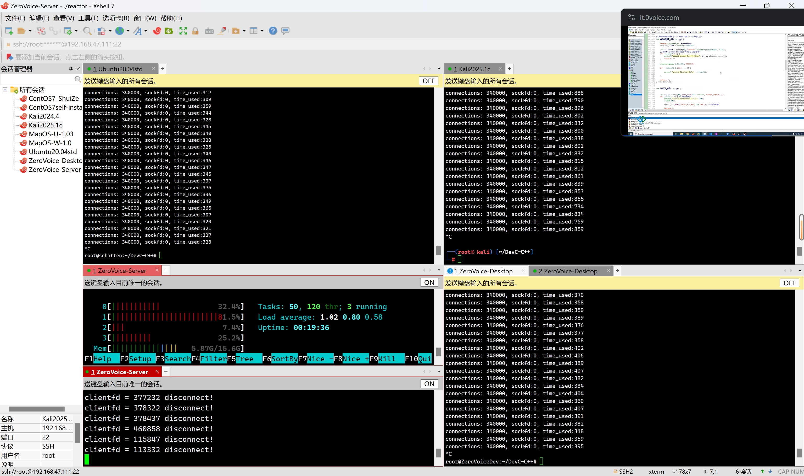

## 开启send后测百万并发
1. `<font style="color:rgb(148, 220, 6);">send</font>`<font style="color:rgb(148, 220, 6);">没有正确的错误处理, 缓冲区满了要关闭连接</font>

```c
int len = send(clientfd, connList[clientfd].wbuffer, connList[clientfd].wlength, 0);
  if (len < 0) {
    perror("send");
    close(clientfd);
    return -2;
  }
```

2. <font style="color:rgb(148, 220, 6);">客户端内存爆炸了</font>

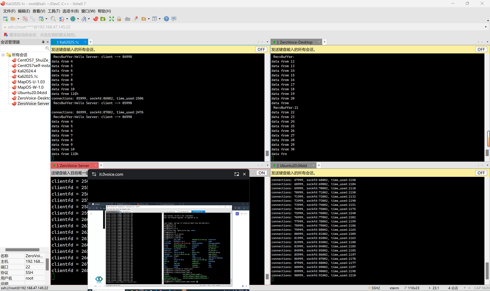

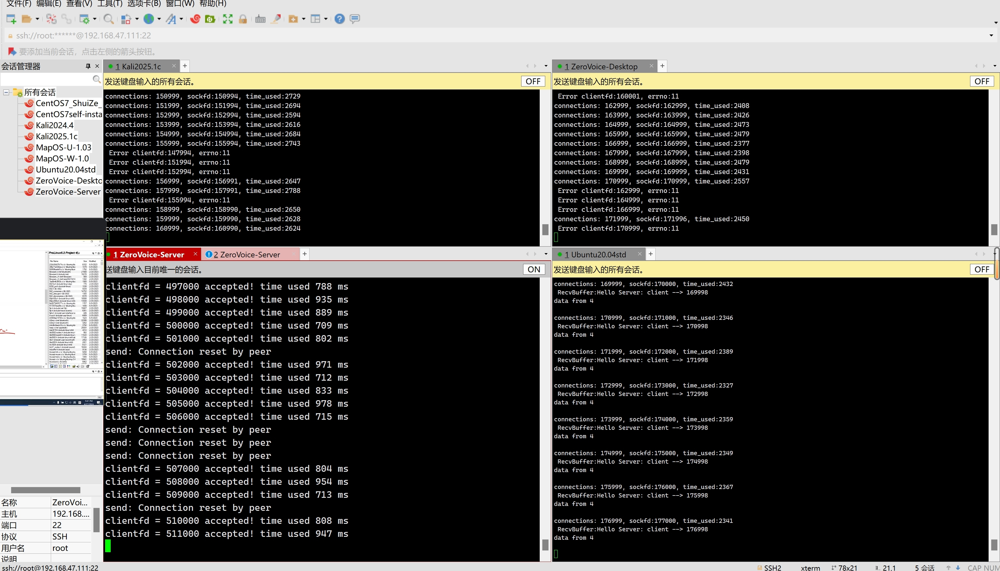

### 🔥`recv+send` 双开: 百万并发成功
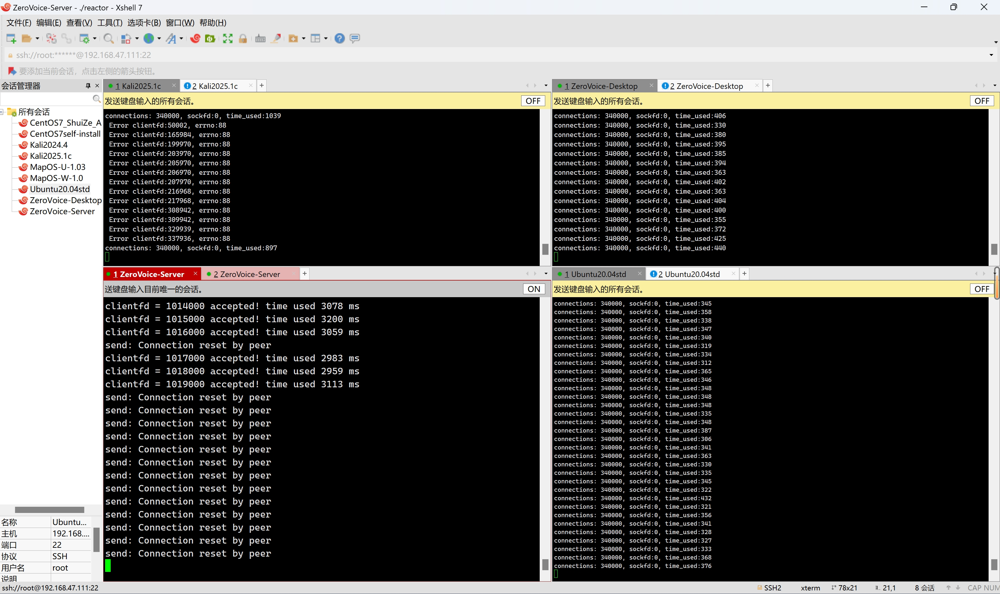

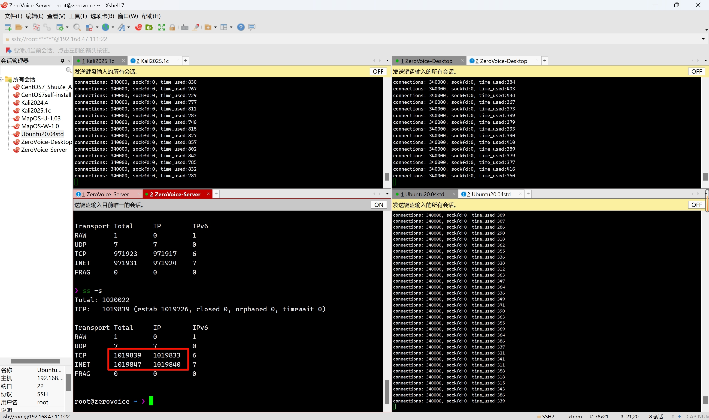

### 成功时内存使用情况
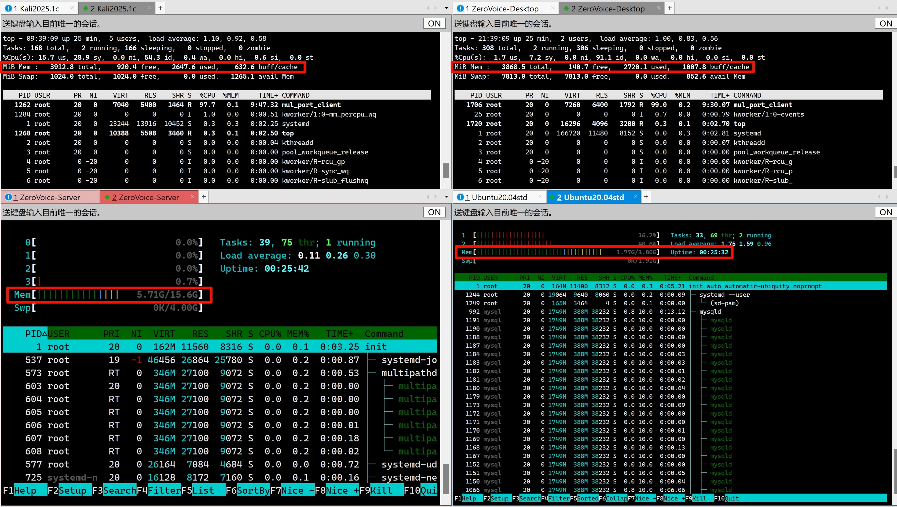

# HTTP 请求与响应
## 代码实现
### `recv_cb`给业务逻辑函数腾个位置
```c
int recv_cb(int clientfd) {
	if (clientfd <= 0) return -1;

	int len = recv(clientfd, connList[clientfd].rbuffer, BUFFER_SIZE, 0);
	if (len < 0) {
		perror("recv");
		close(clientfd);

		epoll_ctl(epfd, EPOLL_CTL_DEL, clientfd, NULL);
		// ...remove_event 待完善
		memset(&connList[clientfd], 0, sizeof(struct Conn));
		return len;
	} else if (len == 0) {
		printf("clientfd = %d disconnect!\n", clientfd);
		close(clientfd);

		epoll_ctl(epfd, EPOLL_CTL_DEL, clientfd, NULL);
		// ...remove_event 待完善
		memset(&connList[clientfd], 0, sizeof(struct Conn));
		return len;
	} 
	// printf("clientfd = %d  Receive %d byte(s):\n%.*s\n", clientfd, len, len, connList[clientfd].rbuffer);
	// rbuffer 收到数据 , rlength 要变为数据的大小
	connList[clientfd].rlength = len;
	#if 0
	
	// ===  以下部分需要实现业务逻辑: 此处实现 `回声` , 将数据原样 send 回去
	memcpy(connList[clientfd].wbuffer, connList[clientfd].rbuffer, connList[clientfd].rlength);
	connList[clientfd].wlength = connList[clientfd].rlength;
	connList[clientfd].rlength = 0;
	// ===
	
	#else
	// Webserver 业务逻辑: 组织一个请求包 (分析 rbuffer)
	http_request(&connList[clientfd]);

	#endif

	// 切换到写事件: 读完一定切换写事件
	ctl_event(clientfd, EPOLLOUT, EPOLL_CTL_MOD);   
	return len;
}
```

### `send_cb`: 也给业务逻辑腾位置
+ 回声服务器的逻辑: `send`完立刻切换读事件

**<font style="color:#DF2A3F;">WebServer:  必须把对方请求的文件完整send过去, 才能切读事件</font>**

**<font style="color:#DF2A3F;">具体代码等完善后再传进来</font>**

:::danger
**自己写的**`**send_cb**`**+**`**http_response**`**整个逻辑实现大文件传输 !!! (超内核缓冲区)**

** --- 摸底的时候一定要说**

:::

#### 状态机的三个状态
```c
enum {
  INIT,         //  0  
  CONTINUE,   //  1
  END       //  2
};
```

#### 具体逻辑
1. **先**`**send**`**响应头+尽可能**`**send**`**一部分文件, **`**send**`**后调整 状态机**
    - **如果**`**BUFFER_SIZE**`**直接装完了**`**响应头 + 整个文件**`** ==> END**
    - **如果已读长度**`**c->length == BUFFER_SIZE**`**, 也就是****<u>文件可能还有剩下</u>**** ==> CONTINUE**
2. **下一次监控到**`**EPOLLOUT**`**, 进入**`**send_cb**`
    - **如果状态是**`**CONTINUE**`**, 在**`**http_response**`**内循环调用**`**sendfile**`**直接传完整个文件, 然后**`**END**`
    - **如果状态是**`**END**`**, 这个时候再清空**`**wbuffer**`**缓冲区 + ****<font style="color:#DF2A3F;">切换为读事件</font>**

#### 大文件效果 (4MB+)


## `wrk`: 压测工具测 QPS
本地测试: 简单请求和响应: **<font style="color:#DF2A3F;">QPS = 5.5 w+</font>**

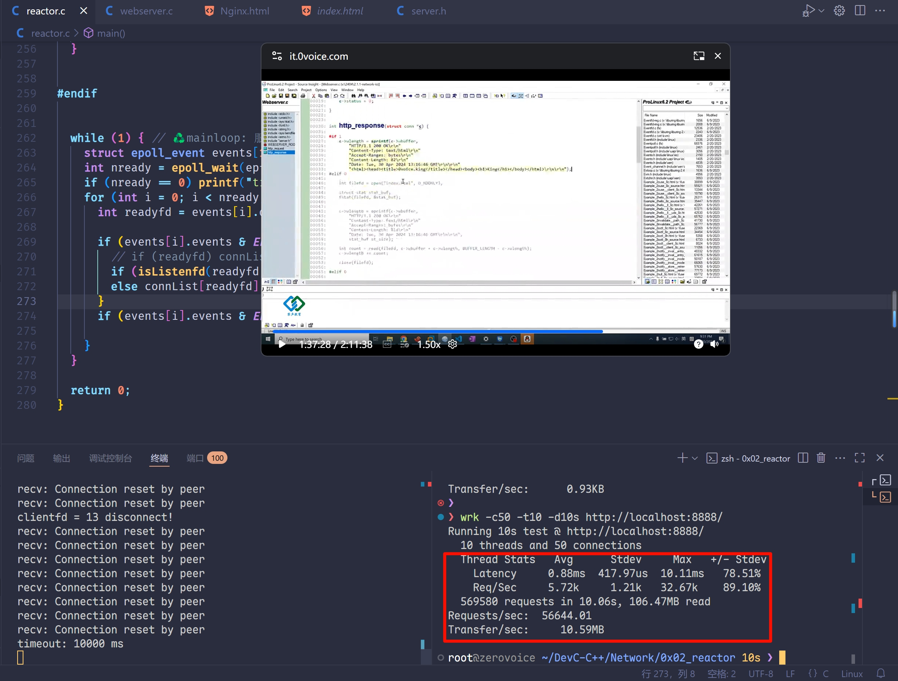

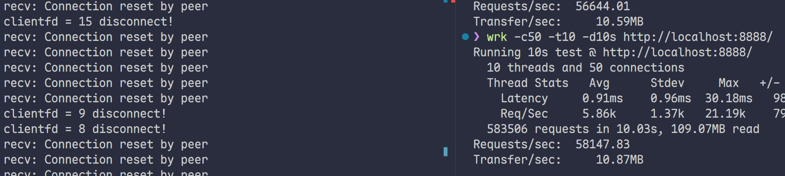

同一局域网 (虚拟网卡) 的虚拟机:**<font style="color:#DF2A3F;"> QPS = 2.5 w+</font>**

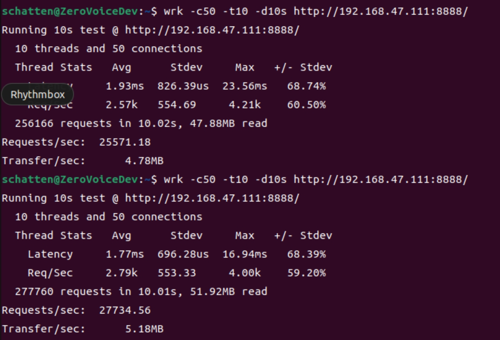

# WebSocket --> HTTP 超进化
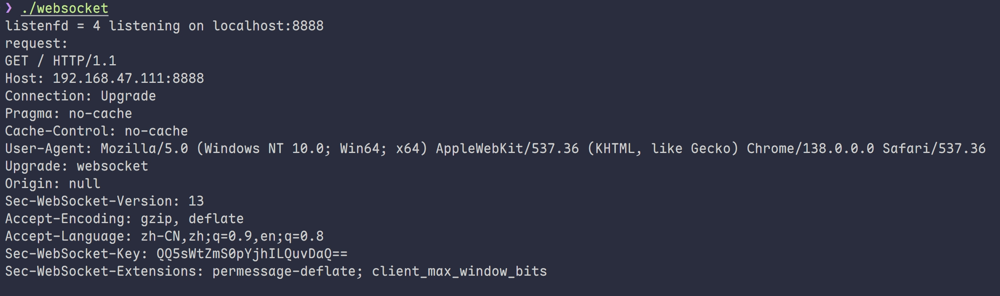

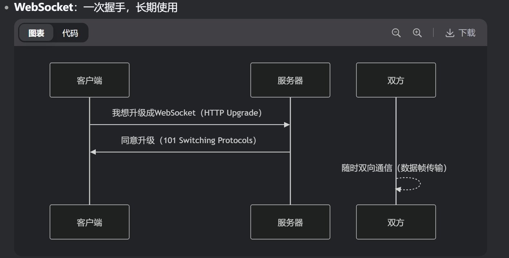

### 通信模式
+ **HTTP：**
    - 必须客户端先发起请求
    - 服务器不能主动推送
    - 像问卷调查：你问我才答
+ **WebSocket：**
    - 服务器可以主动发消息
    - 客户端随时可以发送
    - 像微信聊天：谁想发就发

### 头部开销
**HTTP：**每次请求都带完整的头部

```plain
GET /chat HTTP/1.1
Host: example.com
User-Agent: Chrome
Accept: */*
(每次请求都要重复这些信息)
```

**WebSocket：**建立后只需2-10字节的帧头

**[轻量级帧头] + [实际数据]**

### 典型应用场景
+ 实时聊天（微信网页版）
+ 股票行情实时更新
+ 多人在线游戏
+ 协同编辑（如腾讯文档）
+ 在线直播弹幕

### 工作原理简析
握手阶段（还是走HTTP）：

`javascript`

```javascript
// 客户端请求
new WebSocket("ws://example.com/chat");

// 实际发送的HTTP请求
GET /chat HTTP/1.1
Upgrade: websocket
Connection: Upgrade
Sec-WebSocket-Key: x3JJHMbDL1EzLkh9GBhXDw==
```

服务端响应：

```plain
HTTP/1.1 101 Switching Protocols
Upgrade: websocket
Connection: Upgrade
Sec-WebSocket-Accept: HSmrc0sMlYUkAGmm5OPpG2HaGWk=
```

**<font style="color:#DF2A3F;">连接升级成功后，双方就可以通过简单的数据帧通信了</font>**