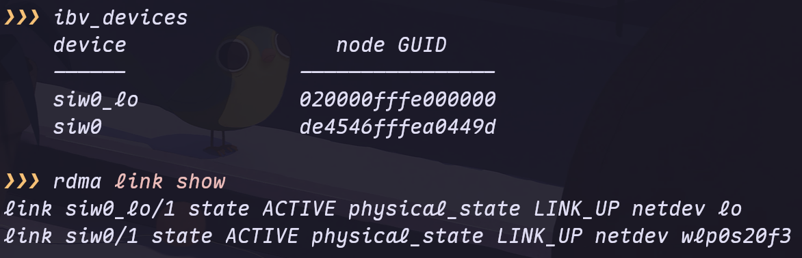
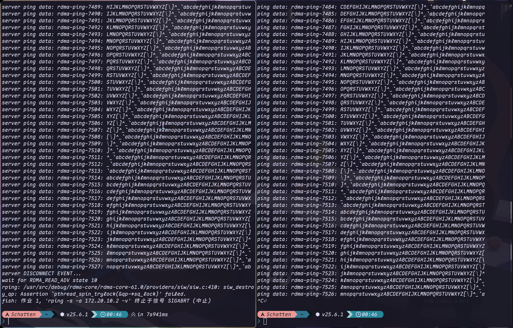
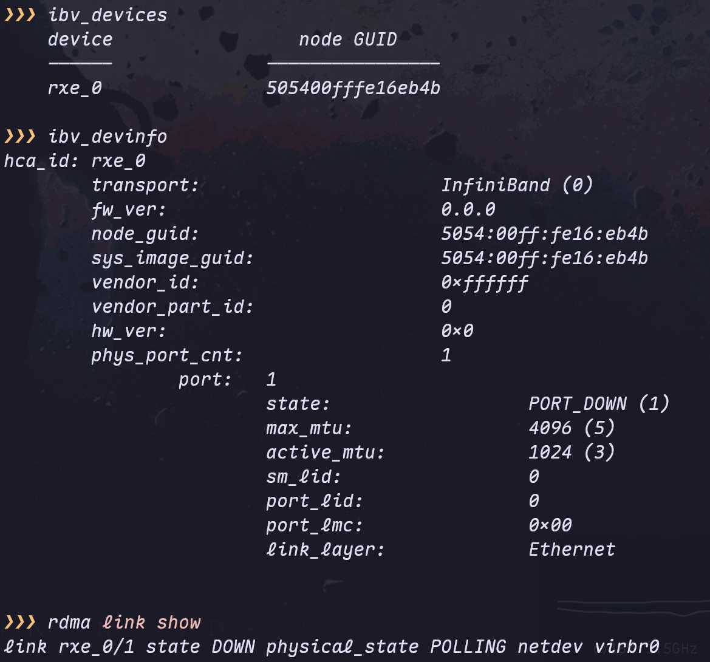

## Soft-iWARP 如何实现软件模拟 RDMA 网卡

> [!WARNING]
>
> Soft-iWARP 方案较落后, 性能也不如 Soft-RoCE 方案, 两种环境配置的方法类似, 后文将补充 Soft-RoCE 配置步骤

根据博客https://github.com/animeshtrivedi/blog/blob/master/post/2019-06-26-siw.md，SoftiWARP (siw) 的核心实现原理是：

### 1. **纯软件实现 iWARP 协议栈**

SoftiWARP 在软件层面完整实现了 iWARP 协议套件（MPA/DDP/RDMAP，对应 IETF RFC 5044/5041/5040），**无需任何专用 RDMA 硬件**。

### 2. **基于 TCP/IP 内核套接字**

博客明确指出："The kernel component runs on top of **TCP kernel sockets**" —— 内核组件运行在标准 TCP 内核套接字之上，将普通以太网卡模拟成 RDMA 设备。

### 3. **与 OpenFabrics (OFA) 生态系统集成**

- 使用 OFA 的连接管理器（Connection Manager）建立连接
- 同时支持**用户态**和**内核态**应用程序
- 提供标准的 libibverbs 编程接口

### 4. **工作流程（内核 5.3+）**

```bash
# 1. 加载内核模块（siw 已合并到主线内核）
sudo modprobe siw

# 2. 使用 rdma 命令将 siw 设备绑定到现有网络接口
sudo rdma link add siw0 type siw netdev enp0s8

# 3. 此时普通网卡就被模拟成了 RDMA 设备
ibv_devices  # 可以看到 siw0 设备
```

## 关于 Arch Linux (内核 6.18.9) 的支持情况

| 内核版本   | SoftiWARP 状态                                            |
| ---------- | --------------------------------------------------------- |
| **5.3+**   | SoftiWARP (siw) **已合并到 Linux 主线内核**，无需手动编译 |
| **6.18.9** | ✅ 完全支持，直接可用                                      |

```bash
# 1. 安装相关包
sudo pacman -S rdma-core

# 2. 加载 siw 内核模块
sudo modprobe siw

# 3. 查看网络接口（选择你要绑定的网卡，如 wlp0s20f3, lo）
ip addr

# 4. 创建 SoftiWARP 设备（将普通网卡模拟为 RDMA 设备）
sudo rdma link add siw0 type siw netdev wlp0s20f3  # 替换为你的网卡名

# 5. 验证设备
ibv_devices        # 应该能看到 siw0
ibv_devinfo siw0   # 查看详细信息
rdma link show     # 查看 RDMA 链接状态
```



## 测试验证

### 服务端

IP地址为 `ip addr` 显示的网卡 IP

```bash
rping -s -a 172.20.10.2 -v
```

### 客户端

```bash
rping -c -a 172.20.10.2 -v
```




## Soft-RoCE 模拟 RDMA 网卡环境配置

```c
# 1. 安装相关包
sudo pacman -S rdma-core

# 2. 加载 siw 内核模块
sudo modprobe rdma_rxe

# 3. 查看网络接口（选择你要绑定的网卡，如 wlp0s20f3, lo, virbr0）
ip addr

# 4. 创建 SoftiWARP 设备（将普通网卡模拟为 RDMA 设备）
sudo rdma link add rxe_0 type rxe netdev virbr0  # 替换为你的网卡名

# 5. 验证设备
ibv_devices        # 应该能看到 siw0
ibv_devinfo siw0   # 查看详细信息
rdma link show     # 查看 RDMA 链接状态
```



> 测试方法同上
>


