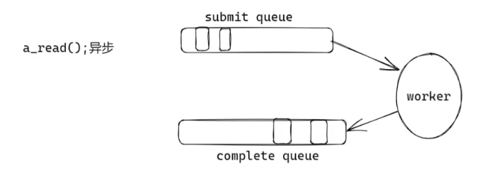
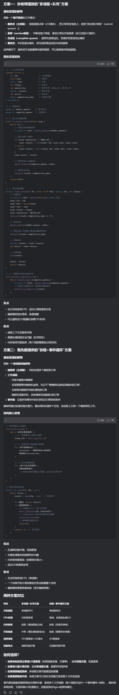
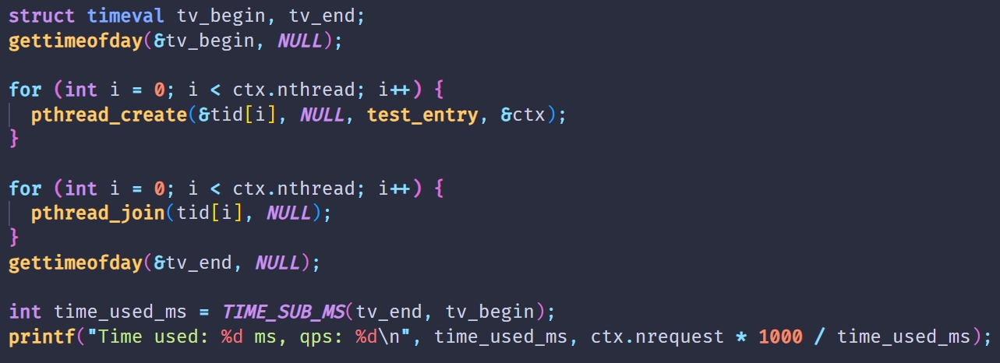
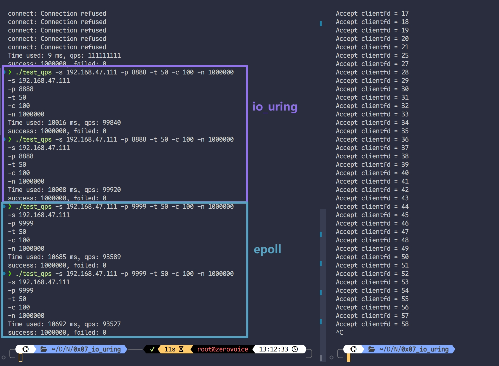
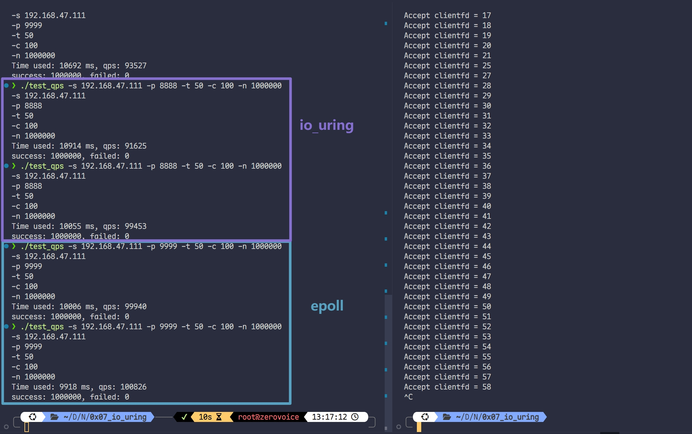

# io_uring

### 引入 : 协程的实现 (多线程)
1. `read 请求` 加入 消息队列 `submit queue`
2. 数据返回 交给 `worker` , 随后将任务加入 `complete queue`

##### 弊端: 频繁copy, 线程不安全 (要加锁)
##### io_uring 的解决方案
1. 采用环形队列 (逻辑上, 通过 `% LEN` 实现), 实现无锁队列
2. mmap 内存映射, 避免频繁 `copy`





# io_uring 19年 新增的 3 个系统调用
1. io_uring_setup
2. io_uring_enter
3. io_uring_register

**`liburing` --- 由于 io_uring 3 个 系统调用 难理解, 其作者封装的第三方库**

# io_uring 实现 TCP_server
## 环境要求
1. `apt install liburing-dev`
2. `#include <liburing.h>`
3. 编译: `gcc ... -luring`

# io_uring 与 epoll 对比
io_uring 	--> `Proactor 模式`

epoll 	--> `Reactor 模式`

|    **模式**    | **数据处理方式** |         **口诀**         |
| :----------: | :--------: | :--------------------: |
| **Reactor**  |   **同步**   | _“事件来了, 告诉我可读, 让我亲自读”_ |
| **Proactor** |   **异步**   |  _“事件来了, 系统读好之后 告诉我”_  |


## 一、上下文数据结构
1. `struct io_uring`  
整个 uring 的“总管”，内部指向 SQ（提交队列）/ CQ（完成队列）/ 一堆 ring-buffer 元数据。
2. `struct io_uring_params`  
初始化时用来向内核“点菜”：我要多少个条目、要不要开启高级特性（IOPOLL、SQPOLL…）。
3. `struct io_uring_sqe`（Submission Queue Entry）  
一次系统调用请求的“订单”，告诉内核“请帮我干什么活”，也塞 64 bit 的 `user_data` 做 cookie。
4. `struct io_uring_cqe`（Completion Queue Entry）  
内核干完活后给你的“回执”，里边最重要的两个字段：
    - `res` —— 返回值（>=0 成功，<0 errno）
    - `user_data` —— 你把订单塞进去的 cookie，原样带回。

---

## 二、生命周期 5 步曲
### step-0 创建（厨房开业）
`int io_uring_queue_init_params(unsigned entries, struct io_uring *ring, struct io_uring_params *p);`

+ 一次性 建 SQ/CQ，映射到用户态。
+ `entries` 必须是 2 的幂（内核要求）。
+ 返回 0 成功，负值 errno。

### step-1 拿订单纸（get_sqe）
`struct io_uring_sqe *io_uring_get_sqe(struct io_uring *ring);`

+ 从 SQ ring-buffer 里 取一张空订单纸（无锁、O(1)）。
+ 最多能拿 `entries` 张，满了返回 NULL。

### step-2 填订单（prep_xxx）
`void io_uring_prep_accept(sqe, fd, addr, addrlen, flags);`  
`void io_uring_prep_recv (sqe, fd, buf, len, flags);`  
`void io_uring_prep_send (sqe, fd, buf, len, flags);`

+ 纯粹 内存填充：把 sqe 各字段写成“内核看得懂”的命令码 + 参数。
+ 这一步 不进内核，只是“写字”。

ps. 自定义 cookie：`memcpy(&sqe->user_data, &conn_info, 8);`

### step-3 把订单投进窗口（submit）
`int io_uring_submit(struct io_uring *ring);`

+ 把当前 SQ 里 所有填好的订单一次性 flush 进内核。
+ 返回值 = 本次实际提交条数；负值 = 有错。
apt install liburing-dev
### step-4 等菜、端菜（wait / peek）
`int io_uring_wait_cqe(struct io_uring *ring, struct io_uring_cqe **cqe);`

+ 阻塞直到至少一条 CQE 就绪；把指针写到 `*cqe`。
+ 用完要 `io_uring_cqe_seen` 或手动 `cq_advance`。

`int io_uring_peek_batch_cqe(struct io_uring *ring, struct io_uring_cqe *cqes[], int count);`

+ 非阻塞批量“偷看”当前已经完成的 CQE，返回条数。
+ 常配合 `io_uring_for_each_cqe` 宏做循环。

### step-5 吃完擦桌子（advance）
`void io_uring_cq_advance(struct io_uring *ring, unsigned nr);`

+ 告诉内核“我已经处理完 nr 条 CQE”，CQ 头指针前移。
+ 与 `io_uring_cqe_seen` 等价，只是批量版。

---

## 三、完整时序脑图（一行代码对一步）
```plain
io_uring_queue_init_params   -->  建厨房
        |
io_uring_get_sqe             -->  拿订单纸
        |
io_uring_prep_xxx            -->  写订单
memcpy(user_data)            -->  贴 `cookie`
        |
io_uring_submit              -->  把订单塞窗口
        |
io_uring_wait_cqe / peek     -->  等菜
        |
cqe->res / user_data         -->  看回执
io_uring_cq_advance          -->  擦桌子
```

---

## 四、常见坑一句话提醒
+ SQE 用完必须 submit，否则永远不进内核。
+ 每条 CQE 读完必须 advance/seen，否则 CQ 会溢出。
+ `io_uring_prep_*` 只是宏，不会自动帮你 get_sqe，顺序别写反。
+ 多线程场景用 `io_uring_register` 系列或 `IORING_SETUP_SQPOLL` 才能零锁化，否则需要外部锁保护 SQ。

把上面 5 步曲背下来，再回去看源码就能“一眼定位”：

+ **哪几行在 填订单（prep_xxx）**
+ **哪一行 ***真正送进内核****（submit）*
+ **哪几行 收菜处理（wait/peek → switch(res.event)）**

# 实现一个 QPS 测试工具
1. 可以实现多线程发请求

```c
// 每个线程发送 请求的数量: 
int count = pctx->nrequest / pctx->nthread;
```

2. 计算所有线程的生命周期时间

```c
#define TIME_SUB_MS(tv2, tv1)  
((tv2.tv_sec - tv1.tv_sec) * 1000 + (tv2.tv_usec - tv1.tv_usec) / 1000)
```



# 开始测试 (64 bytes)
> **异步的 io_uring 可能略胜 同步的 epoll**
>

#### 第一组数据


#### 第二组数据


**<font style="color:#DF2A3F;">uring server 和 epoll server 不相上下</font>**

# 测测 8 bytes
很小的包 --- **对应业务场景: 心跳包**

### 面试
#### epoll 和 io_uring 有什么区别 ?
+ 同步异步
    + epoll通知后的 recv, send 是同步的
    + io_uring submit后的所有操作都由后台的Linux内核去完成, 是异步的
+ 我进行过相关测试: 分别对于 64 / 128 / 256 / 512 字节的数据, 在 `echo server` 上, 测试 qps , io_uring 略胜 epoll `10%`


#### UDP 并发如何做 (QQ就是UDP) ?
#### TCP 与 UDP 有哪些区别 ?
1. **TCP: 基于连接, UDP: 基于报文**
2. **分包与粘包的解决方案**
    1. **TCP 2种方式: 数据包前面加长度 / 加分隔符**
    2. **UDP : 必须为每个包加 id 值**
3. **并发的方案**
+ TCP: epoll / io_uring等等
+ UDP:  模拟 TCP
4. **使用场景**
    - 游戏
    - 数据下载
5. **UDP 适合短连接 / TCP 适合长连接**
