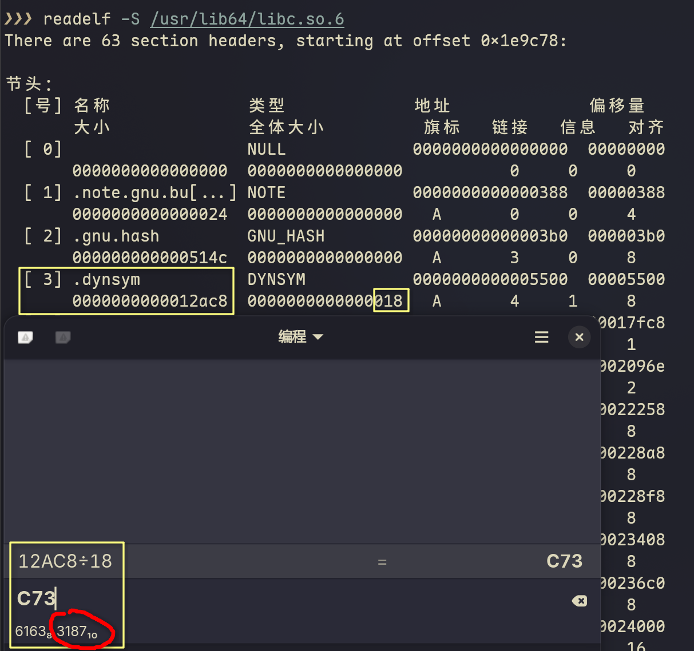
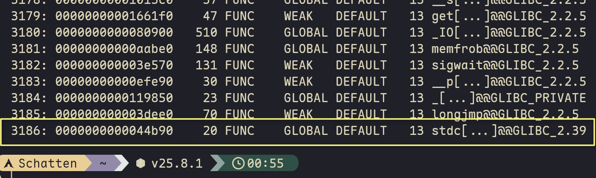

# ELF 学习笔记 01：基础结构篇

> 本系列笔记记录 ELF Reader 开发过程中的学习心得，从代码实践中理解 ELF 文件结构和动态链接机制。
>
> **系列导航**：
> - 📖 **当前文档**：01_基础结构篇（ELF Header、Section Header、符号表与重定位表）
> - 📖 [02_动态链接篇](./ELF学习_02_动态链接篇.md)（.dynamic、PT_LOAD、延迟绑定、PLT反汇编、.rela.dyn、.rodata）
> - 📖 [03_高级解析篇](./ELF学习_03_高级解析篇.md)（.eh_frame、DWARF .debug_line）

---

## 步骤 1：ELF Header 解析

**目标**：理解 ELF 基本元数据（Magic、类型、架构、入口点、Header 位置）

**实现文件**：

- `app/src/main/cpp/elf_reader/elf_types.h`
- `app/src/main/cpp/elf_reader/elf_types.cpp`
- `app/src/main/cpp/elf_reader/main.cpp`
- `app/src/main/cpp/elf_reader/CMakeLists.txt`

### 1.1 ELF 文件结构概览

ELF（Executable and Linkable Format）文件由以下几部分组成：

```
+----------------------------------+
|          ELF Header              |  <-- 52 bytes (32-bit) / 64 bytes (64-bit)
|   - 文件类型、架构、入口点        |
|   - Section Header 偏移位置       |
|   - Program Header 偏移位置       |
+----------------------------------+
|       Program Header Table       |  <-- 段加载信息（运行时用）
|   - PT_LOAD: 可加载段            |
|   - PT_DYNAMIC: 动态链接信息     |
+----------------------------------+
|          .text (代码)            |
|          .data (数据)            |
|          ...                     |
+----------------------------------+
|       Section Header Table       |  <-- 节区信息（链接时用）
|   - .dynsym: 动态符号表          |
|   - .plt: 过程链接表             |
|   - .got.plt: 全局偏移表         |
+----------------------------------+
```

### 1.2 ELF Header 结构详解

#### 1.2.1 e_ident[16] - 标识字节数组（16 bytes）

| 索引 | 名称 | 含义 |
|------|------|------|
| 0-3 | EI_MAG0-3 | Magic: `0x7f` 'E' 'L' 'F' |
| 4 | EI_CLASS | 文件类别：1=32位, 2=64位 |
| 5 | EI_DATA | 数据编码：1=小端, 2=大端 |
| 6 | EI_VERSION | ELF 版本，固定为 1 |
| 7 | EI_OSABI | OS/ABI 类型：0=System V, 3=Linux |
| 8-15 | EI_PAD | 填充，保留 |

#### 1.2.2 关键字段（64-bit ELF）

```cpp
struct Elf64_Ehdr {
    uint8_t  e_ident[16];      // 标识信息
    uint16_t e_type;           // 文件类型：ET_DYN=动态库(so), ET_EXEC=可执行文件
    uint16_t e_machine;        // 目标架构：183=ARM64, 62=X86_64, 40=ARM
    uint32_t e_version;        // ELF 版本: 必须等于 e_ident[6] 的值
    uint64_t e_entry;          // 入口点虚拟地址（so 通常为 0）
    uint64_t e_phoff;          // Program Header 在文件中的偏移
    uint64_t e_shoff;          // Section Header 在文件中的偏移
    uint32_t e_flags;          // 处理器特定标志
    uint16_t e_ehsize;         // ELF Header 大小：64 bytes
    uint16_t e_phentsize;      // 每个 Program Header 条目大小
    uint16_t e_phnum;          // Program Header 条目数量
    uint16_t e_shentsize;      // 每个 Section Header 条目大小
    uint16_t e_shnum;          // Section Header 条目数量
    uint16_t e_shstrndx;       // 字符串表的 Section Header 索引
};
```

### 1.3 字节序处理

ELF 文件可能使用大端或小端格式。在 `elf_types.h` 中实现了通用的读取函数：

```cpp
// 小端读取：低位字节在低地址
template<typename T>
inline T readLE(const uint8_t* p) {
    T val = 0;
    for (size_t i = 0; i < sizeof(T); i++) {
        val |= static_cast<T>(p[i]) << (i * 8);
    }
    return val;
}
// 大端读取：高位字节在低地址
template<typename T>
inline T readBE(const uint8_t* p) {
    T val = 0;
    for (size_t i = 0; i < sizeof(T); i++) {
        val |= static_cast<T>(p[i]) << ((sizeof(T) - 1 - i) * 8);
    }
    return val;
}

// 根据 ELF 文件的字节序读取数据
template<typename T>
inline T readVal(const uint8_t* p, bool littleEndian) {
    return littleEndian ? readLE<T>(p) : readBE<T>(p);
}
```

### 1.4 运行测试

编译后推送到 Android 设备测试：

```bash
# 编译
./gradlew :app:externalNativeBuildDebug

# 推送并运行
adb push app/build/intermediates/cmake/debug/obj/arm64-v8a/elf_reader /data/local/tmp/
adb shell chmod +x /data/local/tmp/elf_reader
adb shell /data/local/tmp/elf_reader /system/lib64/libc.so
```

### 1.5 学习要点总结

1. **Magic 识别**：ELF 文件以 `0x7f 'E' 'L' 'F'` 开头
2. **e_type = ET_DYN**：共享库（.so）的类型是 DYN
3. **e_entry = 0**：共享库没有固定的入口点
4. **e_shoff 和 e_phoff**：Section Header 和 Program Header 的位置
5. **e_shstrndx**：Section 名称字符串表的索引

---

## 步骤 2：Section Header 解析——摸清 so 的"部门架构"

**目标**：理解 Section Header Table，识别动态链接相关的关键 section

**实现文件**：

- `app/src/main/cpp/elf_reader/elf_sections.h`
- `app/src/main/cpp/elf_reader/elf_sections.cpp`

**测试结果**：输出与 readelf -S 基本一致

### 2.1 从 Section Header 看 so 的"部门分工"

如果把 so 文件比作一家公司，各个 section 就是不同的部门：

| Section | 类型 | 运行时地址 | 部门职能 |
|---------|------|-----------|----------|
| `.dynsym` | DYNSYM | 0x2f8 | **人事档案部**：记录所有员工的姓名和职位（函数/变量符号） |
| `.dynstr` | STRTAB | 0xc888 | **姓名数据库**：存储所有员工的真实姓名字符串 |
| `.rela.plt` | RELA | 0x17110 | **转接指南**：记录"外部员工的分机号对应关系" |
| `.plt` | PROGBITS | 0xef890 | **前台转接处**：临时接待外来访客，负责转接 |
| `.got.plt` | PROGBITS | 0xf6e50 | **电话簿**：存储外部合作伙伴的实际电话号码 |
| `.text` | PROGBITS | 0x54000 | **核心业务部**：公司的实际业务代码 |

**为什么 `.got.plt` 有 `W` 标志？**

因为动态链接器需要在运行时修改 GOT 条目（电话号码会动态更新）。

### 2.2 sh_link：部门间的协作关系

Section Header 中的 `sh_link` 字段表示**"这个 section 依赖的另一个 section 的索引"**——要看懂我，你需要先看懂那个。

#### 从 libc.so 看实际的链接关系

```bash
$ readelf -S /tmp/libc.so | grep -E "\.dynsym|\.dynstr|\.rela|\.dynamic|sh_link"
```

```
[ 4] .dynsym      DYNSYM    ...  sh_link=9  → 依赖 [9] .dynstr
[ 9] .dynstr      STRTAB    ...  sh_link=0  → 无依赖（基础表）
[10] .rela.dyn    RELA      ...  sh_link=4  → 依赖 [4] .dynsym
[11] .rela.plt    RELA      ...  sh_link=4  → 依赖 [4] .dynsym
[22] .dynamic     DYNAMIC   ...  sh_link=9  → 依赖 [9] .dynstr
[29] .symtab      SYMTAB    ...  sh_link=31 → 依赖 [31] .strtab


```

#### 逐个解析依赖关系

**1. .dynsym → .dynstr（sh_link=9）**

```
.dynsym[1129].st_name = 0x1234
         │
         └─ 去 .dynstr + 0x1234 处读取字符串
                  ↓
            得到 "malloc"
```

符号表只存数字索引，真正的字符串存在 `.dynstr`。没有 `.dynstr`，`.dynsym` 只是一堆无意义的数字。

**2. .rela.plt → .dynsym（sh_link=4）**

```
.rela.plt[21]:
  r_info = 0x046900000007
           └── 高32位 = 0x469 = 1129（符号索引）

  去 .dynsym[1129] 查找符号
           ↓
       st_name → .dynstr → "malloc"
```

重定位表不直接存符号名，而是通过索引引用符号表。没有 `.dynsym`，`.rela.plt` 不知道要重定位哪个符号。

**3. .dynamic → .dynstr（sh_link=9）**

`.dynamic` 包含 `DT_NEEDED` 条目（依赖的 so 名称，如 `libc.so`），这些字符串存储在 `.dynstr` 中。

#### 链式查找示例

要找 `malloc` 的重定位信息，需要按链查找：

```
1. 从 .rela.plt[21] 出发
         ↓ sh_link=4
2. 查 .dynsym[1129] 获取符号信息
         ↓ sh_link=9
3. 查 .dynstr 获取字符串 "malloc"
         ↓
4. 在 libc.so 中找到 malloc 地址
         ↓
5. 回填到 GOT[24]
```

#### 为什么这样设计？

**避免冗余存储**：
- 1000 个符号名，如果每个符号结构体都存 50 字节字符串，需要 50KB
- 用 `.dynstr` 集中存储，`.dynsym` 只需存 4 字节偏移，总共 4KB + 实际字符串长度

**分表存储、链式引用**是 ELF 的核心设计思想。

### 2.3 sh_entsize：计算"员工数量"

通过 `sh_size / sh_entsize` 可以计算表中的条目数量：

```
.dynsym:
    sh_size = 0x8b38 = 35640 bytes
    sh_entsize = 24 bytes (Elf64_Sym 大小)
    符号数量 = 35640 / 24 = 1485 个符号

.rela.plt:
    sh_size = 0x2e08 = 11784 bytes
    sh_entsize = 24 bytes (Elf64_Rela 大小)
    重定位条目数 = 11784 / 24 = 491 个
```

这个数字校验帮助我们确认解析逻辑的正确性。

#### 实验一下

**大小 == size ,  全体大小 == sh_entsize :  计算得到应有 3187 个条目**



```bash
 $ readelf --dyn-syms /usr/lib64/libc.so.6
```

**最后一条索引: 3186** (索引0条目是占位的, 各字段均为0)



---

## 步骤 3：动态符号表与重定位表解析——读懂"人事档案"与"转接指南"

> **目标**：解析 .dynsym 和 .rela.plt，建立"函数名 → GOT 位置"的完整映射
>
> **实现文件**：
> - `app/src/main/cpp/elf_reader/elf_symbols.h/cpp`
> - `app/src/main/cpp/elf_reader/elf_relocations.h/cpp`
>
> **预期输出**：
> - 列出所有动态符号（类似 `readelf --dyn-syms`）
> - 列出 PLT 重定位条目（类似 `readelf -r`）
> - 建立符号与重定位的关联

### 3.1 为什么需要解析这两张表？

步骤 2 已经知道 `.dynsym` 的**位置**和**大小**，但还不知道里面**存了哪些函数**。

**数据流关系**：

```
.dynstr（姓名数据库）
    ↓ st_name 偏移索引
.dynsym（人事档案）
    ↓ 符号索引（.rela.plt 引用）
.rela.plt（转接指南）
    ↓ r_offset 指向
.got.plt（电话簿）
```

只有解析了 .dynsym 和 .rela.plt，才能回答：
- "malloc 在符号表的第几个条目？"
- "malloc 的 GOT 槽位是第几个？地址是多少？"

### 3.2 Elf64_Sym：符号表条目的内存布局

**.dynsym** section 是一个 `Elf64_Sym` 结构体数组，每个元素 24 字节：

```
偏移 | 字段      | 大小  | 含义
-----|-----------|-------|------------------------------------------
  0  | st_name   | 4字节 | 符号名在 .dynstr 中的字节偏移
  4  | st_info   | 1字节 | 高4位=bind，低4位=type
  5  | st_other  | 1字节 | 可见性（通常 0=DEFAULT）
  6  | st_shndx  | 2字节 | 所在 section 索引（0=未定义外部符号）
  8  | st_value  | 8字节 | 符号值（外部函数为0，本地函数为偏移）
 16  | st_size   | 8字节 | 符号大小（函数体字节数）
```

**st_info 编码**：
```cpp
bind = st_info >> 4;        // 高4位：STB_GLOBAL=1, STB_LOCAL=0, STB_WEAK=2
type = st_info & 0x0f;      // 低4位：STT_FUNC=2, STT_OBJECT=1, STT_NOTYPE=0

// 示例：st_info = 0x12
// bind = 0x1 = GLOBAL（全局可见）
// type = 0x2 = FUNC（函数类型）
```

**st_shndx 特殊值**：
- `0 (SHN_UNDEF)`：未定义，需要从其他 so 解析（外部符号）
- `0xfff1 (SHN_ABS)`：绝对地址，不受重定位影响

⚠️ **32-bit 陷阱**：`Elf32_Sym` 的字段顺序与 64-bit 不同！

```
// Elf64_Sym: st_name → st_info → st_shndx → st_value → st_size
// Elf32_Sym: st_name → st_value → st_size → st_info → st_shndx
//                    ↑ 注意这里顺序不同！
```

### 3.3 代码实现：解析 .dynsym

```cpp
bool DynamicSymbolTable::parse(const uint8_t* dynsymData, size_t dynsymSize,
                               const uint8_t* dynstrData, size_t dynstrSize,
                               bool is64bit, bool isLittleEndian) {
    this->dynstrData = dynstrData;
    this->dynstrSize = dynstrSize;

    size_t entrySize = is64bit ? 24 : 16;  // Elf64_Sym vs Elf32_Sym
    size_t numSymbols = dynsymSize / entrySize;

    for (size_t i = 0; i < numSymbols; i++) {
        const uint8_t* entry = dynsymData + i * entrySize;
        SymbolInfo sym;
        sym.index = i;

        // 所有格式：st_name 都在 offset 0
        uint32_t st_name = readVal<uint32_t>(entry + 0, isLittleEndian);

        if (is64bit) {
            // 64-bit 布局：name(4) → info(1) → other(1) → shndx(2) → value(8) → size(8)
            uint8_t st_info  = readVal<uint8_t>(entry + 4, isLittleEndian);
            uint8_t st_other = readVal<uint8_t>(entry + 5, isLittleEndian);
            uint16_t st_shndx = readVal<uint16_t>(entry + 6, isLittleEndian);
            uint64_t st_value = readVal<uint64_t>(entry + 8, isLittleEndian);
            uint64_t st_size  = readVal<uint64_t>(entry + 16, isLittleEndian);

            sym.bind = st_info >> 4;
            sym.type = st_info & 0x0f;
            sym.other = st_other;
            sym.shndx = st_shndx;
            sym.value = st_value;  // 注意：使用简化字段名
            sym.size = st_size;
        } else {
            // 32-bit 布局：name(4) → value(4) → size(4) → info(1) → other(1) → shndx(2)
            // 注意字段顺序不同！
            uint32_t st_value = readVal<uint32_t>(entry + 4, isLittleEndian);
            uint32_t st_size  = readVal<uint32_t>(entry + 8, isLittleEndian);
            uint8_t st_info   = readVal<uint8_t>(entry + 12, isLittleEndian);
            // ...
        }

        // 从 .dynstr 读取符号名
        if (st_name < dynstrSize) {
            sym.name = reinterpret_cast<const char*>(dynstrData + st_name);
        }

        symbols.push_back(sym);
    }
    return true;
}
```

### 3.4 Elf64_Rela：重定位表条目的内存布局

**.rela.plt** section 是一个 `Elf64_Rela` 结构体数组，每个元素 24 字节：

```
偏移 | 字段      | 大小  | 含义
-----|-----------|-------|------------------------------------------
  0  | r_offset  | 8字节 | 需要被修改的内存地址（即对应 GOT 条目的运行时地址）
  8  | r_info    | 8字节 | 高32位=符号表索引，低32位=重定位类型
 16  | r_addend  | 8字节 | 加数（int64_t，JUMP_SLOT 通常为0）
```

**r_info 解码**：
```cpp
uint64_t r_info = ...;
uint32_t symIndex = (uint32_t)(r_info >> 32);        // 高32位
uint32_t type     = (uint32_t)(r_info & 0xffffffff); // 低32位

// .rela.plt 中的类型通常是：
// R_AARCH64_JUMP_SLOT = 1026 = 0x402（PLT 函数跳转）
```

> **术语速查：重定位类型**
>
> | 类型常量 | 架构 | 值 | 含义 |
> |---------|------|----|------|
> | `R_AARCH64_JUMP_SLOT` | ARM64 | 1026 (0x402) | PLT 函数跳转槽，需要填充 GOT 条目 |
> | `R_X86_64_JUMP_SLOT` | x86_64 | 7 | 同上，x86_64 架构版本 |
> | `R_AARCH64_GLOB_DAT` | ARM64 | 1025 | 全局数据变量 GOT 条目 |
> | `R_X86_64_GLOB_DAT` | x86_64 | 6 | 全局数据变量 GOT 条目 |

### 3.5 rela[n] → GOT[n+3] 的映射关系

理解这个映射关系是掌握延迟绑定的关键。

#### 为什么要有 +3？

GOT（Global Offset Table）是一个指针数组，但**前 3 个条目有特殊用途**：

| GOT 索引 | 用途 | 说明 |
|---------|------|------|
| GOT[0] | `.dynamic` section 地址 | 指向动态链接信息 |
| GOT[1] | `link_map` 指针 | 当前 so 的"身份证"，用于动态链接器识别 |
| GOT[2] | `_dl_runtime_resolve` 地址 | 动态链接器的符号解析函数 |
| GOT[3] | 第 1 个外部函数地址 | 如 `malloc` |
| GOT[4] | 第 2 个外部函数地址 | 如 `free` |
| ... | ... | ... |
| GOT[n+3] | 第 n+1 个外部函数地址 | 对应 `.rela.plt[n]` |

> **术语速查：GOT（Global Offset Table）**
>
> **本质**：函数指针数组，存放外部符号的运行时地址。
>
> - `GOT[0]` = `.dynamic` section 地址
> - `GOT[1]` = `link_map` 指针（当前 so 的标识）
> - `GOT[2]` = `_dl_runtime_resolve` 地址（首次调用时的符号解析函数）
> - `GOT[3+]` = 外部函数的实际地址（延迟绑定，首次调用后才填入真实地址）
>
> GOT 为何可写（`W` 标志）？因为动态链接器需要在运行时更新 GOT[1]、GOT[2] 和 GOT[3+]。

**映射公式**：
```
.rela.plt[n]  对应  GOT[n+3]

即：
- rela[0] → GOT[3]（第 1 个外部函数）
- rela[1] → GOT[4]（第 2 个外部函数）
- rela[n] → GOT[n+3]（第 n+1 个外部函数）
```

#### 从 rela 到 GOT 地址的计算

`.rela.plt[n].r_offset` 字段存储的就是对应 GOT 条目的运行时地址：

```
r_offset = got_plt_base + (n + 3) * sizeof(void*)
         = got_plt_base + (n + 3) * 8    (64-bit 系统)
```

**实例验证**（使用真实 libc.so 数据）：

首先获取必要信息：
```bash
# 1. 获取 .got.plt 基址
$ readelf -S libc.so | grep got.plt
  [24] .got.plt          PROGBITS         00000000000f6e50  000f6e50
# 基址 = 0x00000000000f6e50

# 2. 获取 malloc 在 .rela.plt 中的索引
# .rela.plt 从第 1042 行开始（行号 3 是表头，1041 是重定位节标题）
$ readelf -r libc.so | grep -n malloc
1063:0000000f6f10  046900000007 R_X86_64_JUMP_SLO 00000000000550b0 malloc@@LIBC + 0
# malloc 在第 1063 行，索引 n = 1063 - 1042 = 21（第22个条目）

# 3. 验证 r_offset
# readelf 显示: r_offset = 0x0000000f6f10
```

验证计算：
```
Step 1: 计算 GOT 索引
  GOT 索引 = n + 3 = 21 + 3 = 24
  → malloc 对应 GOT[24]

Step 2: 计算 GOT[24] 的理论地址
  GOT[24] 地址 = 0x00000000000f6e50 + 24 × 8
               = 0x00000000000f6e50 + 192
               = 0x00000000000f6e50 + 0xC0
               = 0x00000000000f6f10

Step 3: 与 readelf 输出对比
  readelf 显示的 r_offset: 0x0000000f6f10
  计算得到的 GOT[24] 地址:  0x00000000000f6f10

  结果: ✓ 完全匹配！
```

在 `readelf -r` 的输出中，你可以直接看到这个对应关系：
```bash
$ readelf -r libc.so | grep malloc
0000000f6f10  046900000007 R_X86_64_JUMP_SLO 00000000000550b0 malloc@@LIBC + 0
      ↑              ↑
  GOT[24]地址    符号索引 0x0469 = 1129
                 → 指向 .dynsym 第 1129 个符号（即 malloc）
```

#### 一张图看懂映射关系（以 libc.so 中的 malloc 为例）

```
.rela.plt (重定位表)              .got.plt (全局偏移表)
                                  基址: 0x00000000000f6e50
+----------------+               +-------------------------+
| rela[0]        |-------------->| GOT[3]  第1个外部函数    |
|   r_offset     |    n+3        |                         |
+----------------+               +-------------------------+
| rela[1]        |-------------->| GOT[4]  第2个外部函数    |
|   r_offset     |               |                         |
+----------------+               +-------------------------+
| ...            |               | ...                     |
+----------------+               +-------------------------+
| rela[21]       |-------------->| GOT[24] malloc ◄────────┤
|   r_offset ────┘               │   地址: 0x0f6f10        │
|   = 0x0f6f10   │   验证:       │   (基址 + 0xC0)          │
|   symIdx=1129 ─┤   21+3=24 ✓   │   初始: PLT解析代码      │
+----------------+               │   解析后: 0x550b0        │
                                 +-------------------------+
                                 | ...                     |
                                 +-------------------------+
                                 │ GOT[2] _dl_runtime_resolve│ ← 保留
                                 │ GOT[1] link_map           │ ← 保留
                                 │ GOT[0] .dynamic           │ ← 保留
                                 +-------------------------+

验证公式: rela[n].r_offset = got_base + (n + 3) × 8
          0x0f6f10 = 0x0f6e50 + 24 × 8 = 0x0f6e50 + 0xC0 ✓
```

#### GOT 的生命周期与演进

**阶段1：编译/链接时（磁盘上的 .so）**
```
GOT[0-2]: 值为 0（占位符，运行时由 linker 填充）
GOT[3+]:  初始指向各自的 PLT 条目（解析代码）
```

**阶段2：加载时（System.loadLibrary() 后）**
动态链接器立即填充前3项，其余保持不变：
```
GOT[0] = .dynamic section 地址（内存虚拟地址）
GOT[1] = link_map 指针（当前 so 的"身份证"）
GOT[2] = _dl_runtime_resolve 地址（符号解析函数）
GOT[3+] = 仍指向 PLT（未解析状态）
```

**阶段3：首次调用时（运行时）**
以 malloc（GOT[24]）为例：
```
第1次调用 malloc:
  PLT[22] → GOT[24] → 发现是解析代码 → 触发 _dl_runtime_resolve
  _dl_runtime_resolve 查找 malloc 真实地址 0x550b0
  填充 GOT[24] = 0x550b0
  跳转到 malloc 执行

第2次调用 malloc:
  PLT[22] → GOT[24](0x550b0) → 直接跳转（快！）

第3+次: 同第2次
```

**GOT[0-2] vs GOT[3+] 的关键区别**：

| 特性 | GOT[0-2] | GOT[3+] |
|------|----------|---------|
| **用途** | 动态链接器内部使用 | 存储外部函数地址 |
| **填充时机** | so 加载时（立即） | 首次调用时（延迟绑定） |
| **填充者** | 动态链接器 (linker) | `_dl_runtime_resolve` |
| **内容** | 元数据（.dynamic, link_map, 解析器） | 函数指针 |
| **变化** | 加载后固定不变 | PLT地址 → 真实地址 |

#### 为什么这个映射很重要？

1. **PLT 代码硬编码了这个关系**：PLT 条目通过固定的偏移量访问 GOT
   ```asm
   # PLT[3]（对应 rela[0]/GOT[3]）
   adrp x16, #<got_page>      # 计算 GOT 页基址
   ldr  x17, [x16, #24]       # 加载 GOT[3] 的地址偏移 = 3*8 = 24
   br   x17
   ```

2. **Hook 原理基于此**：知道函数名 → 查符号表得到索引 → 通过公式计算 GOT 位置 → 修改 GOT 条目

3. **延迟绑定的核心**：首次调用时 GOT[n+3] 指向 PLT 解析代码，解析后填入真实地址

### 3.6 代码实现：解析 .rela.plt 并关联符号

```cpp
bool RelocationTable::parse(const uint8_t* data, size_t size,
                            bool is64bit, bool isLittleEndian, bool isPLT) {
    this->isPLT = isPLT;
    size_t entrySize = 24;  // Elf64_Rela 固定 24 字节
    size_t numEntries = size / entrySize;

    for (size_t i = 0; i < numEntries; i++) {
        const uint8_t* entry = data + i * entrySize;
        RelocationInfo rel;
        rel.index = i;

        rel.offset  = readVal<uint64_t>(entry + 0, isLittleEndian);
        rel.info    = readVal<uint64_t>(entry + 8, isLittleEndian);
        rel.addend  = (int64_t)readVal<uint64_t>(entry + 16, isLittleEndian);

        // 解码 r_info
        rel.symIndex = (uint32_t)(rel.info >> 32);
        rel.type     = (uint32_t)(rel.info & 0xffffffff);

        relocations.push_back(rel);
    }
    return true;
}

// 建立重定位条目与符号的关联
void RelocationTable::linkSymbols(const DynamicSymbolTable& symtab) {
    for (auto& rel : relocations) {
        rel.symbol = symtab.findByIndex(rel.symIndex);
        // 现在 rel.symbol->name 就是函数名
    }
}
```

### 3.7 测试结果验证

**测试命令**：
```bash
# 推送到设备
adb push app/build/intermediates/cmake/debug/obj/arm64-v8a/elf_reader /data/local/tmp/
adb shell chmod +x /data/local/tmp/elf_reader

# 运行测试
adb shell /data/local/tmp/elf_reader /system/lib64/libc.so
```

**验证 1：函数符号数量**
```bash
# 我们的工具
adb shell /data/local/tmp/elf_reader /system/lib64/libc.so 2>&1 | grep -c FUNC
# 结果：1448

# GNU readelf（电脑上）
readelf --dyn-syms /system/lib64/libc.so | grep FUNC | wc -l
# 结果：1448 ✅ 一致
```

**验证 2：malloc 的重定位信息**
```
PLT relocations (function jumps):
  Entry  Offset           GOT Index  Symbol
[   21] 00000000000f6f78 [ 24]      malloc

解读：
- rela.plt 第 21 个条目对应 malloc
- 该条目指向 GOT[24]（21 + 3 = 24）
- GOT[24] 的运行时地址是 0xf6f78
```

### 3.8 从数据到洞察：我们学到了什么？

通过步骤 3 的实现，我们真正读懂了 so 文件的"人事档案"和"转接指南"：

1. **符号表是字典**：通过 `.dynsym` + `.dynstr`，我们知道"第21号员工叫 malloc"

2. **重定位表是地图**：通过 `.rela.plt`，我们知道"malloc 的电话号码存在 GOT[24]"

3. **延迟绑定的实现基础**：
   - GOT[0-2] 保留给动态链接器
   - GOT[3+] 存放外部函数地址
   - 首次调用时，GOT 条目指向 PLT 解析代码
   - 解析完成后，GOT 条目被改写为真实地址

4. **Hook 的原理**：
   - GOT 是可写的（`W` 标志）
   - 修改 GOT[n] = 替换函数实现
   - ByteHook 正是利用这一点

---

## 本篇总结

本篇（基础结构篇）完成了 ELF Reader 的前三个核心解析功能：

| 步骤 | 功能 | CLI 参数 | 关键成果 |
|------|------|----------|----------|
| **步骤 1** | ELF Header 解析 | `-h` | 识别文件类型、架构、字节序，定位 Section Header |
| **步骤 2** | Section Header 解析 | `-S` | 识别关键 section（.dynsym, .rela.plt, .got.plt 等） |
| **步骤 3** | 动态符号表+重定位表 | `-s` / `-r` | 建立"函数名 → GOT 位置"映射，理解延迟绑定机制基础 |

**核心收获**：
- ELF 采用**分表存储、链式引用**设计：.dynsym 引用 .dynstr，.rela.plt 引用 .dynsym
- GOT 是动态链接的核心数据结构，GOT[3+] 存放外部函数地址
- rela[n] → GOT[n+3] 的映射关系，是理解延迟绑定和 PLT Hook 的基础

**下一步**：[02_动态链接篇](./ELF学习_02_动态链接篇.md) 将深入分析 .dynamic 段、运行时内存布局，以及延迟绑定的完整调用流程。