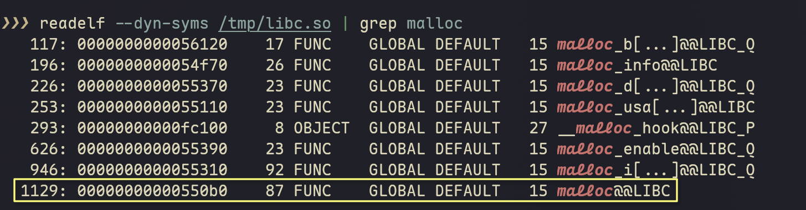

# ELF 学习笔记 02：动态链接篇

> 本系列笔记记录 ELF Reader 开发过程中的学习心得，从代码实践中理解 ELF 文件结构和动态链接机制。
>
> **系列导航**：
> - 📖 [01_基础结构篇](./ELF学习_01_基础结构篇.md)（ELF Header、Section Header、符号表与重定位表）
> - 📖 **当前文档**：02_动态链接篇（.dynamic、PT_LOAD、延迟绑定、PLT反汇编、.rela.dyn、.rodata）
> - 📖 [03_高级解析篇](./ELF学习_03_高级解析篇.md)（.eh_frame、DWARF .debug_line）

> **前置知识**：本篇依赖 01_基础结构篇 中建立的概念：Section 结构、.dynsym/.rela.plt 数据流、GOT 基本原理。

---

## 步骤 4：.dynamic 段解析——依赖库的"清单"

**目标**：解析 .dynamic 段，提取依赖库列表（DT_NEEDED）和其他动态链接元数据

**实现文件**：
- `app/src/main/cpp/elf_reader/elf_dynamic.h/cpp` (新建)
- 修改 `main.cpp` 添加 -d 参数支持

---

### 4.1 什么是 .dynamic 段？

**.dynamic 是动态链接的"元数据中心"**。如果把 so 文件比作一份简历，.dynamic 就是简历顶部的基本信息：

| 字段 | 作用 | 示例值 |
|------|------|--------|
| **DT_NEEDED** | 依赖的其他 so 文件 | `libc.so`, `libm.so` |
| **DT_SONAME** | 当前 so 自己的名字 | `libc.so.6` |
| **DT_SYMTAB** | 动态符号表 (.dynsym) 地址 | 内存地址 |
| **DT_STRTAB** | 动态字符串表 (.dynstr) 地址 | 内存地址 |
| **DT_HASH** | 符号哈希表地址（加速查找） | 内存地址 |
| **DT_GNU_HASH** | GNU 哈希表地址（更高效的查找） | 内存地址 |

**简单说**：动态链接器通过读取 .dynamic，就能知道"这个 so 需要哪些库、符号表在哪里、怎么快速查找符号"。

---

### 4.2 Elf64_Dyn 结构

.dynamic 是一个 `Elf64_Dyn` 结构体数组，每个元素 16 字节：

```
偏移 | 字段      | 大小  | 含义
-----|-----------|-------|------------------------------------------
  0  | d_tag     | 8字节 | 条目类型（DT_NEEDED, DT_SONAME 等）
  8  | d_un      | 8字节 | 联合体：d_val（整数值）或 d_ptr（地址）
```

d_tag 决定 d_un 如何解释：
- **DT_NEEDED**: d_un.d_val 是 .dynstr 中的偏移（字符串索引）
- **DT_SONAME**: d_un.d_val 是 .dynstr 中的偏移（字符串索引）
- **DT_SYMTAB**: d_un.d_ptr 是内存地址
- **DT_HASH**: d_un.d_ptr 是内存地址

---

### 4.3 d_tag 常量定义

```cpp
// 关键 d_tag 值
DT_NULL         = 0,    // 标记数组结束
DT_NEEDED       = 1,    // 需要的共享库（字符串表偏移）
DT_PLTRELSZ     = 2,    // PLT 重定位表大小
DT_PLTGOT       = 3,    // PLT/GOT 地址
DT_HASH         = 4,    // 符号哈希表地址
DT_STRTAB       = 5,    // 动态字符串表地址
DT_SYMTAB       = 6,    // 动态符号表地址
DT_RELA         = 7,    // RELA 重定位表地址
DT_RELASZ       = 8,    // RELA 重定位表大小
DT_RELAENT      = 9,    // RELA 条目大小
DT_STRSZ        = 10,   // 字符串表大小
DT_SYMENT       = 11,   // 符号表条目大小
DT_INIT         = 12,   // 初始化函数地址
DT_FINI         = 13,   // 终止函数地址
DT_SONAME       = 14,   // 共享对象名称（字符串表偏移）
DT_RPATH        = 15,   // 库搜索路径（已废弃）
DT_SYMBOLIC     = 16,   // 符号解析标志
DT_REL          = 17,   // REL 重定位表地址
DT_RELSZ        = 18,   // REL 重定位表大小
DT_RELENT       = 19,   // REL 条目大小
DT_PLTREL       = 20,   // PLT 重定位类型（REL/RELA）
DT_DEBUG        = 21,   // 调试用
DT_TEXTREL      = 22,   // 文本段重定位标志
DT_JMPREL       = 23,   // PLT 重定位表地址（.rela.plt）
DT_BIND_NOW     = 24,   // 立即绑定标志
DT_INIT_ARRAY   = 25,   // 构造函数指针数组
DT_FINI_ARRAY   = 26,   // 析构函数指针数组
DT_INIT_ARRAYSZ = 27,   // 构造函数数组大小
DT_FINI_ARRAYSZ = 28,   // 析构函数数组大小
DT_RUNPATH      = 29,   // 库搜索路径（替代 RPATH）
DT_FLAGS        = 30,   // 标志位
DT_GNU_HASH     = 0x6ffffef5,  // GNU 哈希表地址
```

---

### 4.4 代码实现

#### DynamicEntry 结构体

```cpp
struct DynamicEntry {
    uint32_t index;        // 在数组中的索引
    uint64_t tag;          // d_tag
    uint64_t value;        // d_un.d_val（整数值）
    uint64_t ptr;          // d_un.d_ptr（地址）

    // 判断 d_un 是值还是指针
    bool isValue() const {
        // 这些 tag 使用 d_val（整数值或字符串偏移）
        return tag == DT_NEEDED || tag == DT_PLTRELSZ || tag == DT_RELASZ ||
               tag == DT_RELAENT || tag == DT_STRSZ || tag == DT_SYMENT ||
               tag == DT_SONAME || tag == DT_RPATH || tag == DT_RELSZ ||
               tag == DT_RELENT || tag == DT_PLTREL || tag == DT_INIT_ARRAYSZ ||
               tag == DT_FINI_ARRAYSZ || tag == DT_RUNPATH || tag == DT_FLAGS;
    }

    bool isPointer() const {
        return !isValue() && tag != DT_NULL;
    }
};
```

#### DynamicTable 类

```cpp
class DynamicTable {
public:
    std::vector<DynamicEntry> entries;
    std::vector<const DynamicEntry*> neededLibs;  // DT_NEEDED 条目指针
    const DynamicEntry* soname = nullptr;           // DT_SONAME 条目
    const DynamicEntry* symtab = nullptr;           // DT_SYMTAB
    const DynamicEntry* strtab = nullptr;           // DT_STRTAB
    const DynamicEntry* hash = nullptr;             // DT_HASH
    const DynamicEntry* gnuHash = nullptr;          // DT_GNU_HASH
    const DynamicEntry* jmprel = nullptr;           // DT_JMPREL (.rela.plt)
    const DynamicEntry* rela = nullptr;             // DT_RELA (.rela.dyn)

    bool parse(const uint8_t* data, size_t size,
               bool is64bit, bool isLittleEndian);

    void print() const;           // 打印所有条目
    void printNeededLibs() const; // 只打印依赖库

    static const char* getTagName(uint64_t tag);
};
```

---

### 4.5 依赖库列表的意义

当运行一个可执行文件时，动态链接器（/system/bin/linker64 或 ld-linux.so）的工作流程：

```
1. 加载可执行文件
2. 读取其 .dynamic 段
3. 找到所有 DT_NEEDED 条目
4. 递归加载每个依赖库
5. 对每对（加载的 so，其依赖库）执行符号解析和重定位
```

**这正是我们实现 so 跳转分析的基础**——只有理解了依赖关系，才能知道函数调用的目标库。

---

### 4.6 测试验证

```bash
# 查看 libc.so 的依赖
adb shell /data/local/tmp/elf_reader -d /system/lib64/libc.so

# 预期输出（Android libc 通常没有依赖）
# Dynamic Section (.dynamic):
#   依赖库列表 (DT_NEEDED):
#   [无]
#
#   SONAME: libc.so
#   符号表地址: 0x...
#   字符串表地址: 0x...
#   ...
```

---

**步骤 4 已完成**：`.dynamic` 段解析实现
- `elf_dynamic.h/cpp` 创建
- `DynamicTable` 类实现
- `-d` 参数支持打印依赖库列表
- main.cpp 集成

---

## 步骤 5：PT_LOAD 段信息——运行时内存布局

**目标**：解析 Program Header Table，识别 PT_LOAD 段，理解运行时内存映射

**实现文件**：
- `app/src/main/cpp/elf_reader/elf_segments.h/cpp` (新建)
- 修改 `main.cpp` 添加 -l/--segments 参数支持

---

### 5.1 Segment vs Section 的区别

这是理解 ELF 的关键概念：

| 特性 | Section | Segment |
|------|---------|---------|
| **用途** | 链接时组织数据 | 运行时内存映射 |
| **粒度** | 细粒度（.text, .data, .rodata 等） | 粗粒度（代码段、数据段） |
| **数量** | 通常 20-30 个 | 通常 3-5 个 |
| **关系** | 多个 section 可以合并到一个 segment | 一个 segment 包含多个 section |

**运行时视角**：操作系统只关心 Segment，不关心 Section。

### 5.2 PT_LOAD 段的类型

```
┌─────────────────────────────────────────────┐
│  PT_LOAD [R-E] 代码段                        │  ← .text, .plt, .init, .fini
│  虚拟地址: 0x1000                            │
│  权限: 可读(R) + 可执行(E)                   │
│  特点: 不可写（防止代码被篡改）              │
└─────────────────────────────────────────────┘

┌─────────────────────────────────────────────┐
│  PT_LOAD [RW-] 数据段                        │  ← .data, .bss
│  虚拟地址: 0x2000                            │
│  权限: 可读(R) + 可写(W)                     │
│  特点: 不可执行（防止数据被执行）            │
│  注意: 内存大小 >= 文件大小（.bss 扩展）     │
└─────────────────────────────────────────────┘

┌─────────────────────────────────────────────┐
│  PT_LOAD [R--] 只读数据段                    │  ← .rodata, .eh_frame
│  虚拟地址: 0x3000                            │
│  权限: 只读(R)                               │
│  特点: 常量字符串、只读数据                  │
└─────────────────────────────────────────────┘
```

### 5.3 Elf64_Phdr 结构

```cpp
struct Elf64_Phdr {
    uint32_t p_type;    // 段类型（PT_LOAD=1）
    uint32_t p_flags;   // 标志（PF_R=4, PF_W=2, PF_X=1）
    uint64_t p_offset;  // 文件偏移
    uint64_t p_vaddr;   // 虚拟地址（运行时）
    uint64_t p_paddr;   // 物理地址（通常忽略）
    uint64_t p_filesz;  // 文件大小
    uint64_t p_memsz;   // 内存大小（>= 文件大小）
    uint64_t p_align;   // 对齐要求
};
```

### 5.4 内存大小 vs 文件大小

```
文件中的布局：          内存中的布局：
+------------+         +------------+
| .text      |         | .text      |
| 0-1000     |         | 0-1000     |
+------------+         +------------+
| .data      |         | .data      |
| 1000-2000  |         | 1000-2000  |
+------------+         +------------+
| .bss       |         | .bss       |
| （不占空间） |        | 2000-3000  | ← 零初始化
+------------+         +------------+

.bss 段：未初始化的全局变量
- 文件中不占空间（节省磁盘）
- 加载时分配内存并清零
- 所以 p_memsz > p_filesz
```

### 5.5 代码实现

```cpp
class ProgramHeaderTable {
public:
    std::vector<SegmentInfo> segments;
    std::vector<const SegmentInfo*> loadSegments;

    bool parse(const uint8_t* data, size_t size,
               uint64_t phoff, uint16_t phnum, uint16_t phentsize,
               bool is64bit, bool isLittleEndian);

    void print() const;           // 打印所有段
    void printLoadSegments() const; // 只打印 PT_LOAD
};
```

### 5.6 测试验证

```bash
adb shell /data/local/tmp/elf_reader -l /system/lib64/libc.so
```

预期输出：
```
PT_LOAD 段 (运行时内存映射):
  序号 | 虚拟地址           | 文件偏移 | 文件大小 | 内存大小 | 权限 | 用途
  -----|--------------------|----------|----------|----------|------|----------
  [ 0] | 0x0000000000000000 | 0x000000 | 0x0b3ca0 | 0x0b3ca0 | R E  | 代码段 (.text)
  [ 1] | 0x00000000000b4000 | 0x0b4000 | 0x002298 | 0x0022a0 | RW-  | 数据段 (.data/.bss)
  [ 2] | 0x00000000000d7000 | 0x0d62a0 | 0x00f5b8 | 0x00f5b8 | R--  | 只读数据 (.rodata)
```

---

**步骤 5 已完成**：
- `elf_segments.h/cpp` 创建
- `ProgramHeaderTable` 类实现
- `-l/--segments` 参数支持
- PT_LOAD 段识别和打印

---

## 理论深入：延迟绑定机制详解——以 malloc 为例

> 阅读完步骤 4（.dynamic）和步骤 5（PT_LOAD）之后，我们已经了解了 so 文件的静态结构：依赖库、内存布局。现在来看这些结构在**运行时如何协作**，完成一次跨 so 的函数调用。
>
> **前后呼应**：本节涉及的 PLT 代码会在步骤 6 中通过反汇编验证，届时可以对照本节的机制描述。

### 阶段一：编译期（制造"外交手册"）

**场景**：你正在开发 libgame.so，代码里写了一行：

```cpp
void* ptr = malloc(100);  // 向 libc.so 申请 100 字节内存
```

**编译器**看到 `malloc`，但不知道它在哪里。于是：

1. **生成占位符**：在 `.o` 文件中标记"此处需要外部符号 malloc"
2. **创建 PLT 条目**：链接器生成一个"前台转接处"代码片段

**链接器**组装 libgame.so 时，创建三套关键表格：

**📋 表格 1：.dynsym（人事档案部）**

```
索引 | 姓名偏移 | 类型   | 绑定   | 所在部门
-----|----------|--------|--------|----------
...  | ...      | ...    | ...    | ...
1129 | 0x1234   | FUNC   | GLOBAL | UNDEF    ← malloc，未定义（外部符号）
...  | ...      | ...    | ...    | ...
```

- `st_name = 0x1234`：在 `.dynstr` 中的偏移，对应字符串 "malloc"
- `st_info = 0x12`：`bind=1(GLOBAL, 全局可见)` + `type=2(FUNC, 函数)`
- `st_shndx = 0(SHN_UNDEF)`：外部符号，需要运行时从其他 so 解析

**📒 表格 2：.rela.plt（转接指南）**

```
索引 | GOT偏移(r_offset) | 符号索引(r_info高32位) | 类型(r_info低32位)
-----|-------------------|------------------------|-------------------
21   | 0xf6f10           | 1129 (0x469)           | 7 (X86_64_JUMP_SLOT)
```

字段解析（以 libc.so 中的 malloc 为例）：
- `r_offset = 0xf6f10`：对应 GOT[24] 的运行时地址（基址 0xf6e50 + 24×8）
- `r_info = 0x046900000007`（64位字段）：
  - 高32位 = 0x469 = 1129：指向 .dynsym[1129]（即 malloc 符号）
  - 低32位 = 0x7 = 7：重定位类型 `R_X86_64_JUMP_SLOT`
- 含义：告诉动态链接器 "请把 .dynsym[1129] 对应函数的地址填入 GOT[24]"

**验证: 0x0469 确实对应上了 .dynsym[1129]**



**📇 表格 3：.got.plt（电话簿）**

存储外部函数的实际地址。编译时初始指向 PLT 解析代码，首次调用后被填充为真实地址。

### 编译期的更多细节

#### .o 文件中的占位符

编译 `game.c` 生成 `game.o` 时，编译器还不知道 `malloc` 在哪里：

```asm
# objdump -d game.o 中调用 malloc 的地方
10:   callq  0x0      # 目标地址暂时填 0（占位符）
```

`.o` 文件标记了两件事：
1. **.rela.text 节**："text 节偏移 0x11 处需要重定位"
2. **符号表**："引用的外部符号叫 malloc"

#### PLT 是什么？

> **术语速查：PLT（Procedure Linkage Table，过程链接表）**
>
> 每个外部函数对应一个 PLT 条目（16字节），是"前台转接代码"。作用：
> 1. 首次调用时，触发动态链接器解析真实地址
> 2. 后续调用，直接从 GOT 读取已解析的地址跳转
>
> PLT[0] 是"总服务台"，负责调用动态链接器；PLT[n+1] 是第 n 个外部函数的条目。

每个外部函数对应一个 PLT 条目（16字节），是"前台转接代码"：

```asm
# x86_64 的 PLT 条目示例（假设 malloc 是第3个外部函数，对应 PLT[3]）
0000000000001030 <malloc@plt>:
    jmpq   *0x2fe2(%rip)    # 1. 尝试直接跳转到 GOT[6]（n+3=3+3=6）
    pushq  $0x2              # 2. 首次：压入重定位索引 n=2
    jmpq   1020 <.plt>       # 3. 跳转到 PLT[0] 总服务台
```

- **PLT[0]**：总服务台，所有 PLT 条目共享，负责调用动态链接器
- **PLT[n+1]**：第 n 个外部函数的前台（n 从 0 开始计数）

### 阶段二：加载期（入职与地图补全）

App 启动，调用 `System.loadLibrary("game")` 时：

1. **内存映射**：linker 把 libgame.so 映射到内存（如 `0x7f1234000000`）
2. **依赖加载**：发现依赖 libc.so，递归加载到 `0x7f4567000000`
3. **GOT 预填充**：linker 立即填充 GOT[0-2]，GOT[3+] 保持指向 PLT（延迟绑定）

此时 GOT 的状态：
- `GOT[0]` = `.dynamic` section 地址（内存虚拟地址）
- `GOT[1]` = `link_map` 指针（当前 so 的"身份证"）
- `GOT[2]` = `_dl_runtime_resolve` 地址（"查号服务"电话）
- `GOT[3+]` = 指向各自 PLT 条目的解析代码（等待首次调用时解析）

> **术语速查：link_map 与 _dl_runtime_resolve**
>
> **link_map**：动态链接器维护的已加载 so 链表节点，包含：
> - `l_addr`：so 加载基地址
> - `l_name`：so 文件路径
> - `l_ld`：指向 `.dynamic` section
>
> **_dl_runtime_resolve**：动态链接器的核心函数，首次调用外部函数时执行：
> 1. 通过 `link_map` 找到当前 so 的符号表
> 2. 通过重定位索引找到符号名
> 3. 在依赖库中查找符号地址
> 4. 更新 GOT 条目并跳转

### 阶段三：首次调用（传奇的"第一次查号"）

游戏运行，执行到 `malloc(100)`：

```
[1] 呼叫前台（进入 PLT）
    call malloc@plt  → 跳转到 PLT[3]（假设 malloc 是第3个 PLT 条目）

[2] 查电话簿（首次失败）
    PLT[3]: jmp *GOT[3]  → 发现 GOT[3] 指向 PLT[3] 的下一条指令（陷阱！）

[3] 触发查号服务
    PLT[3]: push $21      → 压入重定位索引 21
            jmp PLT[0]    → 跳转到总服务台

    PLT[0]: push GOT[1]   → 压入 link_map（so 身份证）
            jmp *GOT[2]   → 跳转到 _dl_runtime_resolve

[4] 万能查号（_dl_runtime_resolve 执行）
    - 从栈取出参数：(link_map, 21)  ← 21 是 .rela.plt 索引
    - 通过 link_map 找到 libgame.so 的 .dynamic
    - 从 .dynamic 找到 .dynsym 和 .dynstr
    - 查 .rela.plt[21] → symIdx=1129 → .dynsym[1129] → 名字是 "malloc"
    - 在 libc.so 中查找 malloc 地址：0x7f4567001234
    - **填充 GOT[24] = 0x7f4567001234**
    - 跳转到 malloc 执行

[5] 执行与返回
    malloc 执行完毕，通过栈上的返回地址跳回 libgame.so
```

**关键结果**：GOT[24] 现在永久保存了 malloc 的真实地址！

### 阶段四：后续调用（直通热线）

第二次调用 malloc：

```asm
call malloc@plt   # 进入 PLT[3]
jmp *GOT[24]      # 直接读到 0x7f4567001234，跳转！
```

耗时对比：
- 首次：~100-200 个时钟周期（查符号表、哈希计算）
- 后续：~5 个时钟周期（一次内存读取+跳转）

---

## 步骤 6：PLT 反汇编——看清"前台转接处"的真实代码

> 本节通过反汇编 ARM64/x86_64 指令，**验证延迟绑定机制详解**所描述的 PLT→GOT 跳转逻辑。

**目标**：实现 ARM64 指令解码，查看 `.plt` section 中的实际机器指令

**实现文件**：
- `app/src/main/cpp/elf_reader/elf_plt.h/cpp` (新建)
- 修改 `main.cpp` 添加 `-D/--disassemble` 参数支持

---

### 6.1 PLT 条目的真实代码

通过解码 PLT 指令，可以直接看到延迟绑定机制的实现细节：

**ARM64 PLT 条目（每个外部函数 16 字节，4 条指令）**：

```asm
# PLT 条目（每个外部函数 16 字节，4 条指令）
adrp x16, #<page>       # 计算 GOT 页基址
ldr  x17, [x16, #<off>] # 从 GOT[n] 加载函数地址
add  x16, x16, #<off>   # x16 = &GOT[n]
br   x17                # 跳转到目标函数
```

**x86_64 PLT 条目**：

```asm
# x86_64：jmp [rip+offset] 相对寻址
jmp  *[rip + <offset>]   # 从 GOT 加载并跳转
push $<reloc_index>      # 首次：压入重定位索引
jmp  PLT[0]              # 跳到总服务台
```

通过解码这些指令，我们可以：
1. **验证 PLT-GOT 对应关系**：从指令中提取 GOT 偏移，计算 GOT 索引，与 `.rela.plt` 中的 `r_offset` 对比（结果 100% 一致）
2. 理解位置无关代码（PIC）的实现：`adrp` + `ldr` 是 ARM64 的 PC 相对寻址
3. 直观看到 PLT 条目如何读取和跳转 GOT

---

**步骤 6 已完成**：
- `elf_plt.h/cpp` 创建
- ARM64/x86_64 指令解码
- GOT 索引计算验证（与 readelf -r 输出 100% 一致）
- `-D/--disassemble` 参数支持

---

## 步骤 7：.rela.dyn 解析——数据重定位

**目标**：实现 .rela.dyn 的解析，与 .rela.plt 并列显示

---

### 7.1 .rela.plt vs .rela.dyn 的区别

| 特性 | .rela.plt | .rela.dyn |
|------|-----------|-----------|
| **用途** | 函数跳转（PLT） | 全局变量/数据访问 |
| **类型** | JUMP_SLOT | GLOB_DAT, ABS64, RELATIVE |
| **触发时机** | 函数调用时 | 模块加载时 |
| **目标** | GOT 表项填充 | 全局变量地址填充 |

**举个例子**：
```cpp
// 外部全局变量
extern int errno;

void foo() {
    errno = 0;  // 访问外部全局变量
}
```

`errno` 的重定位信息在 .rela.dyn 中，类型是 `R_X86_64_GLOB_DAT` 或 `R_AARCH64_GLOB_DAT`。

### 7.2 实现代码

```cpp
// main.cpp 中同时解析两者
RelocationTable relaPlt;  // PLT 重定位（函数）
RelocationTable relaDyn;  // 数据重定位（全局变量）

if (sections.relaPltSection) {
    relaPlt.parse(..., true, ...);  // isPLT = true
}

if (sections.relaDynSection) {
    relaDyn.parse(..., false, ...); // isPLT = false
}

// 打印时分别显示
if (options.showRelocs) {
    if (!relaPlt.relocations.empty()) {
        relaPlt.printRelocations();  // 标题显示 .rela.plt
    }
    if (!relaDyn.relocations.empty()) {
        relaDyn.printRelocations();  // 标题显示 .rela.dyn
    }
}
```

---

**步骤 7 已完成**：
- `main.cpp` 同时解析 .rela.plt 和 .rela.dyn
- `-r` 参数打印两种重定位表
- `isPLT` 标志区分两种类型

---

## 步骤 8：.rodata 解析——字符串常量提取

**目标**：解析 .rodata 节，提取并打印字符串常量

**实现文件**：
- `app/src/main/cpp/elf_reader/elf_rodata.h/cpp` (新建)
- 修改 `main.cpp` 添加 `-R/--rodata` 参数支持

---

### 8.1 什么是 .rodata？

**.rodata = Read-Only Data（只读数据）**

存放以下内容：
- **字符串常量**：`printf("hello")` 中的 `"hello"`
- **只读数组**：`const int table[] = {1, 2, 3}`
- **编译时常量**：类型信息、虚函数表等

---

**步骤 8 已完成**：
- `elf_rodata.h/cpp` 创建
- 空终止字符串扫描、可打印字符过滤
- `-R/--rodata` 参数支持

---

## 修复记录

### 修复1：Android 特定 DT 标签显示

**问题**：`DT_OS/PROC(0x6ffffffb)` 显示不友好

**解决**：添加 Android 特定标签识别：
- `DT_FLAGS_1 = 0x6ffffffb` → 扩展标志位
- `DT_VERNEED = 0x6ffffffe` → 版本需求
- `DT_VERNEEDNUM = 0x6fffffff` → 版本需求数量
- `DT_ANDROID_REL/RELSZ/RELA/RELASZ = 0x60000001-04` → Android 重定位

### 修复2：PT_LOAD 段用途识别

**问题**：两个数据段都显示为".data/.bss"，无法区分

**解决**：根据 filesz vs memsz 关系判断：
- `filesz == memsz`: 纯 .data
- `filesz < memsz`: .data + .bss（或纯 .bss 如果 filesz==0）
- `filesz == 0`: BSS 段（零初始化）

---

## 本篇总结

本篇（动态链接篇）完成了 ELF Reader 的核心动态链接解析功能：

| 步骤 | 功能 | CLI 参数 | 关键成果 |
|------|------|----------|----------|
| **步骤 4** | .dynamic 段解析 | `-d` | 提取依赖库列表、SONAME、符号表地址 |
| **步骤 5** | PT_LOAD 段信息 | `-l` | 识别代码段(R-E)、数据段(RW-)、只读数据段(R--) |
| **理论深入** | 延迟绑定机制详解 | — | 理解 malloc 完整调用流程（编译→加载→首次调用→后续调用） |
| **步骤 6** | PLT 反汇编 | `-D` | 验证 PLT-GOT 对应关系，ARM64/x86_64 指令解码 |
| **步骤 7** | .rela.dyn 解析 | `-r` | 区分函数重定位(.rela.plt)与数据重定位(.rela.dyn) |
| **步骤 8** | .rodata 解析 | `-R` | 提取字符串常量 |

**核心收获**：
- 延迟绑定是一个完整的协作机制：.dynamic（元数据）+ .rela.plt（映射表）+ GOT（地址表）+ PLT（跳转代码）+ _dl_runtime_resolve（解析器）
- PLT 反汇编可以直接验证 rela[n] → GOT[n+3] 映射关系
- 数据重定位（.rela.dyn）与函数重定位（.rela.plt）在触发时机和类型上有本质区别

**下一步**：[03_高级解析篇](./ELF学习_03_高级解析篇.md) 将解析 .eh_frame（C++ 异常处理帧）和 DWARF 调试信息。