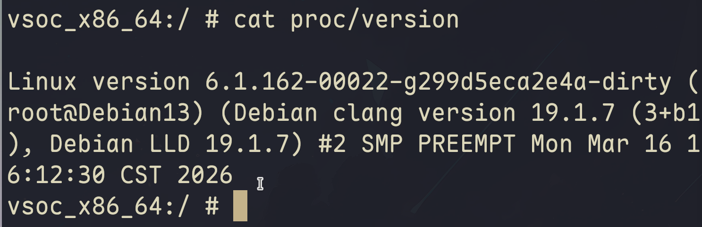
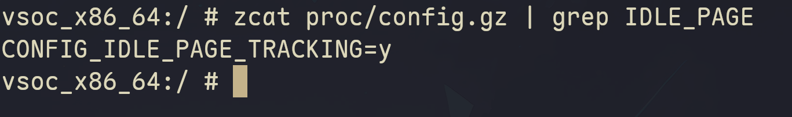
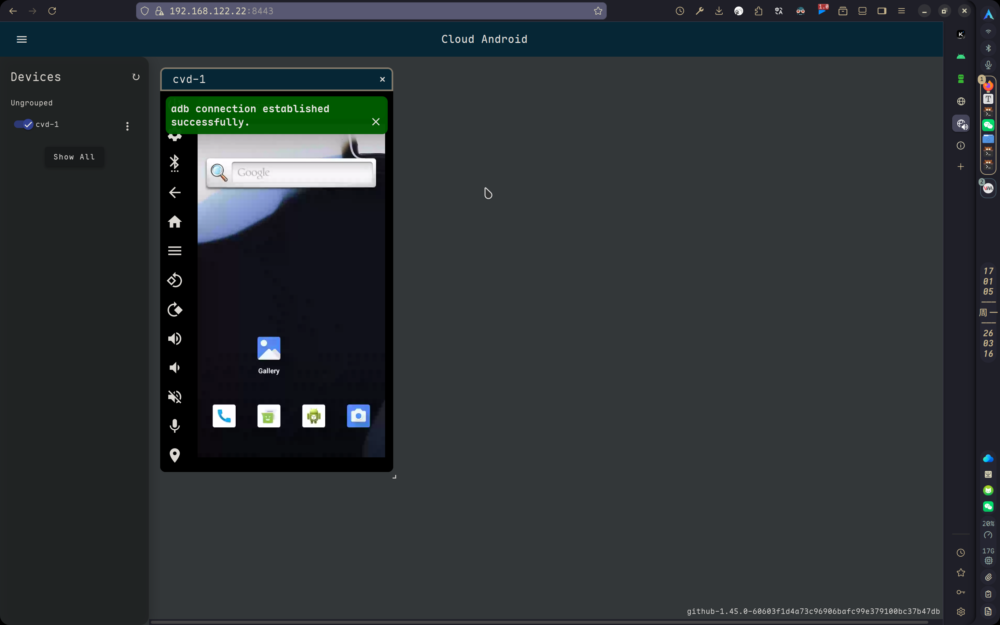

# 在虚拟机里编译安卓内核并启动 Cuttlefish 的踩坑记录

最近折腾了一个挺有意思的事情——在虚拟机里编译 Android 内核，然后用 Cuttlefish 跑起来。整个过程说不上顺利，但好歹最后成功了，记录下踩过的坑。

先上几张效果图：







---

## 一、前置准备：虚拟机配置很重要

### 血泪警告

**必须用基于 Debian 的发行版（如 Ubuntu）**，我在 Arch 上试了各种姿势都装不上 Cuttlefish，乖乖滚回 Debian 了。

> *Ubuntu也可以哈*

还有几个磁盘相关的坑：

| 项目 | 建议配置 | 说明 |
|------|----------|------|
| `/` 分区 | 至少 20G | 如果全程用 root，建议 60G |
| `/home` 分区 | 至少 60G | 或者干脆给 `/` 和 `/home` 单独分一个大盘 |
| CPU 核心 | 能多给就多给 | `make -j$(nproc)` 加速编译 |

> 我当时 `/` 分小了，只能滚到 `/home` 下编译，每次启动都要改 `$HOME` 环境变量，很烦。

另外，**Cuttlefish 在哪就在哪编译**。我用 Arch 的工具链编译的 kernel 在 Debian 上死活启动不了，死因是工具链版本太高...

---

## 二、内核编译

- 提醒大家一下

**先安装: cuttlefish, 直接使用包管理器, 切勿手动编译 (磁盘占用极大, 虚拟机环境下极其耗时)**

https://github.com/google/android-cuttlefish/blob/main/README.md

### 2.1 修改内核参数

这次主要是为了开启 `CONFIG_IDLE_PAGE_TRACKING`，用来做一些内存相关的实验。

```bash
# 下载内核，选一个分支
git clone https://android.googlesource.com/kernel/common -b android14-6.1
cd common

# 追加需要的配置,这里最重要的是 IDLE_PAGE, 其次别忘了 IKCONFIG (可能会导致cvd无法启动它)
echo "CONFIG_IKCONFIG=y" >> arch/x86/configs/gki_defconfig
echo "CONFIG_IDLE_PAGE_TRACKING=y" >> arch/x86/configs/gki_defconfig
echo "CONFIG_IKCONFIG_PROC=y" >> arch/x86/configs/gki_defconfig

# 导出 .config
make ARCH=x86_64 LLVM=1 gki_defconfig

# 验证一下配置是否生效
grep -E "IKCONFIG|IDLE_PAGE_TRACKING" .config
```

### 2.2 开始编译

缺啥装啥，需要 clang、llvm、lld、libbpf 等。

```bash
# 试过各种命令(不下10次哈), 这个成功率最高( Arch 和 Debian 上均一遍过)
make ARCH=x86_64 CC=clang LD=ld.lld AR=llvm-ar NM=llvm-nm STRIP=llvm-strip \
     OBJCOPY=llvm-objcopy OBJDUMP=llvm-objdump READELF=llvm-readelf \
     HOSTCC=clang HOSTCXX=clang++ HOSTAR=llvm-ar HOSTLD=ld.lld \
     LLVM=1 LLVM_IAS=1 WERROR=0 -j$(nproc)
```

编译完成后，`bzImage` 在 `./arch/x86_64/boot/bzImage`。

---

## 三、下载各种 .img 文件

以 `android14-6.1` 为例，去 CI 上扒镜像：

### 3.1 initramfs.img

https://ci.android.com/builds/submitted/15025335/kernel_virt_x86_64/latest

### 3.2 其他镜像（boot.img、bootloader 等）

在下面这个链接找到：
- `aosp_cf_x86_64_phone-img-14927007.zip`
- `cvd-host_package.tar.gz`

https://ci.android.com/builds/submitted/14927007/aosp_cf_x86_64_phone-userdebug/latest

下载完直接在启动目录下解压就行。

---

## 四、目录结构

我的启动目录是 `/home/common-android-mainline/cf`，大概长这样：

```txt
root@Debian13 /home/c/cf# tree -L 2
.
├── bin
├── boot.img
├── bootloader
├── bzImage          <-- 自己编译的内核
├── cuttlefish
│   ├── assembly
│   └── instances
├── cuttlefish_assembly -> /home/common-android-mainline/cf/cuttlefish/assembly
├── cuttlefish_runtime -> /home/common-android-mainline/cf/cuttlefish/instances/cvd-1
├── init_boot.img
├── initramfs.img
├── launcher_pseudo_fetcher_config.json
├── lib64
├── super.img
├── system.img
├── userdata.img
├── vbmeta.img
├── vendor_boot.img
└── ...
```

---

## 五、启动 Cuttlefish

### 5.1 启动命令

```bash
export HOME=/home/common-android-mainline/cf
cd $HOME

# 注意：路径必须用绝对路径，否则解析会有问题
../bin/launch_cvd \
    -kernel_path=/home/common-android-mainline/cf/bzImage \
    -initramfs_path=/home/common-android-mainline/cf/initramfs.img \
    -system_image_dir=/home/common-android-mainline/cf
```

如果启动失败，在我的环境下是因为实例目录里缺了 `bootloader`，需要手动拷贝：

```bash
cp /home/common-android-mainline/cf/bootloader /home/common-android-mainline/cf/cuttlefish/instances/cvd-1/
```

### 5.2 停止命令

```bash
cd ../bin
HOME=$PWD/../cf ./stop_cvd
```

---

## 六、adb 连接

如果像我一样在宿主机（Arch）连接虚拟机里的 Cuttlefish：

```bash
# 通过网络连接
adb connect 192.168.122.22:6520

# 查看已连接设备
adb devices

# 进入 shell
adb shell
```

本地的话默认已经连上了，直接 `adb shell` 就行。

---

## 总结

整个过程下来，最大的感受是：**环境一致性真的很重要**。工具链版本、系统发行版、路径配置，任何一个对不上都会踩坑。但看到 Cuttlefish 成功跑起来，还是蛮有成就感的。

希望这篇记录能帮到有类似需求的同学。