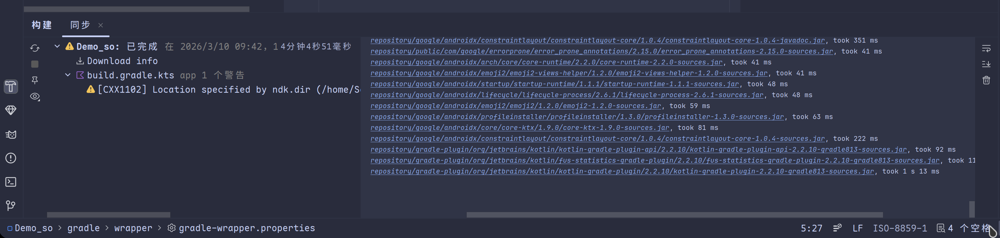

# 安卓开发环境配置

==DAY 0: 2026 年 3 月 9 日==

## 1. 下载 Android Studio

Arch Linux:

```bash
yay -S android-studio
```

### 首次启动-初始化

按照默认配置选择即可

---

## 2. 安装 NDK

### NDK 是干啥的？

简单说：**把 C++ 代码编译成 Android 能运行的二进制文件**。

| 功能             | 说明                                                         |
| ---------------- | ------------------------------------------------------------ |
| **交叉编译**     | 你的电脑是 x86 架构，手机是 ARM 架构，NDK 提供编译器把 C++ 转成 ARM 机器码 |
| **标准库**       | 提供 `malloc`, `free`, `mmap`, `pthread` 等函数（你要模拟的内存操作都在这里） |
| **Android 支持** | 提供 `log.h`（打印日志）、JNI 接口等                         |

### 为什么这个项目一定需要？

需求：

1. ✅ 编写 `so1.so`（C++ 共享库）→ **必须 NDK**
2. ✅ 使用 `malloc/free/calloc/realloc/mmap/munmap` → **必须 NDK 提供的 libc**
3. ✅ 多线程模拟 → **必须 NDK 提供的 pthread**

**没有 NDK，只能写纯 Java 代码，无法生成 so1.so，也无法调用底层内存分配函数。**

### 安装

```bash
yay -S android-ndk
# 目前版本为 29.0.14206865
```


---

## 3. 环境变量

- ndk 版本号注意修改

```bash
set -x ANDROID_HOME $HOME/Android/Sdk
set -x PATH $ANDROID_HOME/platform-tools $PATH
set -x ANDROID_NDK_HOME /opt/android-ndk
```

### 验证

```bash
set | grep ANDROID
# 输出
	# ANDROID_HOME /home/Schatten/Android/Sdk
	# ANDROID_NDK_HOME /opt/android-ndk
```

## 4. 创建一个 Native-C++ 项目

### gradle 同步

#### 换源

修改 `settings.gradle.kts`

```kotlin
pluginManagement {
    repositories {
        // 阿里云镜像（优先）
        maven("https://maven.aliyun.com/repository/google")
        maven("https://maven.aliyun.com/repository/gradle-plugin")
        maven("https://maven.aliyun.com/repository/public")

        // 备用
        google {
            content {
                includeGroupByRegex("com\\.android.*")
                includeGroupByRegex("com\\.google.*")
                includeGroupByRegex("androidx.*")
            }
        }
        mavenCentral()
        gradlePluginPortal()
    }
}

plugins {
    id("org.gradle.toolchains.foojay-resolver-convention") version "1.0.0"
}

dependencyResolutionManagement {
    repositoriesMode.set(RepositoriesMode.FAIL_ON_PROJECT_REPOS)
    repositories {
        // 阿里云镜像（优先）
        maven("https://maven.aliyun.com/repository/google")
        maven("https://maven.aliyun.com/repository/public")
        maven("https://repo.huaweicloud.com/repository/maven")

        // 备用
        google()
        mavenCentral()
    }
}

rootProject.name = "Demo_so"
include(":app")
```

### 确认 gradle 版本

查看 `gradle-wrapper.properties`, 确认版本号符合 IDE 要求

- 应该是不用改

```
distributionBase=GRADLE_USER_HOME
distributionPath=wrapper/dists
distributionUrl=https\://mirrors.cloud.tencent.com/gradle/gradle-9.3.1-bin.zip
zipStoreBase=GRADLE_USER_HOME
zipStorePath=wrapper/dists
```

### 重启,等待同步

可通过左下角 `构建 -> 同步` 观察 gradle 同步进度



### 配置 NDK 信息

修改 `build.gradle.kts`

```kotlin
// ...
android {
    namespace = "com.example.demo_so"
    compileSdk {
        version = release(36) {
            minorApiLevel = 1
        }
    }

    // *添加这两行*
    ndkPath = "/opt/android-ndk"
    ndkVersion = "29.0.14206865"  // 改成实际的 r29 版本号

    // ...
 
}
```


> 接下来就可以开始写代码了