# DPDK环境配置

# 多队列网卡
输入命令, 看看有没有如下内容

```bash
cat /proc/interrupts
```

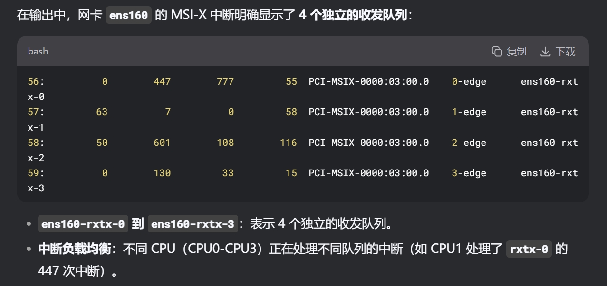

**<font style="color:#DF2A3F;">虚拟机关机!!</font>**

修改`.vmx`文件, 对于当前网卡: **<u>修改</u>**`virtualDev`, **<u>添加</u>**`wakeOnPcktRcv`

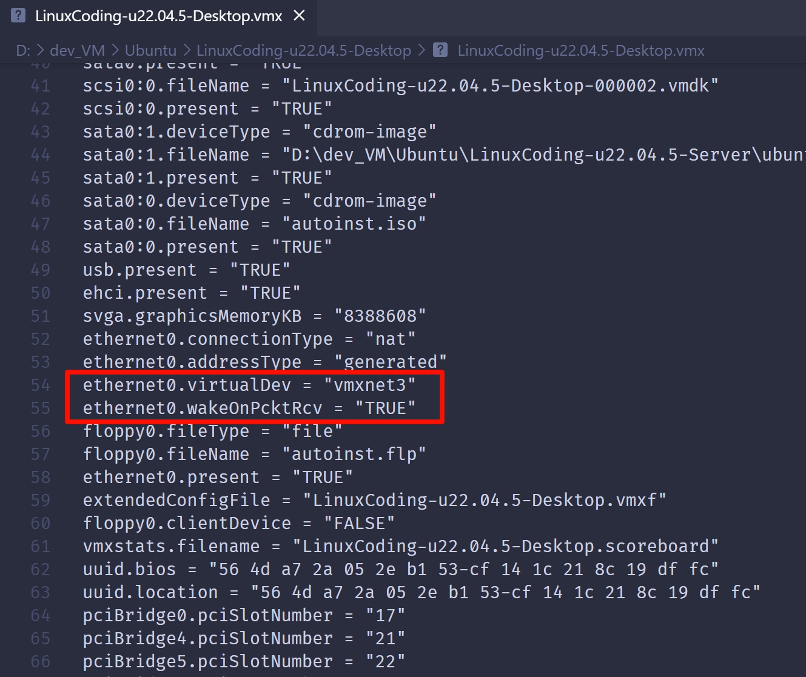

**<font style="color:#DF2A3F;">再打开虚拟机</font>**

**输入命令: **`lspci -k | grep -A3 -i ethernet`

+ 可以看到网卡类型切换成功

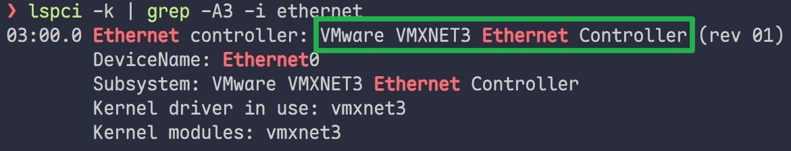

## KVM 虚拟机 开启网卡多队列（Linux下虚拟机）

### 方法：修改虚拟机 XML 配置

在宿主机（Arch Linux）执行：


```bash
# 编辑虚拟机配置
sudo virsh edit ubuntu-mini  # 替换为你的虚拟机名称
```

找到 `<interface>` 部分，修改为：

```xml
<interface type='network'>
  <mac address='52:54:00:xx:xx:xx'/>
  <source network='default'/>
  <model type='virtio'/>
  <driver name='vhost' queues='6' iommu='on'/>  <!-- 添加这一行，queues 数建议=CPU数 -->
  <address type='pci' domain='0x0000' bus='0x00' slot='0x03' function='0x0'/>
</interface>
```

**关键参数**：

- `queues='6'`：队列数，建议等于你的 vCPU 数（你有 6 个核）
  
- `iommu='on'`：DPDK 需要 IOMMU 支持（还需在虚拟机 XML 的 `<features>` 中添加 `<iommu model='intel'/>` 或 `'amd'`）

# Huge Page 巨页 的配置
1. 修改 `grub`启动参数，启用**多队列**和**巨页支持**：

```bash
vim /etc/default/grub
```

找到** **`**GRUB_CMDLINE_LINUX**`，添加三个参数

`**"... default_hugepagesz=1G hugepagesz=2M hugepages=1024 ..."**`

```plain
最后要执行下面的命令, 使其生效
update-grub
```

# 安装编译DPDK源码
一开始先跟着视频用19年的版本(19.08.2), 等以后熟悉了自己用别的

**地址: **[DPDK](https://core.dpdk.org/download/)** **`[**https://core.dpdk.org/download/**](https://core.dpdk.org/download/)`

**建议: 安装到 **`**~/src/**`** 目录下, 不要放在**`**samba**`**的共享目录内**

1. **使用**`**tar -xf**`**解压**
2. **解压后进入其中的**`**usertools**`**目录, 运行**`<u>./dpdk-setup.sh</u>`

### <font style="color:#DF2A3F;">编译时报错: numa.h: No such file or directory</font>
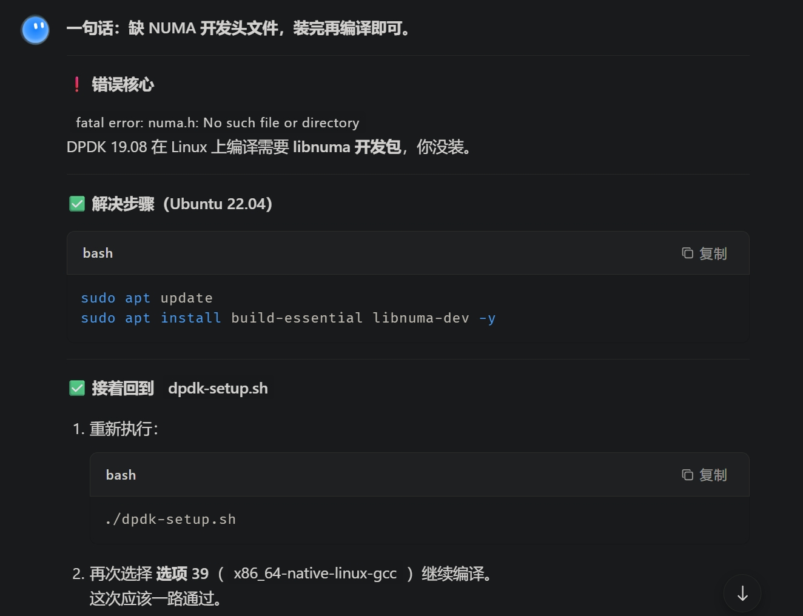

### 网卡的作用
数据传输时, 实现 光信号 和 数字信号 互转

### 网卡驱动作用
使各厂商网卡能够正常工作 (不同厂商, 不同id, 启动不同的驱动)

### 问题
**网络通信中海量的数据包, 海量的sk_buffer, 用什么数据结构保存**

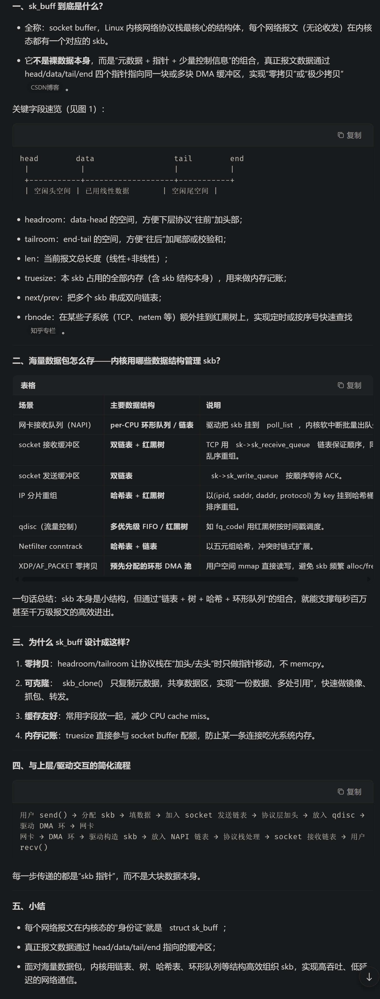

### IGB_UIO module / VF IO module
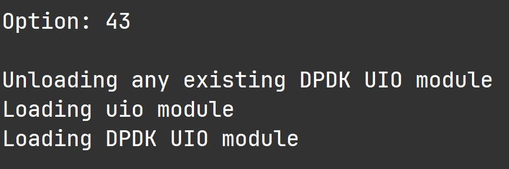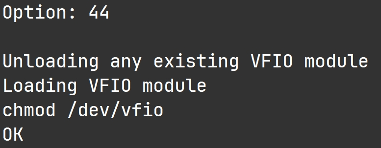

+ 用于截获从PCI出来的数据
    - PCI可以看作是一条条 **' 高铁 '**
    - UIO 截获从 **' 高铁站出站口 '** 出来的数据
    - VF IO 截获一些 **工作模式比较特殊的网卡** 的数据

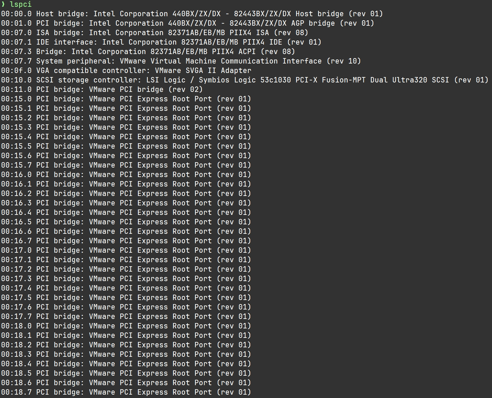

### KNI module 
+ **内核网络接口**

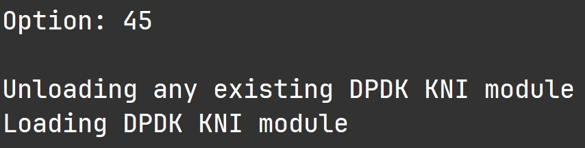

### NUMA 与 non-NUMA
**两种内存编号方式 (多张内存卡)**

+ **非统一编码**: NUMA
+ **统一编码**: non-NUMA

> `输入` 46 ↩︎ 512 ↩︎ 47 ↩︎ 512
>

### PCI 地址
前面的就是 PCI 地址, 这里要绑定 **网卡的 PCI 地址 **到** IGB UIO **模块

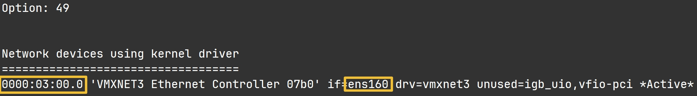

### <font style="color:#DF2A3F;">警告: 网卡正在工作, 没有成功更改</font>
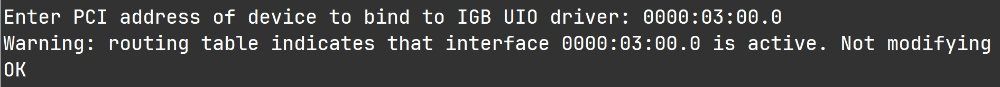

#### 解决: 把这块网卡 `down`掉
+ 若要使用 SSH 需要添加一块新网卡, IP 地址和这块给 dpdk 用的网卡 不同

```bash
ifconfig ens160 down
```

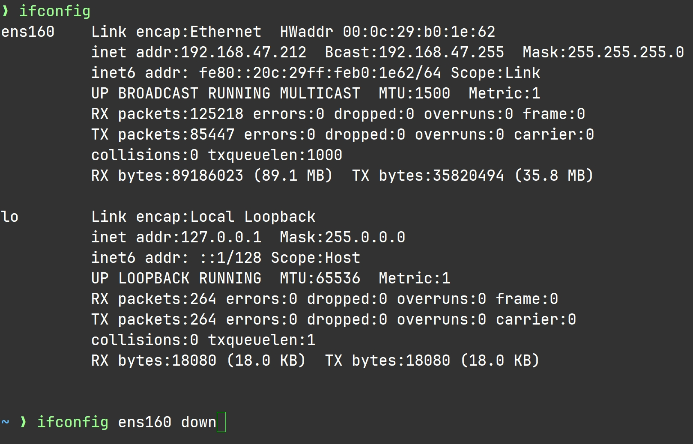

# **DPDK 用户态网卡 ARP 问题**

## **问题现象**  
DPDK 程序绑定网卡后，宿主机无法访问虚拟机 IP（`nc`/`ping` 无响应），`ip neigh show <IP>` 显示 `INCOMPLETE` 或 `FAILED`。

## **原因**  
DPDK 程序未实现 ARP 协议，宿主机发送 ARP 请求无人响应，无法获取目标 MAC 地址，导致数据包无法发出。

在宿主机手动添加静态 ARP 表项（绕过 ARP 请求）：
## **解决方案**  


```bash
# 查看 DPDK 网卡 MAC（虚拟机内运行 DPDK 程序时打印的 MAC）
# 例如：52:54:00:95:EF:30

# 宿主机执行：强制替换/添加静态 ARP
sudo ip neigh replace 192.168.122.160 lladdr 52:54:00:95:EF:30 dev virbr0 nud permanent

# 验证（应显示 PERMANENT）
ip neigh show 192.168.122.160
```

## **关键命令**

- \<dev> 为mac地址

- 删除错误条目：`sudo ip neigh del <IP> dev <dev>`
  
- 清空并重置：`sudo ip neigh flush to <IP> dev <dev>`
  

## **注意**  
此问题仅出现在 DPDK 接管整个网卡（`--bind=vfio-pci`）且未实现 ARP 协议栈的场景。若 DPDK 程序实现了 ARP 响应，则无需手动配置。

### 总览
1. dpdk 不能提高 Redis 的 QPS (**效果不明显**)
2. dpdk 不能降低 Nginx 的 延迟 ( 50ms -> 25ms ✕ )
3. **<font style="color:#DF2A3F;">dpdk 可以提高网卡的吞吐量 (大文件传输速率)</font>**
    - <font style="color:#DF2A3F;">应用场景: 数据备份, WAF, 网关 --> 高性能网络开发</font>

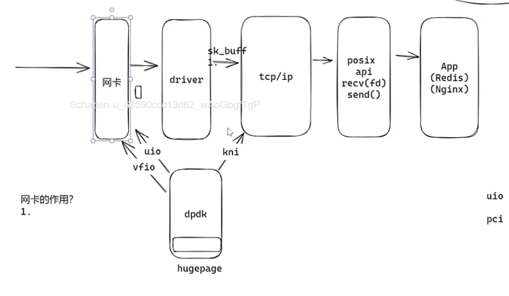

### 推荐的协议栈
1. **ntytcp (King老师自研)**
2. **4.4BSD**
3. **mtcp**
4. **lwip**
5. **vpp**
