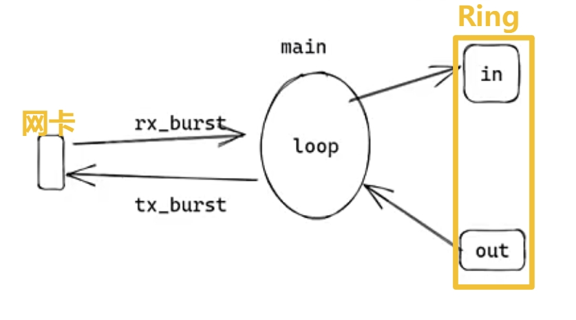
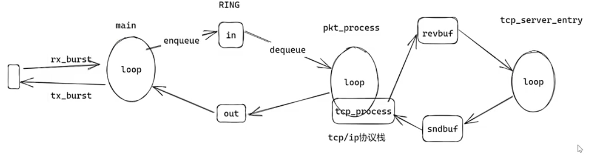

# TCP/UDP 协议栈实现并发

**用 dpdk 封装好各种 **`POSIX API : send, recv, accept, listen, bind...` **后**

# 协议栈架构
### main_loop (网络收/发包)
+ 从网卡中取数据 `rx_burst` 存入 Ring `enqueue`
+ 从 Ring 中取数据 `dequeue`, 发送 `tx_burst` 到网卡

### pkt_process (解析数据包) + tcp_server_entry

> _" 三山夹两盆 "_
>

# 两种方式实现并发
**注意: 需要修改 RING 的名字**

+ **DPDK 要求**`rte_ring_create 函数`**创建的多个Ring, 名字应当不同**
+ **否则多连接创建多个同名Ring, 会报段错误**

### 一请求一线程
### 实现一个 epoll
普通的 `epoll` 不能直接使用, 需要实现一个_**用户态 **_`epoll`
