# DPDK-ustack

# Hello, DPDK
+ 随便复制 example 目录里面的一个项目的 `Makefile`文件到我们的项目文件
    - 修改编译的`.c`文件名, 以及产出的二进制文件名
+ 在项目目录下`make`即可

> 需要安装: `apt install pkg-config`
>

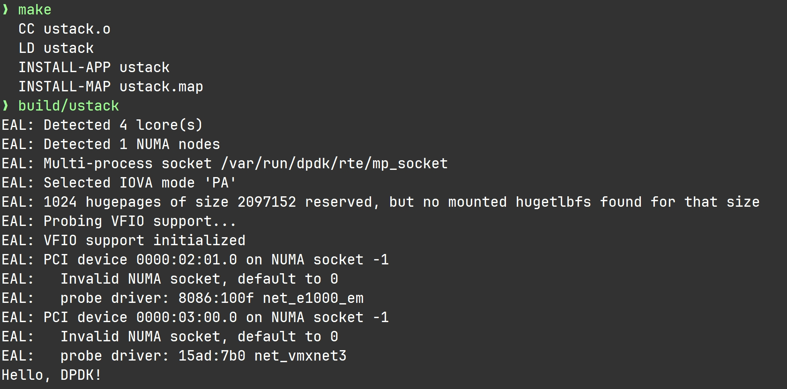

# 为什么收不到数据 --- ARP
| **方式** | **MAC 来源** | **是否发 ARP 请求** |
| :---: | --- | --- |
| **动态** | 通过 ARP 协议现场询问 | ✅ 会发 |
| **静态** | 人工提前写死在**客户端 **`**arp -s**`<br/>**<font style="color:#DF2A3F;">(静态 ARP 缓存记录重启以后就没了)</font>** | ❌ 不发 |


```go
      <DPDK绑定的网卡 IP + 其 MAC 地址>      <源 IP (主机网卡)>
arp -s  192.168.1.88  00-0C-29-B0-1E-62  192.168.1.13
```

#### 永久添加
```powershell
:: 先查出接口（网卡）的 idx
arp -a

:: 然后添加静态 ARP
netsh interface ipv4 add neighbors "<Idx或连接名>" <目标IP> <目标MAC>
```

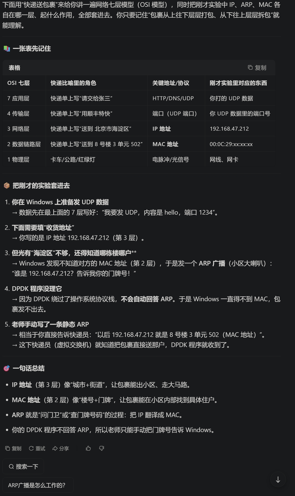

# 实现发送数据包
## 发送队列的设置
> **技巧 : 宏定义**` #define    ENABLE_SEND    1 或 0` 
>
> + 所有补丁都打在这个宏定义里面
> + 在新版本上线前保留这个宏定义, 确保新改动不会影响原本代码
>

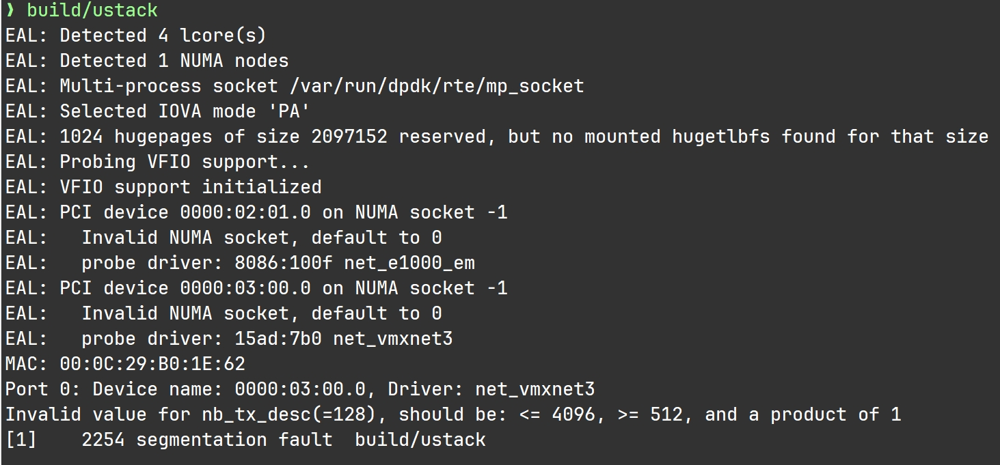

## 源地址与目的地址的调换
1. **以太网头:** MAC地址
2. **IP头:** IP地址
3. **UDP头:** 端口号

**地址数据类型转换API**

```c
#include <arpa/inet.h> 
// 地址类型转换 
inet_pton(ip)   //->	(struct in_addr) binary_addr
inet_ntop(addr_in)  //->	(char*) IP
```

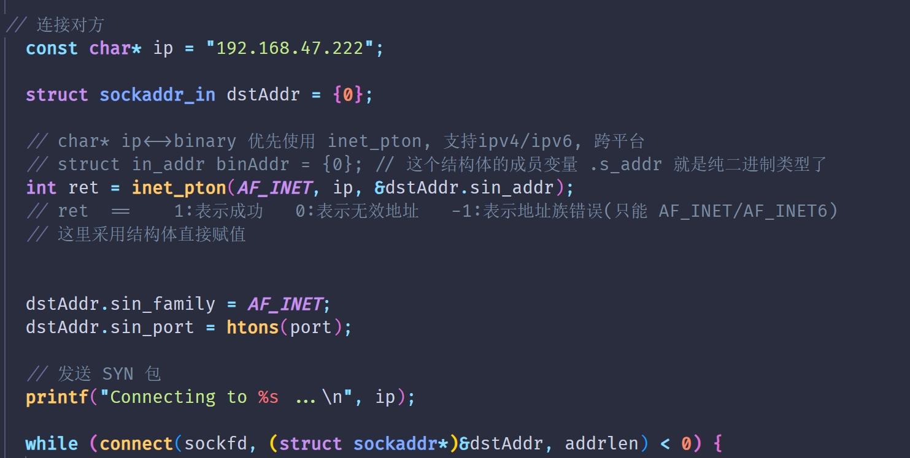

## 配置好发送队列和mbuf, 装填好数据
还是收不到包, 原因是:

**IP头的 total_len 字段 长度不对**

+ **需要进行 **`htons()`** 网络字节序的转化**

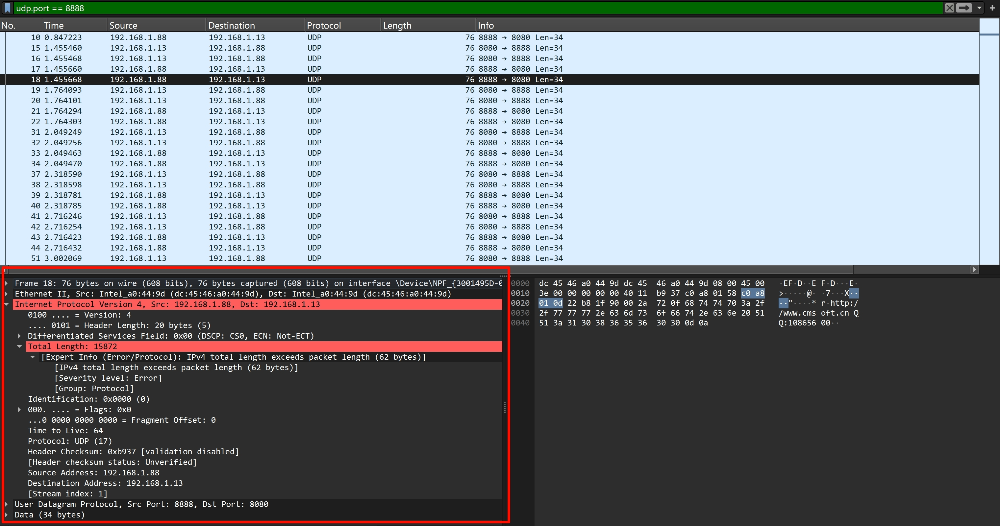

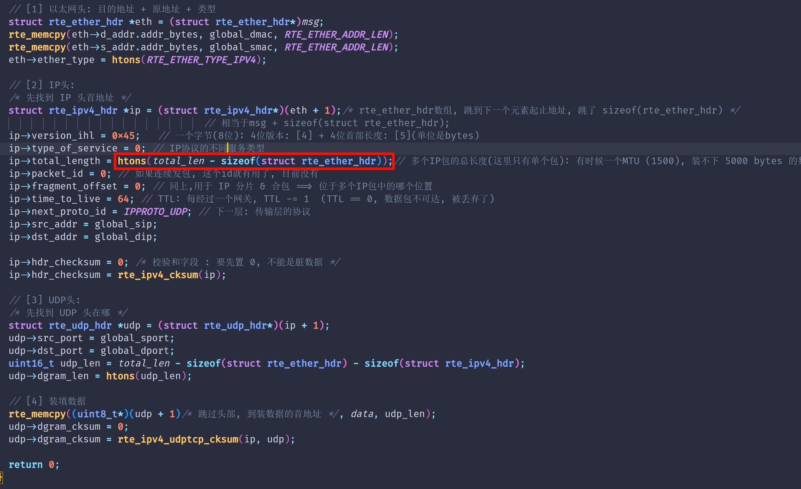

## TCP 与 UDP 头
*问 : 为什么 UDP 头有 `dgram_len` 字段代表 UDP 包的长度, 而 TCP 头没有 TCP 的长度字段*

> 1. **IP 层的 fragment offset**  
只在“一份 IP 报文被切成多片”时起作用——  
它告诉 IP：“这片在整个 IP 报文里的字节偏移量是多少”  
于是接收端能把这些 IP 片重新拼成一份完整的 IP 报文，然后交给上层  
**注意：这只是一份报文内部的拼图，不涉及先后顺序、丢片重传、重复片等问题；如果丢了某一片，整个 IP 报文就作废**
> 2. **TCP 层的 seq/ack**  
   工作对象是“一整条字节流”，面对的是: 
>     - 可能乱序到达的多份 IP 报文（每份报文内部早已由 IP 拼好）
>     - 可能重复、丢失、延迟的 TCP 报文段
>     - 需要按字节序号把数据流按序、无空洞地交付给应用，并负责重传、流量控制、拥塞控制
>
> **因此：**
>
> + **IP fragment offset 解决的是**: 
>   - **同一份 IP 报文内部的分片重组** (一份IP报文被切成碎片)
> + **TCP seq (字节序号) 解决的是**:
>   - **多条 IP 报文之间的字节流顺序、完整性、重传** (多份IP报文的顺序)
>

#### 为什么 TCP 不需要“长度字段”
+ TCP 像“顺丰的连续传送带”，货物（字节）一个接一个，没有间隙。
+ IP 像“顺丰的卡车”，每辆卡车只负责把“这一车货”送到目的地。
+ 收货的仓库（TCP 接收端）只需要知道“下一件货的编号是多少”，就能按顺序把传送带拼回去——传送带上每一件货自带编号（TCP seq 序号），所以仓库永远知道“我接下来该收第 42 号货”。
+ 至于“这一卡车到底装了多少件货”，卡车司机（IP 层）卸货时会告诉仓库“我这一车共有 120 件”，仓库直接数一下就行——仓库并不需要货物再贴一张“本车共 120 件”的标签。

因此 TCP 省掉长度字段：  
“长度”由卡车司机（IP 层）现场报数即可，货物本身只要有序号就足够拼回传送带。

---

#### 为什么 UDP 必须自带“长度字段”
+ UDP 像“邮政小包”，每个包裹都是独立、完整的，包裹之间互不相关。
+ 邮政规定：如果包裹太大，卡车装不下，就得把大包裹 切成几片 分几辆车运（IP 分片）。
+ 问题：
    1. 每辆卡车只知道自己拉的“这一片”有多重，但不一定知道原始整包有多重（因为片与片之间没有“总重量”字段）。
    2. 邮政司机卸货后，可能顺手把称重标签改成了“本片重量”，于是仓库（UDP 接收端）拿到几片后，无法反推出“原来那一整包到底是多重”。
+ 如果邮政小包（UDP 报文）里不自带一张“本包裹总重”的标签，仓库就无法判断：  
– 我收到的所有片加起来，是不是正好等于发件人寄出的那一整包？  
– 万一少了一片或者多了一片，我也不知道，更没法一次性把整包交给收件人。

因此 UDP 必须在包头写“长度字段”：  
“长度”就是包裹上贴的那张“整包总重”标签，让仓库能一次性核点、交付。

---

#### 校验和（checksum）是什么
+ 校验和 = “包裹的指纹”
+ 寄件人把包裹里的全部内容按固定算法算出一个指纹，写在包裹上
+ 收件人收到后，把包裹再算一遍指纹，如果跟包裹上写的不一样，就说明运输途中被压坏、掉件或串包，直接拒收

## 小问题：VScode 索引/宏冲突
1. **uint16_t 被当成函数**
2. **EXIT_FAILURE 找不到**

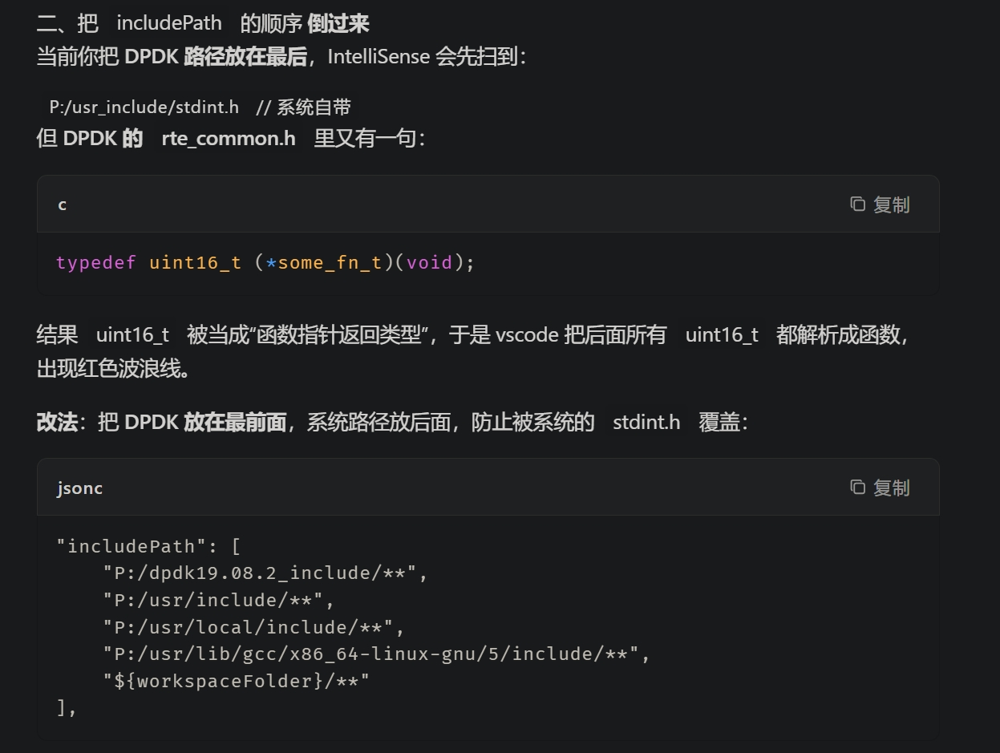

**清缓存 & 重索引**  
VS Code 不会自动刷新索引，执行一次：

1. `Ctrl+Shift+P` → `C/C++: Reset IntelliSense Database`
2. 关闭 VS Code，再打开工程

## 以太网头
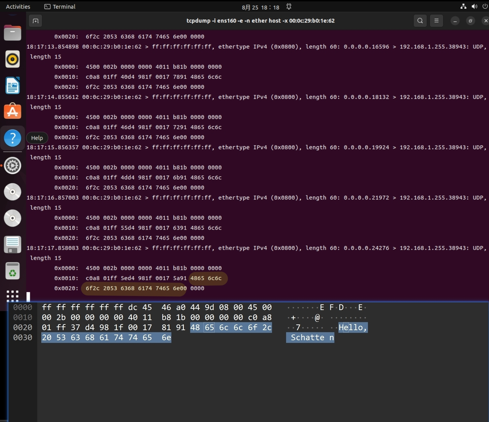

# 实现三次握手
收到 `SYN`,  `seq_num = <u>ntohl</u>( tcp_hdr->sent_seq )`

回复 `SYN | ACK`, `ack_num = htonl( seq_num + 1 )`

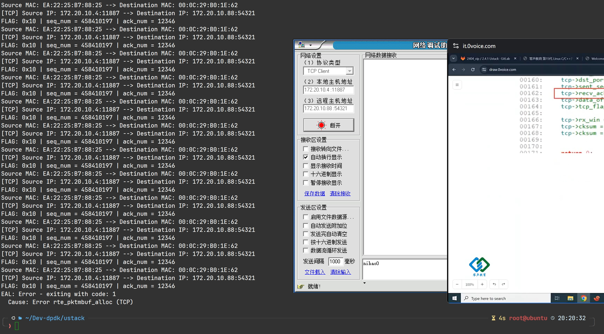

## 为什么出现 Error rte_pktbuf_alloc (TCP)</font>
```go
 RTE_TCP_CWR_FLAG 0x80 < Congestion Window Reduced 
 RTE_TCP_ECE_FLAG 0x40 < ECN-Echo 
 RTE_TCP_URG_FLAG 0x20 < Urgent Pointer field significant 
 RTE_TCP_ACK_FLAG 0x10 < Acknowledgment field significant 
 RTE_TCP_PSH_FLAG 0x08 < Push Function 
 RTE_TCP_RST_FLAG 0x04 < Reset the connection 
 RTE_TCP_SYN_FLAG 0x02 < Synchronize sequence numbers 
 RTE_TCP_FIN_FLAG 0x01 < No more data from sender 
```

最后发来的

+ `FLAGS = 0x10` --> `ACK`
+ `ack_num =  12346` (我们之前发回的`SYN+ACK`的`seq = 12345`)
+ 说明他最后一直在发 ACK, 我们每次接收的时候, 都会`alloc mbuffer`, 最后`mbuf`不够用了, 出错

### 问: 最后一次握手持续发来 ACK 包, 原因是? 

- 第一次我们回了 `SYN + ACK`
+ 往后, 他发一次 `ACK`, 我们就回一次`SYN+ACK` ...
+ 根本原因是: 我们一直发`SYN+ACK`, 导致了他一直回 `ACK`

- **陷入死循环**

- **所以我们需要判断是否收到最后一次 ACK, 并停止发 SYN+ACK**

### TCP 状态迁移
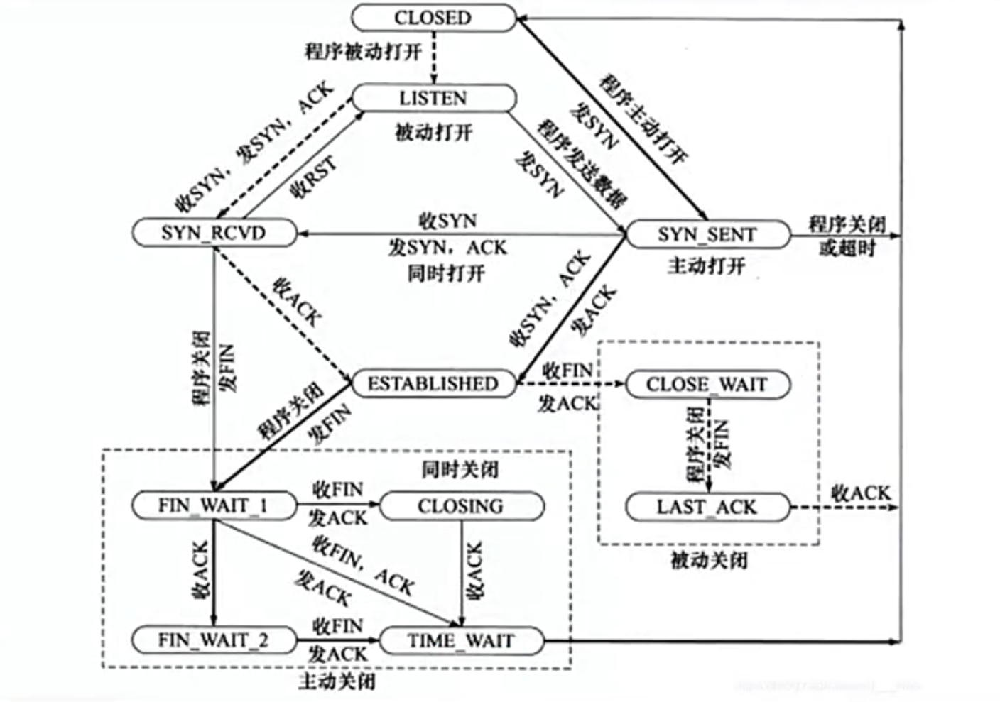

TCP 状态初始化为 `LISTEN`

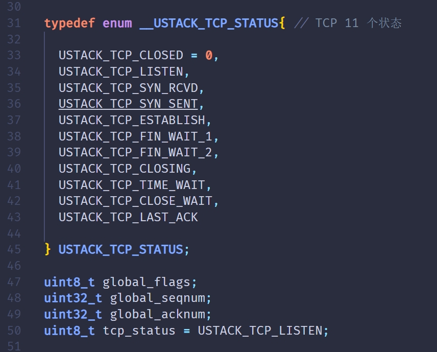

判断是 `SYN` 包, 且状态为 `LISTEN`, 才发回我们的 `SYN+ACK`包

这样, 就不会一直给它发 `SYN+ACK` 了

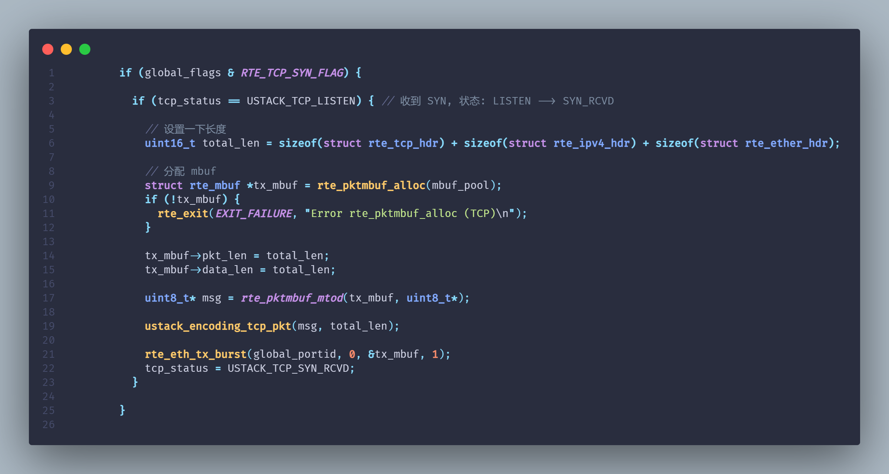

### 三次握手成功
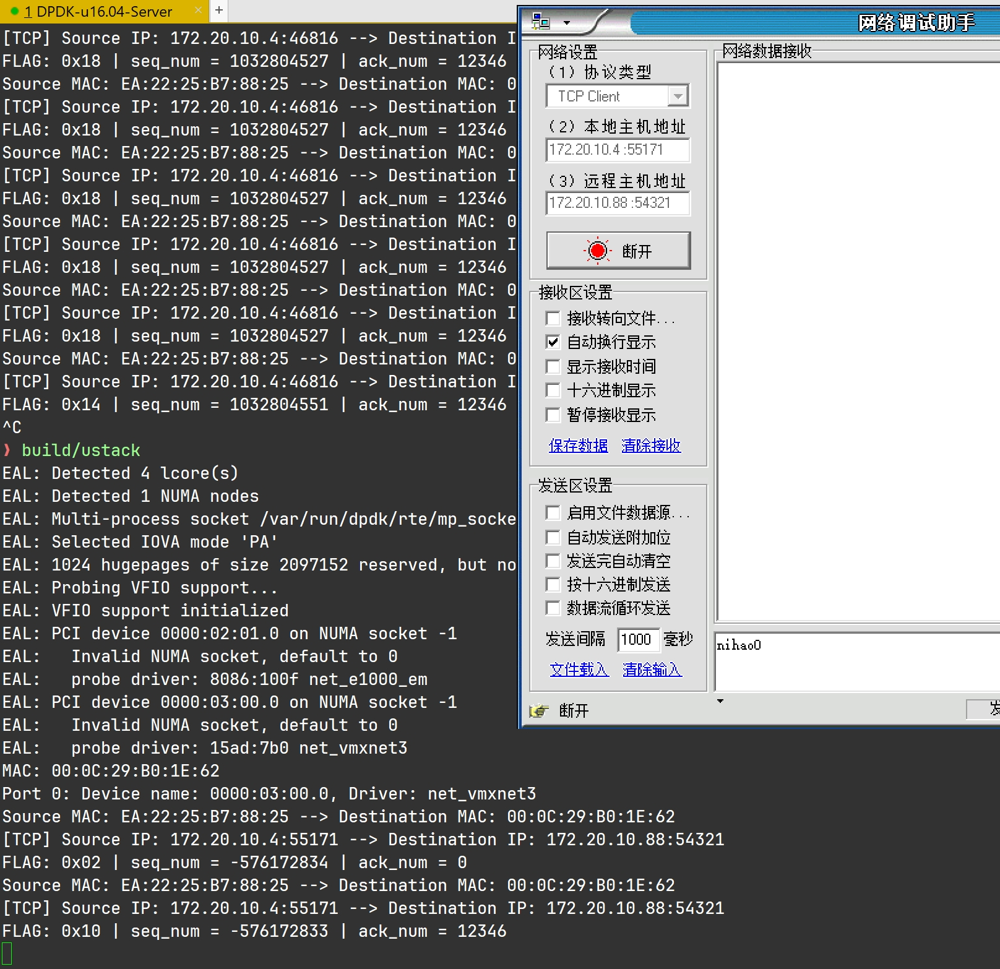

### 取出数据
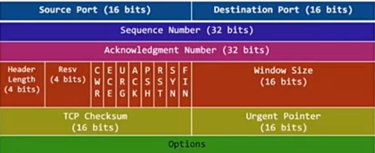

#### data_off 字段值 --> 首部长度
因为 DPDK 把 Data Offset 放在字节的高 4 位，所以必须先右移 4 位，再乘 4 才能拿到“字节长度”。  
下面拆开给你看（把“字节”和“位”画出来就懂了）：  
TCP 头的第 13 字节（从 0 开始数）长这样：

```go
bit 7 6 5 4 | 3 2 1 0
+-------------+-------+
| Data Offset |  Res  |
+-------------+-------+
```

+ 高 4 位（7-4）：Data Offset（值 5～15）
+ 低 4 位（3-0）：Reserved + NS（你不用管）

DPDK 把这 8 位直接读出来，放进 `uint8_t data_off`

**假设 TCP 头 20 字节，Data Offset = 5 → 字节值就是 0x50（二进制 0101 0000）。**

**想拿到“真正的 offset 数字”：**

+ **0x50 >> 4  =>  0x05**
+ **再乘 4 字节：**
+ **0x05 * 4 = 20 字节**

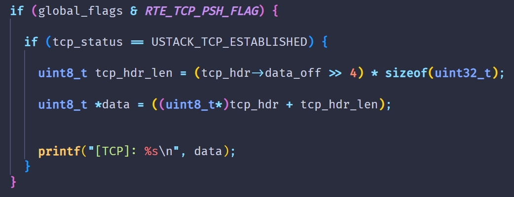


# 理论部分
## 延迟确认
+ 接收方, 确保数据完整

eg: 收到数据, 200ms 后才发送确认消息 (后面的数据要全部重传) --> `高端: KCP 协议 选择性重传`

> 1-400 , 401-800 , 801-1200 目前已经收到1-400 和 801-1200 的seq_num包, 但没有收到 401-800
>
> 此时应当发送的 ack_num --> 400
>
> 也就是说, 400 以后的数据, 都要重传 --> 超时重传
>

## 滑动窗口
+ 用于形容 数据发送方 如何

**中间的窗口部分, 指的是: 已发送, 未确认**

+ 随着我们这边数据的发送, 右指针后移
+ 随着我们这边接受到确认消息, 左指针后移

## 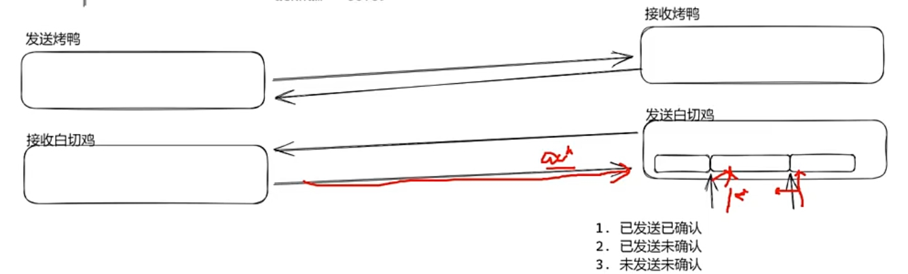
## 慢启动 + 拥塞控制
形容发送方 控制发送数据的节奏

+ 前半部分, 指数级增长: 慢启动

发现数据不能在规定时间内收到 `往返时间: RTT`

说明已经 '堵车了' --> 那就少发 --> 拥塞控制

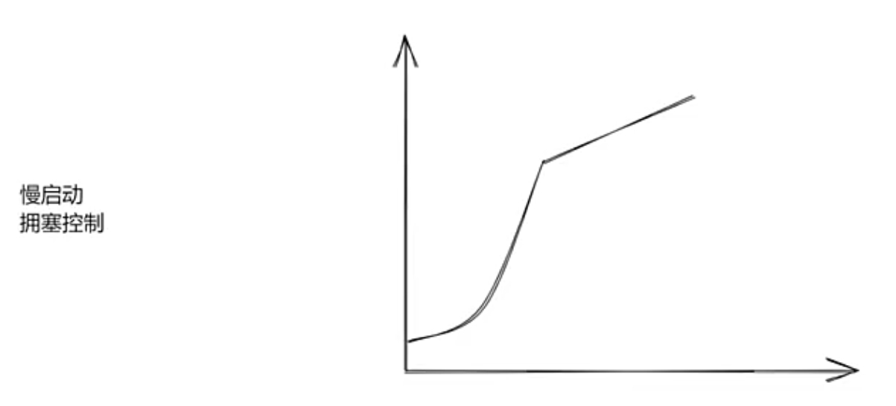
