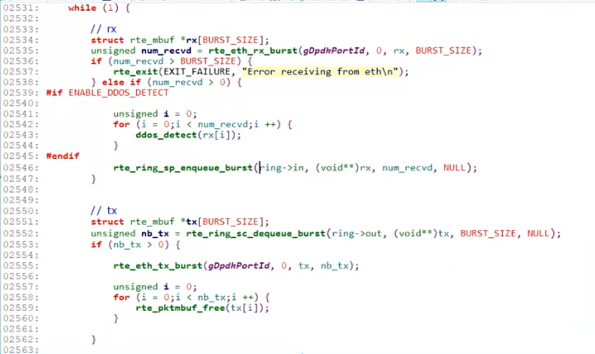

# TCP/UDP 协议栈实现并发

**用 dpdk 封装好各种 `POSIX API : send, recv, accept, listen, bind...` 后**

# 协议栈架构
### main_loop (网络收/发包)
+ 从网卡中取数据 `rx_burst` 存入 Ring `enqueue`
+ 从 Ring 中取数据 `dequeue`, 发送 `tx_burst` 到网卡

### pkt_process (解析数据包) + tcp_server_entry

> _" 三山夹两盆 "_
>

# 两种方式实现并发
**注意: 需要修改 RING 的名字**

+ **DPDK 要求**`rte_ring_create 函数`**创建的多个Ring, 名字应当不同**
+ **否则多连接创建多个同名Ring, 会报段错误**

### 一请求一线程
每当有新的 TCP 连接建立，通过 `pthread_create` 创建一个新的线程来处理。每个线程拥有独立的 Ring 队列用于收发数据。

### 实现一个 epoll
普通的 `epoll` 不能直接使用, 需要实现一**用户态`epoll`**。通过维护就绪列表和事件回调，在单个或少量线程中高效处理成千上万的并发连接。

---

# 性能优化考量

## 1. 锁竞争优化
在多线程环境下，尽量使用 `rte_ring` 提供的无锁队列（Single-Producer/Single-Consumer 或 Multi-Producer/Multi-Consumer 模式）来减少锁开销。

## 2. 缓存一致性 (Cache Locality)
将数据包处理逻辑绑定到特定的 CPU 核心（Core Affinity），并利用 DPDK 的内存对齐机制，减少伪共享（False Sharing）。

## 3. 批量处理
在 `main_loop` 中采用 `burst` 模式进行收发，一次性处理 32 或 64 个数据包，摊薄系统调用和上下文切换的开销。
