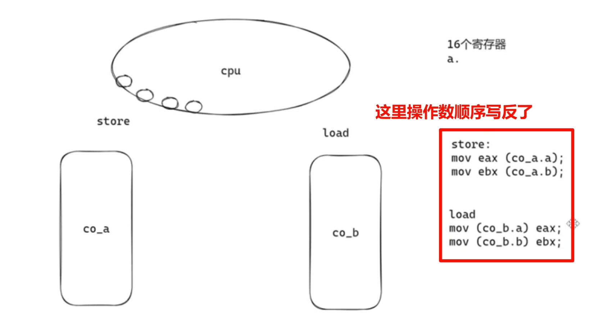
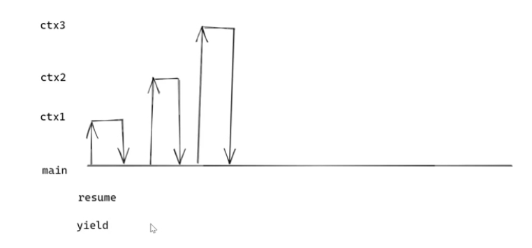
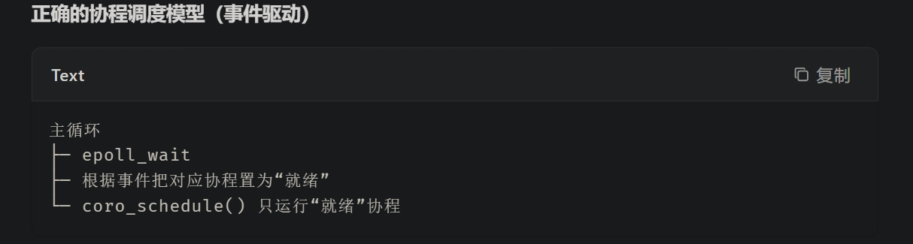
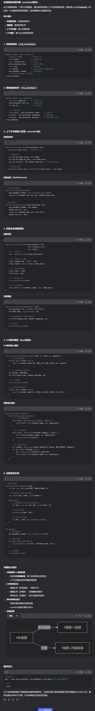

# 协程

**目的: 以同步的编程方式, 实现异步的性能**

异步的缺点: 逻辑复杂, 难以实现

+ **协程: 封装好的`异步`函数, 使用同步的编程方式, 实现异步逻辑**

# 应用场景
| **产品 / 功能**     | **协程并发场景（你能看到的）**                             | **亲身感受小实验**                                                    |
| --------------- | :-------------------------------------------- | :------------------------------------------------------------- |
| **淘宝商品详情页**     | 详情、价格、优惠券、推荐、评价、店铺评分 6 类接口一次性并发。              | 在淘宝随便进一个商品详情，**立刻上滑**，看 6 大模块几乎同时到位；用 4G 更明显。                  |
| **高德 / 百度地图**   | 搜索“附近餐厅”时要并发：①POI 列表 ②评分 ③距离 ④实时排队 ⑤价格。       | 在高德地图输入“附近美食”，**点搜索**，列表页 1 秒内全部字段齐全，就是协程批量请求。                 |
| **微信小程序“美团外卖”** | 进入小程序同时要并发：①定位 ②附近商家 ③Banner ④红包 ⑤订单状态。       | **微信里第一次打开美团外卖小程序**，2 秒内首页全部模块出现，背后即用协程并发。                     |
| **B 站视频播放页**    | 视频流、弹幕、推荐列表、评论、UP 主信息、点赞/投币状态……全部异步并发。        | 打开任意视频，**立即点“全屏”**，注意右侧推荐和弹幕几乎是秒出——协程并行请求。                     |
| **微博首页信息流**     | 下拉刷新时要同时拉取：①关注人时间线 ②热门流 ③广告 ④视频封面 ⑤未读计数……     | 打开微博，**猛地下拉刷新**，观察 1 秒内几乎同时蹦出的不同卡片 → 这就是协程并发请求在客户端/网关并行后的结果。   |
| **携程/去哪儿酒店列表**  | 列表页一次并发：①酒店基础信息 ②实时价格 ③剩余房量 ④用户评分 ⑤优惠标签。      | 搜索“北京酒店”，**瞬间出现 10 条结果且每条都带实时价**，这就是协程并行各供应商接口。                |
| **微信朋友圈**       | 进入朋友圈瞬间：①主 feed 列表 ②每条的小图/视频首帧 ③点赞评论数 ④广告横幅…… | **断网→快速连网→立刻点“发现-朋友圈”**，你会看到文字先出，图片随后插进来——协程让多个请求先返回先渲染，不互相阻塞。 |
| **京东 App 首页**   | 首页有 20+ 个楼层，每个楼层对应一个后端微服务接口，全部并发拉取。           | **杀掉京东→重新冷启动**，首页瞬间铺满，就是后台用协程并行调所有楼层接口。                        |
| **网易云音乐评论**     | 打开一首歌：①歌曲信息 ②歌词 ③评论 ④相似推荐 ⑤当前用户红心状态。          | 点进一首歌，**立刻上滑评论区**，你会看到歌词、评论、推荐 3 栏几乎同时加载完毕。                    |
| **今日头条刷新**      | 下拉一次要并发：①图文 feed ②小视频 ③广告 ④热榜关键词。             | **疯狂下拉头条首页**，每次刷新 0.5 秒出现 10+ 条卡片，体验丝滑无卡顿。                     |
# 实现
需要检测 IO 状态, 如果 `不可读/不可写`, 就 **跳转**

## 实现函数的跳转
1. **setjmp/longjmp --- 跨平台性最好**
2. **ucontext --- 最容易实现**
3. **汇编 --- CPU体系结构不同, 需要不同的汇编**

#### 汇编法切换 → 图示: 
使用 `mov`指令

1. 将 **协程 A** **的上下文信息存储**`**mov**`到**变量**中
2. 将 **协程 B 的上下文信息读入**`**mov**`到**寄存器**里

## 具体实现思路
在 send/recv 前, 使用 select/poll/epoll 监控: --> `timeout = 0`, 立即返回 

+ 如果IO未就绪, 就切换
+ IO 就绪, 进行 send/recv

## 函数结构
`**main**`** 函数作为 **`**schedule**`** 调度器**

+ 其余`func0`, `func1`, `func2` ... 作为协程 `coroutine0`, `coroutine1`, `coroutine2` ...

**每个协程处理完 **`**send/recv**`** 要回到调度器**`**main**`, **不要协程互切**

+ **coroutine --> main : **`**yield 让出**`
+ **main --> coroutine : **`**resume 恢复**`

# NtyCo实现思路 --> ucontext版

